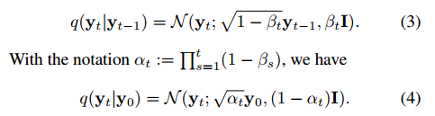
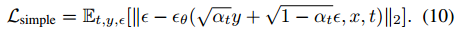
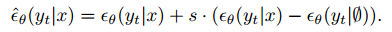
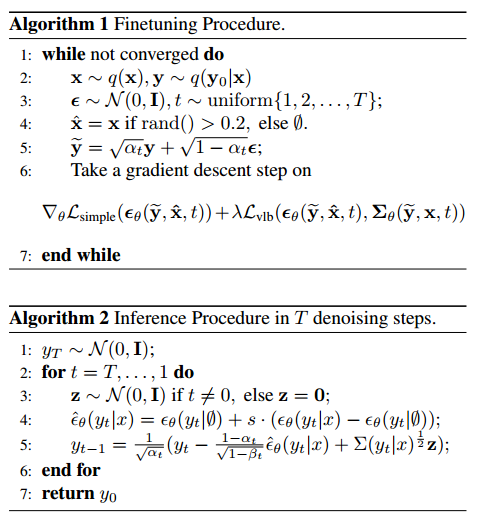
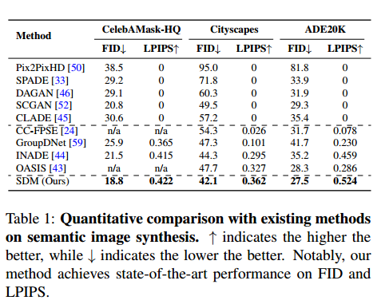
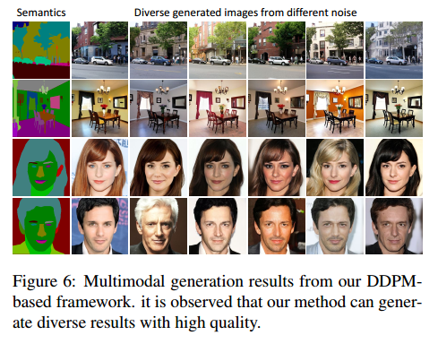

# Semantic Image Synthesis via Diffusion Models

从文章的标题就可以看出，本文主要实现了用于语义图像生成的Diffusion模型。

## 1. Introduction
本文的主要贡献：
1. 本文基于DDPM，提出了一种新的用于生成高保真度和多样性的语义图像的Diffusion模型，称作Semantic Diffusion Model（SDM）。
2. 现有的条件Diffusion模型不能很好的处理带噪声的输入和语义的mask。本文提出了一种新的网络架构，能够同时很好的处理带噪声的输入和语义mask。
3. 为了在采样阶段得到更好的结果，作者提出了一种classifier-free的方法，能够得到高质量并且能和输入的语义图有高相关性的结果。
4. 作者在benchmark数据集上的实验结果在FID和LPIPS两个指标上达到了SOTA。

## 2. Method
### 2.1 Preliminaries
理论基础就是给Diffusion添加条件。对Diffusion熟悉的话，看一下公式就一目了然。

### 2.2 Semantic Diffusion Model（SDM）
首先是对Encoder和Decoder结构的改动。

从图中可以一目了然的看出作者的改动。结合了SPADE进行的设计。

### 2.3 Loss Function
除了原始的Diffusion损失之外，还加入了对于KL散度的约束。

### 2.4 Classifier-free guidance
按照Conditional DDPM的采样过程的话，采样得到的结果虽然有很高的多样性，但是得到的结果可能并不能达到很好的真实性，而且结果和语义图之间的关系也可能得不到很好的保持。在之前的文章中提到过，conditional diffusion model采样的质量可以通过加入 $\triangledown_{y_t}log p(x | y_t)$ 从而得到提高。具体的做法就是：

也就是利用加入的梯度信息对反向网络预测的均值进行修正。
但是要得到这个梯度，之前的方法需要额外训练一个classifier网络来实现。本文提出了一种不需要额外训练classifier的方法。主要思想就是用一个没有标签信息的空图 $\phi$ 将有条件的信息和无条件的信息分离。

### 2.5 训练和采样流程
整体的训练和采样的流程如图所示：

## 3. Experiments
作者在CelebAMaskHQ，ADE20K，cityscape三个数据集上进行实验，实验结果都能达到SOTA：

多样性实验：

