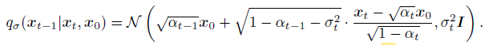
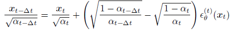
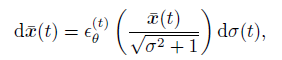

# Denoising Diffusion Implicit Models
这篇笔记是在上一篇DDPM的基础上写的, 如果哪里不明白可以先参考上一篇DDPM的笔记.
## 1. Introduction
DDPM模型可以生成高质量的结果,但是DDPM一个很大的缺点就是需要大量的采样步数才能得到一张图像. 但是相比之下GAN就能很快的得到大量的结果,因为GAN只需要运行一次生成器就能得到结果, 而DDPM则需要运行几百次甚至数千次. 比如,在2080Ti GPU上,生成50000张32x32的图像,DDPM需要20小时,但是GAN只用1min. 如果要生成更大的图像, 比如50000张256x256的图像,DDPM需要1000小时.  

本文中,作者指出DDPM采样速度慢的关键原因就是DDPM的反向生成过程(generative process)的Markov Chain是在近似前向过程(diffusion/inference process)的Markov Chain, 而前向过程有大量的步数. 那么如果前向diffusion process不是Markov Chain是不是就可以减少反向采样的步数了呢?  

DDIM正是采用了这样的思路. 作者指出DDIM优于DDPM主要有三个方面:  
1. DDIM在牺牲很小的采样质量的情况下,可以加速DDPM采样速度10倍到100倍,也就是原来1000步的DDPM现在只用10步到100步就能得到接近的采样质量.
2. consistency. 也就是说从同一个 $x_T$ 采样得到的结果会有相似的语义特征, 而DDPM只是同一个 $x_T$ 的话, 采样得到的结果完全不同.
3. 正是由于consistency, DDIM可以对 $x_T$ 进行插值来控制得到的结果的语义变化, 类似于StyleGAN的隐空间插值.

## 2. Non-Markovian Forward process
作者指出DDPM的反向生成过程是在近似前向的推断过程,而前向过程因为是markovian的,所以需要大量的步骤. 那么怎么变成Non-Markovian呢?  
回头先看一下DDPM约束的目标:

  

DDPM前向过程虽然基于Markov Chain的, 即 $q(x_{1:T} | x_0) = \prod_{t=1}^T q(x_t | x_{t-1})$ 但是实际在训练模型的时候, 实际用到的是变形之后的, 也就是 $q(x_{1:T} | x_0) = q(x_T | x_0) \prod_{t=2}^T q(x_{t-1} | x_t, x_0)$ . 那么从这个实际用到的分布出发, 那么除了Markov Chain之外, 还有其它的分布也能表示成这种形式.  

为了给DDPM加速采样,那么就要保证训练好的DDPM模型不改变,而只是对采样的过程做加速. 现在考虑一族分布Q,满足如下的条件:  
1. 条件一
$$
  q_{\sigma}(x_{1:T} | x_0) = q_{\sigma} \prod_{t=2}^T q_{\sigma}(x_{t-1} | x_t, x_0)
$$
这个条件就是DDPM实际训练时候所用到的分布. 为了与DDPM训练过程完全一致, 还需要有以下两个条件:  

2. 条件二
$$
  q_{\sigma}(x_T | x_0) = N(\sqrt{\alpha_T} x_0, (1-\alpha_T)I)
$$

3. 条件三

那么在满足上面三个条件时, 训练的过程就能和DDPM完全一样, 也就可以用已经训练好的DDPM模型.  

## 3. 加速采样
那么满足这三个条件怎么加速采样的过程呢?
着重来看条件二和三,

简而言之, 只要第t步的分布 $q(x_t | x_0)$ 满足条件二, 且任意的 $\tau \lt t$ 满足条件三, 都有第 $t-\tau$步的分布 $q(x_{t-\tau} | x_0)$ 满足条件二. 这是一个很好地性质, 也是DDIM可以减少采样步数的关键, 有了这个性质, 可以设置任意长度的采样步数.  

这样就可以得到采样的过程:

关于方差 $\sigma$ 的取值, 作者令:

当 $\eta = 1$ 时, 采样的过程就是DDPM的采样过程.  

## 4. 与Neural ODE的联系
上一部分, DDIM可以加速采样, 而且作者指出, DDIM可以设置任意长度的采样步数, 那么当采样步数为无限长的时候, 就可以近似看作是连续的采样过程. 那么就可以写作ODE的形式.  

  

  

## 5. 实验结果
作者尝试了不同的 $\eta$ 和采样步数的组合, 得到的结论是, DDIM可以在20到100步内, 采样出与DDPM 1000步相同质量的结果. 尽管DDPM也可以在100步得到reasonable的结果, 但是DDIM可以用更少的步数得到同样质量的结果.  

此外,作者还对DDIM进行了插值的实验,来验证consistency:

