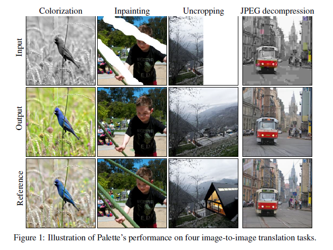
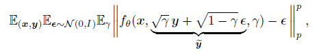

# Palette: Image-to-Image Diffusion Models

本文是Conditional Diffusion的应用, 作者提出了基于Conditional Diffusion的 Image-to-Image新的baseline. 本文偏向于应用, 在理论上的创新性并不大.  

## 1. Introduction
本文作者的工作主要有三个部分:
1. 提出了基于Conditional Diffusion的Image-to-Image baseline  
2. 探究了训练Diffusion时, L1和L2损失, 以及self-attention层的作用  
3. 在四个任务, Colorization, Inpainting, Uncropping, JPEG decompression测试了新的baseline, 并使用了Frechet Inception Distance(FID), Inception Score(IS), Classification Accuracy(CA) of a pretrained ResNet-50 classifier, Perceptual Distance(PD) 四个指标来评测模型性能.  

## 2. Conditional Diffusion
本文在理论方面并没有多少创新性, 做法也比较简单. Diffusion模型中的Unet输入是第t步的结果和对应步的噪声参数, 而Conditional Diffusion只是在输入中加入了条件信息x, 而处理的方法就是将加入的条件x与原来的输入concatenate起来.  

而损失函数形式与Diffusion唯一的区别就在于输入多了个条件信息x.  

作者做出的改进主要是对DDPM的Unet做了改进, 这个部分本文没有给出源码, 具体做了什么不甚了解.  

## 3. 实验结果
作者在四个任务上测试了四种指标, 详细实验内容请参考原文.  
值得一提的是, 作者测试了L1和L2损失对实验结果的影响.  

得出的结论是: L1和L2损失得到结果的采样质量相似, 但是L2得到的结果会有更高的多样性, 而L1损失的结果则相对保守.  

这里有一个实验细节, 也就是说作者在训练时, 前向过程的一系列噪声参数用的是(1e-6, 0.01) 2000步, 而采样过程则用的是(1e-4, 0.09) 1000步. 这个细节可以看出, 训练和采样可以有不同的步数, 不同的参数, 这是个之前没见过的发现.  
