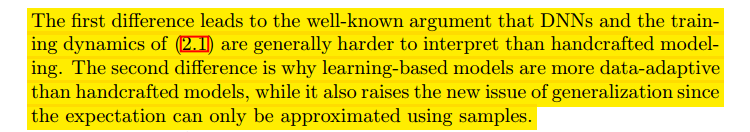

# A Note on Machine Learning Approach for Computational Imaging

本文主要介绍用于计算成像(Computational Imaging)的机器学习方法的一些最新发展, 并讨论其与数学方法的区别和联系. 同时展示了作者如何结合两种方法的智慧, 讨论这种结合的优点和潜力, 并介绍它带来的一些新的计算和理论的挑战.  

## 1.Introduction
 术语 "计算成像"(Computational Imaging) 通常是指通过计算从测量中形成图像的过程.(the process of forming images from measurements via computations). 它包含两个重要的步骤: 第一步使用探测器或电磁束进行传感或扫描,  第二步使用数值算法重建图像. 本文作者扩展了计算成像的定义, 让它也包括图像分析(Image Analysis).

 于是计算成像就包含了三个部分:

 第一部分传感(Sensing)是计算成像最基础的步骤, 这一步硬件的设计是研究的中心问题, 主要由采样的理论和算法支撑. 其主要目标是有效地获取成像对象的高质量测量值.  

第二部分是图像重建(Image Reconstruction), 其主要目标是从上一步获得的测量值中重建出高质量的图像. 这一步在之前的几十年主要靠数学方法实现, 现在有了深度学习的方法.  

第三部分是图像分析(Image Analysis), 其中数学和统计模型都发挥了重要作用, 图像分析的主要目的是从图像中提取有意义的信息以协助人类决策.  

尽管数学和统计模型在计算成像中取得了成功, 但是它们也面临着许多挑战.
1. 在Sensing过程中, 根据压缩感知的理论, 随机采样是一种很好的选择, 但是只有一部分的图像模态比如核磁共振成像, 满足这种理论的假设条件. 此外在没有考虑压缩感知理论的情况下, 应该有更好的感知机制来适应每一种主题. 一个好的自适应传感机制需要为每一个给定的成像对象决定要进行哪些测量以最大化特定的质量度量.  
2. 在图像重建过程中, 现有的模型和算法依赖于人类知道的先验的知识. 虽然我们知道对于每个模型, 哪类图像最适合, 但是对于一个给定的自然图像的集合, 很难手动的确定一个最适合的模型.  
3. 对于图像分析, 最终目标是提取相关的图像特征以方便决策. 在深度学习出现之前, 这些特征是手动给出的, 可能无法很好地适应数据集或底层图像分析任务.  

这些限制计算成像进一步发展的挑战可以用数学术语重新表述为逼近高维 (HD) 非线性函数的挑战，我们对其知之甚少或一无所知，这主要是由于众所周知的维数灾难. 现在，深度学习在不同程度上克服了这一挑战.

## 2. Improving Image Reconstruction with Deep Learning
一种典型的learning-based image Reconstruction可以表示为:

基于学习的方法和手动建模的方法之间的主要区别在与两个方面:

后边的内容了解的不多, 暂时先这样. 先看看相关领域的内容再回头看这部分.  
