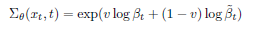
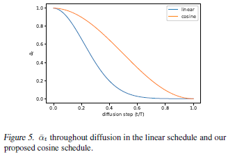
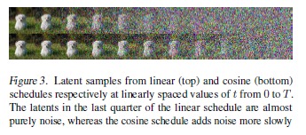
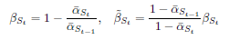

# Improved Denoising Diffusion Probabilistic Models

## 1. Introduction
本文主要是对DDPM的改进，作者指出通过一些简单的修改，DDPM可以在保持高样本质量的同时实现有竞争力的对数似然。此外，作者还指出，DDPM反向过程的方差是固定的，而如果反向扩散过程的方差也是学习的得到的话，可以以更少的数量级的采样步来进行采样， 而样本质量的差异可以忽略不计。

DDPM的内容不再赘述，直接看本文的贡献。

## 2. Improving the Log-likelihood
Diffusion模型的理论基础来自于极大似然估计和变分推断。不了解这部分内容的话可以参考[生成模型笔记](https://blog.csdn.net/D_Trump/article/details/125776944)。评价这种基于似然的生成模型的一个重要的指标就是 Log-likelihood ，简单的可以理解成生成的结果与真实数据像“像不像”。这种“像”也包含了模型的mode，GAN网络常被人诟病的一个地方就是mode collapse，也就是对于所有的输入的随机噪声，生成的结果都是一个。所以mode也包含了结果的多样性。

在DDPM中，作者指出虽然DDPM生成的结果在FID和IS指标上很好，但是在Log-likelihood上并不是很出色，而这种Log-likelihood对生成样本的质量有着很大的影响。

### 2.1 学习采样过程的方差
在DDPM中，反向采样过程的方差是固定的，DDPM的作者分别尝试了方差为 $\beta_t$ 和 $\tilde{\beta}_t$ 两种固定的方差，得到的采样质量几乎是一样的。于是本文的作者思考这两个方差能够的得到相近的效果的原因。作者认为，这两个方差的值可以看作是两个opposite extremes，我们可以理解为是上下界。理由如图所示：

从图中可以看出，$\beta_t$ 和 $\tilde{\beta}_t$ 只有在采样的最初几步，也就是 t 接近 0 的时候相差较大，其余的时候，两者几乎是一样的。而且，随着采样步数的增大，这些几乎相同的步数会更多。从这里可以得出结论，当采样步数趋向于无穷的时候，均值对于分布的影响要比方差更大。（虽然事实确实是这样，但是说是从这图中得出的多少有些逻辑不够严密。）

那么这个方差跟Log-likelihood有什么联系呢？看下图：

作者指出，对于DDPM而言，采样过程最初的几步对于优化变分下界的作用最重要。视觉效果上就表现在，如果把DDPM采样过程每一步直接计算得到的结果 $x_0$ 输出出来的话，会发现最开始50步左右的采样基本上就可以得到比较好的 $x_0$，当然实际采样过程是每一步得到 $x_t$ 。而 $\beta_t$ 和 $\tilde{\beta}_t$ 在最开始的几步的时候，相差是很大的。那么直观的想法就是假设最优的方差是这两个固定方差的线性组合，然后用网络去学习到这个线性组合的系数。

同时在优化目标中，除了DDPM简化的优化目标外，加入对于变分下界的约束。当然，因为均值对最终采样结果的影响更大，变分下界的损失不能对于DDPM中的损失的效果有太大影响。于是作者给变分下界的损失乘上一个 $\lambda = 0.001$

### 2.2 Improving the Noise Schedule
作者指出DDPM用的线性的Noise Schedule，也就是前向过程的 $\beta_t$ 是线性的。这样的设计在高分辨率的图像上效果比较好，但是在较低的分辨率上前向过程就会 too noisy，比如在 $64 \times 64$ 和 $32 \times 32$ 上效果就会不太好。于是作者设计了一种新的Cosine Noise Schedule，这种方法现在已经在很多基于DDPM的方法中得到了广泛的应用：

视觉效果上：

## 3. Improving Sampling Speed
这个部分类似于DDIM，但又有些不同。效果不如DDIM，姑且看一下就好。

## 4. 总结
这篇文章没有太精细的读，只是看了感兴趣的部分。总体来讲，本文用的最多的是Cosine Noise Schedule。
