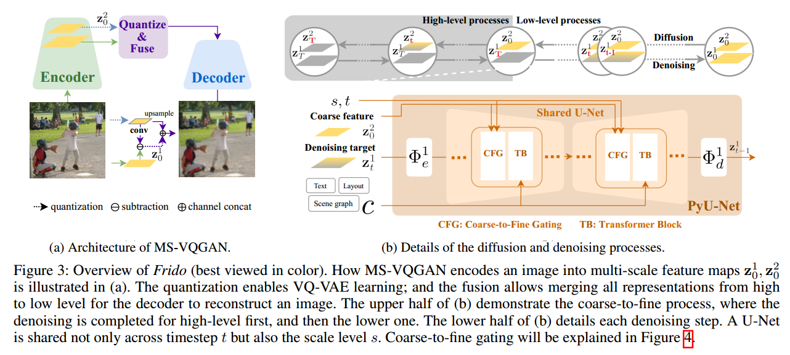
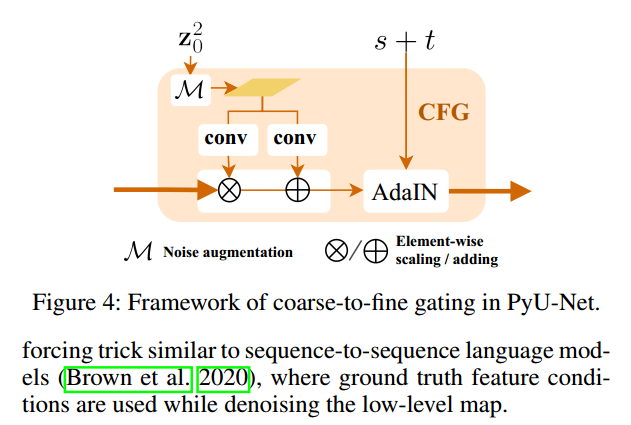

# Frido: Feature Pyramid Diffusion for Complex Scene Image Synthesis

## 1. Introduction
本文提出了一种Feature Pyramid Diffusion model(Frido). Frido将输入的图像分解成尺度独立的量化的feature, 然后通过coarse-to-fine gating来得到输出的结果. 简单来说, 作者首先利用多尺度的MS-VQGAN(Multi-Scale VQGAN), 将输入图像编码到隐空间, 然后用Frido在隐空间做diffusion.  

作者的主要贡献:
* 作者提出了Frido, 一种多尺度的隐空间的diffusion
* 作者尝试了不同的实验, 包括layout-to-image, scene-graph-to-image, label-to-image, 在不同数据集上有5个SOTA
* Frido采样会更快.

## 2. Methodology
### 2.1 MS-VQGAN
MS-VQGAN的encoder将输入图像编码为N个尺度的隐变量, 类似于图像金字塔, 不过是在隐空间. 低层的隐变量保持lower-level visual details, 而高层的隐变量则保持 high-level shape and structures. 然后decoder将得到的所有尺度的隐变量解码为输出图像. 这种隐变量的金字塔的规模也是随着层数递减, 每层为上层的1/2.

这样就可以既保持高层的语义信息, 又能保持底层的更多细节.

### 2.2 Feature Pyramid Latent Diffusion Model
接下来是在隐空间的diffusion模型.

#### diffusion process
之前的方法都是直接在所有的隐变量上实现diffusion模型, 但是本文的方法包含了多个尺度. 于是作者在不同的尺度上分别顺序的做diffusion, 每个尺度T步, 就需要 $N \times T$步. 于是前向加入噪声的diffusion操作, 先是破坏图像的细节, 然后是高层的shape, 最后是整个图像的structure.

#### Denoising process
相应的Denoising的过程就是从高层逐渐到低层的过程.  

作者在之前的U-Net基础上,提出了一种feature pyramid U-Net(PyU-Net)来实现在多尺度上的去噪过程. 这种PyU-Net的两个创新点:
* 通过给每个尺度加入一个轻量级的网络, 将每层的隐变量映射到相同的维度上, 从而能统一作为U-Net的输入. 相应的自然也需要对U-Net的输入加入一个轻量的网络来重新映射回当前尺度信息的维度上去.
* 加入了coarse-to-fine gating从而使得低层的denoise能够利用已有的高层的信息.

#### PyU-Net
以只有两个尺度的情况为例:  
PyU-Net的输入包含四个部分:
* 当前的尺度等级 s 和步数 t 的 embedding
* 已经生成好的高尺度的条件信息 $z_0^2$
* 当前尺度,当前步的信息 $z_t^1$
* 其它跨模态的条件信息

于是输入的当前尺度信息 $z_t^1$ 加噪后, 首先经过轻量映射网络(类似于一个encoder) $\Phi_e^1$ 得到UNet输入, 然后UNet输出的内容经过映射网络 $\Phi_d^1$ (类似于一个decoder), 得到加入的噪声和预测的 $\hat{z}_t^1$

作者这里为了更有效的训练, 用到了一种 teacher forcing trick (这个东西目前不太了解, 之后需要看看相关的文章)

#### coarse-to-fine gating(CFG)
加入CFG有两个目的:
* 与teacher forcing一起保持训练的efficiency, 同时能防止过拟合
* 让UNet能够获得当前尺度等级和时间步的信息.

高层的ground truth信息 $z_0^2$, 通过noise augmentation(就是与噪声做个线性叠加 $M = \alpha z + (1-\alpha)\epsilon$), 然后通过两个卷积层, 分别做scaling和shifting, 之后与embedding之后的尺度和步数信息进行 AdaIN.

## 3. 实验结果
作者在COCO, VisualGENOME, OpenImages等数据集上做了layout-to-image, scene-graph-to-image, label-to-image的实验, 刷了5个SOTA

更多实验结果参考原文. 
