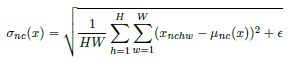
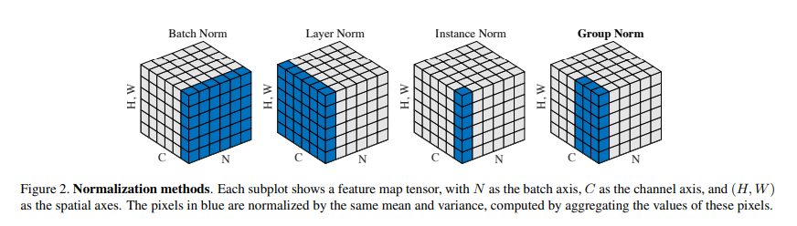

# Arbitrary Style Transfer in Real-time with Adaptive Instance Normalization

这篇笔记总结一下各种Normalization，不仅是AdaIN

## 1. Batch Normalization（BN）
对于输入数据 $x \in R^{N \times C \times H \times W}$, BN对于每一个独立的特征维度的均值和方差进行归一化。

其中 $\gamma,\beta \in R^C$ 是学习到的仿射参数，$\mu(x),\sigma(x) \in R^C$ 是数据的均值和方差。

BN在训练的时候对batch的大小要求比较高，一般需要较大的batch。而在inference的时候，需要用训练时每个batch的均值和方差（mini-batch statistics），再求期望作为推断时用到的均值和方差（popular statistics）。

## 2. Instance Normalization（IN）
IN与BN的主要区别在于均值和方差只在每个Instance内求得，而不在整个batch内求。

## 3. Conditional Instance Normalization（CIN）
CIN在IN的基础上加入了条件，其 $\gamma$ 和 $\beta$ 不再是只学习到一个，而是根据增加的条件输入不同，得到 $s$ 组不同的值，对应于不同风格的输入。

## 4. Adaptive Instance Normalization（AdaIN）
AdaIN不再通过学习得到 $\gamma$, $\beta$ 而是用输入的条件数据 $y$ 来替代。

## 5. Layer Normalization（LN）
与BN的区别在于，BN是在Batch维度做的归一化，而LN则是在Layer上。
$$
LN(x) = \gamma \frac{x-\mu(x)}{\sigma(x)} + \beta \\
\mu_n(x) = \frac{1}{HWC} \sum_{n=1}^H\sum_{n=1}^W\sum_{n=1}^C x_{nchw} \\
\sigma_n(x) = \sqrt{\frac{1}{HWC} \sum_{n=1}^H\sum_{n=1}^W\sum_{n=1}^C (x_{nchw} - \mu_n(x))^2 + \epsilon}
$$

## 6. Group Normalization(GN)
GN与LN的区别在于，LN在所有的特征维度C上做归一化，但是GN则是在部分维度上做归一化。

