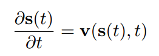
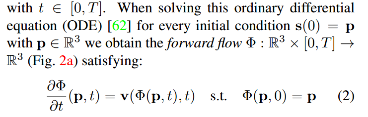
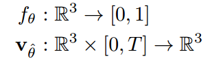
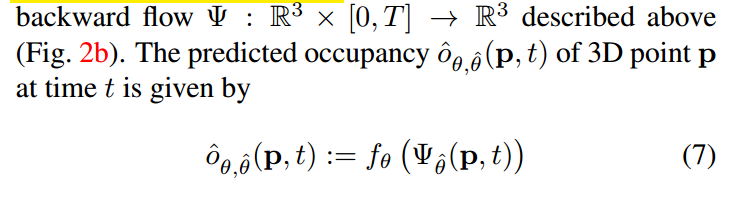
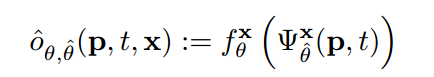
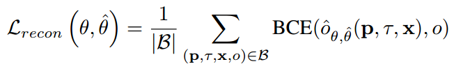
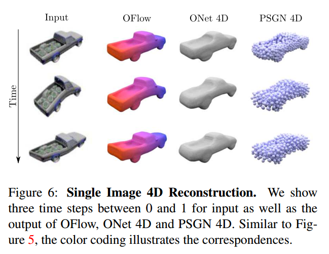

# Occupancy Flow: 4D Reconstruction by Learning Particle Dynamics(ICCV2019)
本文提出了一种利用Occupancy Flow，一种具有隐式对应的时变 3D 几何的新颖时空表示。

## 1. Introduction
本文的主要贡献：  
本文提出了一种新的对于连续4D空间的表示，可以隐式的建模4D数据的correspondence。更具体的，本文用一个向量场给每一个4D时空间的点赋予一个表示移动的3D向量。按照这种思路，作者结合了Occupancy Network（ONet），利用ONet来表示3D的几何模型，之后给每一个点赋予一个移动向量，最后利用常微分方程来建模几何模型的连续的运动过程，整个过程称作Occupancy Flow（OFlow）。这种作者提出的方法不仅在空间和时间上是连续的，而且还隐含地提供了空间中每个点的对应关系，因此 OFlow 可以看作是场景流的连续泛化。

## 2. Methodology

### 2.1 Occupancy Flow
连续的4D空间的表示可以看作是3D物体随时间的移动。那么需要解决两个问题，第一个是如何表示3D物体，第二个是如何表示3D物体随时间的移动。对于第一个问题，本文用了Occupancy Network来连续的表示3D物体。对于第二个问题，本文用常微分方程来建模3D物体中点的移动过程。

#### Occupancy Network
首先是3D物体的表示，本文用的是Occupancy Network。具体做法是，对于 $t=0$ 的时刻的物体，训练一个网络 $f_{\theta}：R^3 \to {0,1}$ ，也就是说这个网络对于给定的点，输出的值称作occupancy value，再根据Occupancy value判断该点是否在物体内。

#### velocity field
在给定了3D物体的表示方式后，作者用速度矢量场来表示3D物体的随时间移动的过程。

定义 $s: [0,T] \to R^3$ 为 3D 空间中点随时间变化的轨迹。$s(0)$ 和 $s(T)$ 分别表示初始和终止的位置。那么对于任意一个点，将其位置变化对时间求偏导数就可以得到每个点的速度矢量 $v: R^3 \times [0,T] \to R^3$:

利用求解常微分方程（ODE）的方式求解上式，就相当于是在给定ODE初值的条件下求解ODE，于是可以得到前向的ODE表示，称作forward flow：

用求积分的方式就可以在给定初始位置的情况下得到任意时刻的位置：

与给定初始位置的forward flow相对应的，有给定终止位置的backward flow：

#### Occupancy Flow
结合以上两部分的内容，就可以得到本文的Occupancy Flow

包含两个部分，一个是用来建模 $t=0$ 时刻物体表示的 Occupancy Network $f_{\theta}$ 以及建模物体运动的velocity network $v_{\hat{\theta}}$。那么现在就有两个问题了，第一个问题 $f_{\theta}$ 只是对于 $t=0$ 时刻物体表示，物体运动之后，其他时刻就不能用这个 $f_{\theta}$ 表示了，那么这些非零时刻的物体怎么表示？第二个问题是上述的两个网络怎么训练？这两个问题是紧密相关的。后边会给出解决方法。

### 2.2 Training
这个部分给出作者如何训练Occupancy Flow。归结起来，利用occupancy重建4D的过程就是需要给出每个时刻t的每个空间点的occupancy value从而判断其是否在模型中。那么首先要解决的就是对于任意时刻的任意点如何通过网络预测其occupancy value。

#### predict occupancy value
对于任意一个非零时刻t的点p的空间坐标，利用反向的ODE，也就是backward flow，求出其对应的零时刻的坐标，然后利用零时刻的Occupancy network得到该点的occupancy value。这就解决了之前提出的第一个问题。

有些情况下，在重建4D的过程中可以有额外的条件输入 $x$，那么就可以把条件加入到Occupancy network和velocity field中，也就得到：

#### loss function
现在可以用occupancy network和velocity network两个网络得到任意时刻任意点的occupancy value，那么一个很直接的loss就是预测值与真值的loss，这里作者用了两者之间的binary cross-entropy error（BCE），对于任意时刻 $\tau$ 的任意位置 $p$，一个mini-batch的数据，

同时，为了增加模型的时间相关性，可以引入相关性的loss，也就是利用forward flow，约束初始时刻 $t=0$ 的点经过ODE计算得到的 $t=\tau$ 时刻对应的点和实际的点的坐标要一致。

整体的训练过程就可以表示为下图所示：

相应的Inference采样过程，就可以在给定初始时刻的表示的情况下，用ODE求解之后的位置。

## 3. Experiments
这篇文章比较早，具体实验结果参考原文，这里只列出Occupancy Flow可以实现的功能

### 3.1 4D Point Cloud Completion

### 3.2 Reconstruction from Image Sequences
这个实验用single-view的图像序列作为条件信息输入。

### 3.3 Interpolation and Mesh Correspondence

## 4. Limitation
OFlow只能处理简单的场景，对于复杂场景并不能达到很好的效果。而且对于整个空间做ODE会有很多冗余信息，因为对于本文用的数据集中，比如人拳击的过程，很多部位是保持不动的。
