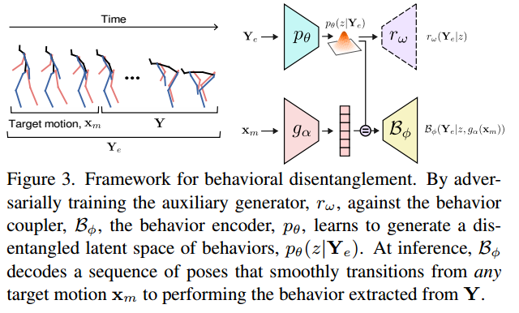
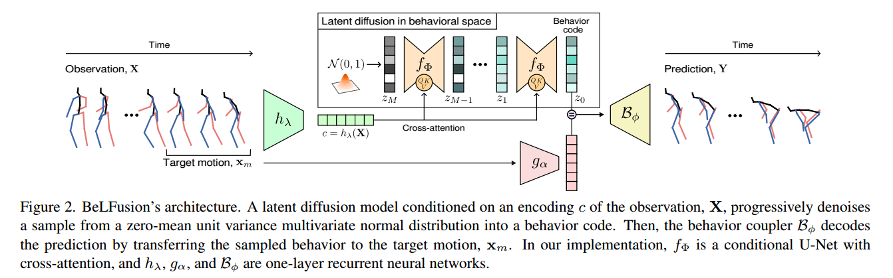

# BeLFusion: Latent Diffusion for Behavior-Driven Human Motion Prediction
本文关注的问题是human motion prediction（HMP），也就是在给定观测到的人体运动的前提下，预测人体的后续运动。本文的思路是，将人的behavior从motion中motion和pose中解耦出来，然后在给定观测到的人体behavior的条件下，利用conditional latent diffusion，预测之后的behavior，结合motion和pose从而实现Stochastic human motion prediction（HMP）

## 1. Introduction
已有方法的缺点：
1. 已有的方法利用分散骨骼关节来预测高度多样化的运动，这导致了这些方法在预测快速和多样化的运动的时候，预测的结果并不现实，并且与已经观测到的运动不一致。
2. 已有的方法还忽略了需要预测具有细微关节位移的各种小范围的动作和行为。

本文的贡献：
1. 本文提出了BeLFusion（Behavior Latent Diffusion），与之前的工作相比，可以生成更加真实和连贯的人体行动预测，同时达到SOTA的准确率。
2. BeLFusion是在behavior层面应用了Latent Diffusion从而具有behavioral diversity。这样可以同时支持小范围和大范围的运动。
3. 本文扩展了对于Stochastic HMP的评测。并且提出了一些新的指标。

## 2.Methodology

### 2.1 Problem definition

### 2.2 Behavioral Latent Diffusion
首先需要从人体的motion中解耦出Behavior的隐编码。

定义Observation window X中最后C个pose为target motion $x_m = \lbrace p_{t-C}, ..., p_{t-2}, p_{t-1} \rbrace \subset X$，这C个pose给出了人体移动的速度和方向，而预测出来的Prediction window中的人体的移动速度和方向需要与之保持一致。定义 $Y_e = x_m \cup Y$。  

为了将Y中的behavior从motion和pose中解耦出来，本文用了一种对抗的思路。

如图中， $Y_e$ 经过behavior encoder $p_{\theta}$ 得到隐式编码 $z$ ，再由auxiliary decoder $r_{\omega}$ 重建出 $Y_e$。这部分可以看做是一个VAE，不同之处在于只训练解码器$r_{\omega}$部分。

接下来为了能让隐式编码 $z$ 中只包含有behavior相关的信息，作者利用另一个编码器 $g_{\alpha}$ $x_m$ 编码出速度和方向等信息，与behavior隐编码 $z$ 一起，经过behavior coupler $B_{\phi}$，得到输出重建的 $Y_e$。

以上两个损失在一个iteration内交替使用一次，分别在固定网络 $\alpha, \theta, \phi$ 参数的情况下，利用 $L_{aux}$ 训练网络 $\omega$ ， 以及在固定 $\omega$ 参数的情况下，利用 $L_{main}$ 训练 $\alpha, \theta, \phi$ 的参数。

得到了产生隐编码 $z$ 的编码器 $p_{\theta}$ 之后，就可以用conditional latent diffusion来预测人体的behavior。

本文主要感兴趣的就是这个解耦的部分，后边的有需要再看。
