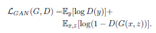
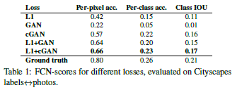

# Image-to-Image Transation with Conditional Adversarial Networks

这篇文章一般被称作Pixel2Pixel, 本文提出了一种Conditional GAN(cGAN)来作为image-to-image Translation任务的framework. 不同于传统的GAN的Generator输入只有噪声, cGAN的输入除了噪声还有条件图像x, 而在优化目标方面每个条件图像x都有与之对应的ground_truth图像可以用来约束输出.    

Image-to-Image Translation任务, 比如真实图到语义图的语义分割, 灰度图到彩色图的着色任务等等

  

## 1. Introduction
在图像处理, 计算机图形学, 计算机视觉等诸多领域, 很多任务都可以被视作是image-to-image Translation的任务. 如果只是用简单的欧氏距离, 也就是常用的L1或者L2的损失优化CNN来实现image-to-image Translation的任务, 通常会得到比较模糊的结果, 这是因为优化欧氏距离一般要最小化所有输出的平均值, 但是欧氏距离在学习低频的信息上有比较好的效果, 所以作者的基本思路就是通过GAN损失来学习高频的信息, 同时加入L1的损失来学习低频信息.  
本文的主要有两个主要的贡献, 第一个是提出了一种可以基于条件输入, 给出相应输出的Conditional GAN, 并且证明在很多问题上可以有比较好的结果. 第二个是基于Conditional GAN的框架应用于不同的Image-to-Image Translation问题.  

## 2. Conditional GAN(cGAN)
### 2.1 网络结构
GAN网络包含两个部分, Generator和Discriminator.  
本文的Generator采用了Unet结构, 并加入了skip connection.  

  

之前的很多网络都采用了Encoder-Decoder的结构, 也就是通过一系列Encoder层, 将输入图像不断降采样直到bottleneck, 然后再通过Decoder层不断上采样得到输出. 在这样的网络结构中, 图像的信息会串行的通过所有的层. 但是对于image Translation问题, 许多low-level的信息在输出图像中要和输入图像保持大概的相似, 比如对于着色任务, 图像的所有的边缘信息是需要完全保留下来的, 那么直接将这些信息从Encoder层传到对应的Decoder层会更好一些. 所以作者采用了一种skip connection将Encoder的结果直接传送到相应的Decoder然后concatenate起来.  

Discriminator采用了PatchGAN Discriminator结构.  
作者希望通过GAN损失来约束高频的信息, 所以作者设计了这种PatchGAN从而只约束patch级别的结构信息. PatchGAN Discriminator将图像分成NxN个patch, 然后判断每个patch的真假.  

### 2.2 优化目标
优化的目标包含两个部分, 第一个部分是GAN的损失, 用来约束高频的信息, 第二个部分是输出图像与输入条件x对应的Ground_truth图像的L1损失, 用来约束低频的信息.  

  

第二部分的L1损失如下所示, 形式很简单不再赘述

  

第一部分的GAN损失, 作者测试了两种形式, 第一种的Discriminator的输入中不包含条件图像x, 作者将其称作GAN损失  

  

第二种的Discriminator的输入中包含了条件图像x, 这种作者将其称作cGAN损失  

  

作者指出, 第二种加入了条件图像x的损失, 达到的效果要比第一种好.  

## 3. 实验结果
首先是不同的损失得到的结果

  

  

可以看出L1和cGAN损失得到的效果最好

作者还测试了Encoder-Decoder结构的生成器与skip connection Unet的生成器的效果  

更多的实验结果请参考原文.  
