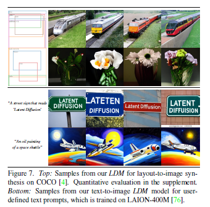

# High-Resolution Image Synthesis with Latent Diffusion Models

## 1. Introduction
本文提出了在隐空间应用diffusion model(DM), 称为Latent Diffusion Models(LDM)

主要做法是在VQGAN增强版做diffusion。

在隐空间的好处是既能保持较高的生成质量又能减少计算的资源消耗。

本文的主要贡献：  
* 比VQGAN重建的效果更好，而且可以更有效地应用到高分辨率的生成。
* LDE在不同的任务上有着比较好的表现。包括（unconditional image synthesis，inpainting，super-resolution）。而且比在像素空间的diffusion，采样的代价要更低。
* 相比于之前在隐空间的方法，LDE不需要对隐空间做太多的正则化，而且可以有高保真的重建效果。
* 可以以卷积的方式应用于多种条件生成任务。
* 实现了一种基于cross-attention的条件机制，可以应用于多模态的训练。

## 2. Method
### 2.1 Perceptual Image Compression
其实也就是模型的第一个阶段，将原始图像编码到隐空间，也就是一种压缩。为了避免隐空间方差过大，作者采用了两种改进的方式，第一种是加入了KL散度的约束作为正则化，类似于VAE，要求隐变量与标准正态分布尽可能相似。第二种是加入了VQ的正则化，类似于VQGAN。

### 2.2 Latent Diffusion Models
这个部分原理上与Diffusion没有本质的区别。只是在实现上对UNet进行了一些改动。

### 2.3 Conditional Mechanisms
对于多模态的条件输入，先用一个编码器 $\tau_{\theta}$ 将条件信息 $y$ 比如文本，编码为中间的表示 $\tau_{\theta}(y)$ 然后与UNet的输出一起作cross-attention

## 3. 实验结果
首先尽管VQ正则化的重建效果比KL正则化略差，但是加入LDM之后采样的质量却是VQ正则化的要更高。
然后作者分别在text-to-image，layout-to-image，semantic-to-image，super-resolution都能达到比较好的效果。

