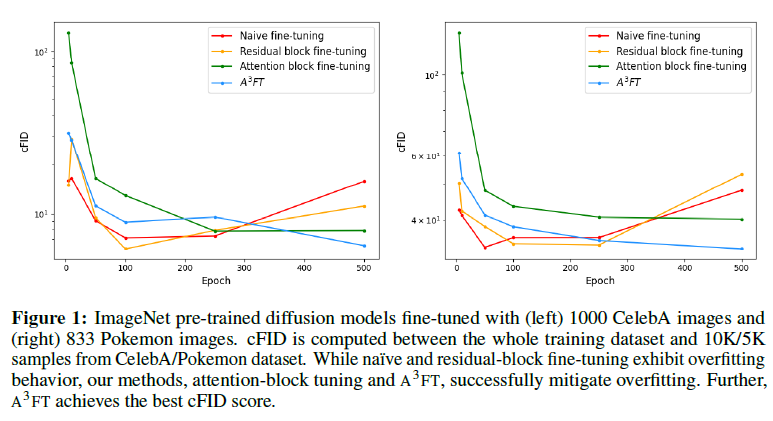
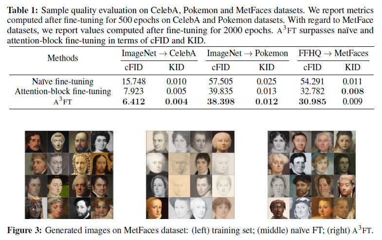

# Fine-tuning Diffusion Models with Limited Data

## 1. Introduction
从头训练一个Diffusion模型需要大量的数据和训练时间，而现有的基于预训练好的diffusion进行fine-tune的方法在小数据集上很容易overfit。本文提出了一种微调Diffusion模型来用于小数据集的方法，这种方法的主要思路是只微调U-Net中的attention部分，并结合本文提出的adapter来进行微调，称为Adapter-Augmented Attention Fine-tuning（$A^3FT$)。

## 2. Methodology

### 2.1 Naive fine-tuning

作者首先尝试了直接在小数据集上微调预训练好的Diffusion。可以看出naive fine-tuning在训练的初期就会过拟合。并且生成结果的质量和多样性也会受到很大影响。

### 2.2 Attention block fine-tuning

现有的大部分Diffusion模型都用了U-Net结构。根据前人对基于Transformer的文本模型等的微调工作的经验，作者提出只微调U-Net中的attention blocks，而residual blocks的参数则保持不变。这样微调的attention参数量只占模型总参数量的10.3%。

### 2.3 Time-aware adapter

同样是根据前人的经验，本文设计了adapter module来进一步提高微调的质量。adapter位于attention和其后的线性层之间。adapter包含两个部分。

#### Time-fusion module
结构如图所示，这部分需要额外引入1.7M参数量，约占预训练模型的 1.4%

#### Time-scaling module
结构如图所示，这部分需要额外引入0.5M参数量，约占预训练模型的 0.4%

### 2.4 Adapter-augmented attention fine-tuning
结合2.2和2.3的内容，作者提出了 $A^3FT$，不仅可以避免过拟合，还可以加速收敛。

## 3. Experiments

