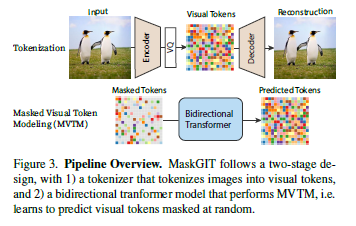
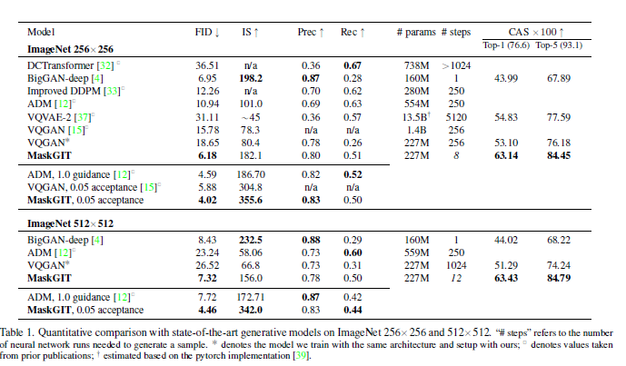
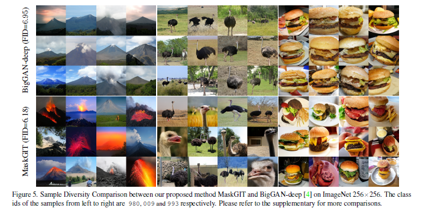
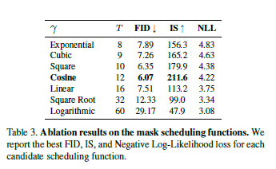
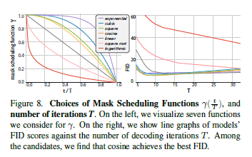

# MaskGIT: Masked Generative Image Transformer(CVPR2022)

## 1. Introduction
本文相当于是BERT向图像生成的迁移。传统的效果最好的Generative Transformer仍然把图像当做是token序列，然后从前到后逐行的生成图像的序列。作者认为这种方式并不是最优的而且效率也不高，于是提出了MaskGIT。在训练阶段MaskGIT通过使用双向Transformer学习预测randomly masked tokens。而在测试阶段，MaskGIT同时生成所有的token，然后多次迭代，根据已经预测的结果来修正。

## 2. Methodology

本文沿用了VQVAE使用的两个阶段生成图像的模型。第一阶段，称作tokenization，将图像压缩到离散的隐空间。第二阶段，利用深度模型来预测隐式地token序列，然后利用第一阶段的解码器将预测的token解码成图像。

本文的方法在于改进第二阶段的预测过程，因此第一阶段的编解码器作者直接采用了VQGAN模型。而在第二阶段用了本文提出的Masked Visual Token Modeling（MVTM）。

### 2.1 MVTM in Training
首先定义标识。$Y = [y_i]^N_{i=1}$ 表示输入图像经过VQ-encoder编码得到的隐式表示序列，N为序列长度。 $M=[m_i]^N_{i=1}$ 表示Mask序列，如果 $m_i=1$ 则当前位置的 $y_i$ 将被一个特殊的 $[MASK]$ 标识替代，否则保持不变。在训练阶段，每次从mask scheduling function $\gamma(r) \in (0,1]$ 随机采样出 $\gamma(r)$，然后在序列中随机取出 $\gamma(r) * N$ 个位置进行mask，得到 $Y_{\bar{M}}$，训练的目标则是最小化negative log-likelihood。

### 2.2 Iterative Decoding
MVTM的采样过程包含四个部分：
1. Predict。在给定当前迭代的masked token $Y_M^{(t)}$，利用模型预测被mask的位置的概率分布 $p^{(t)}$
2. Sample。利用上一步得到的概率分布，采样出每个Mask位置的token，并根据概率分布中该token的概率赋予其confidence值。对于没有mask的位置，confidence=1
3. Mask Schedule。每一次迭代被Mask的token个数由mask scheduling function $\gamma$ 决定。$n=\gamma(\frac{t}{T})N$。
4. Mask。在得到了所有mask位置的预测之后，需要挑选其中confidence较大的部分token取消mask，选取的个数为本次迭代的mask数减去下一次迭代的mask数，剩余的位置依然进行mask，转入下一次迭代。

本文设置迭代次数为8。

### 2.3 Masking Design
这部分主要说明mask scheduling function的设计。其实从上边的内容已经可以想到其需要满足的基本要求。
$\gamma(r)$ 必须是[0,1]上连续的单调减函数，且需要满足 $\gamma(0) \to 1$ ， $\gamma(1) \to 0$。

根据函数的凹凸性，作者尝试了三种设计：
1. 线性变化
2. 凸函数
3. 凹函数
后边会进一步介绍三种函数的实验结果。

## 3. Experiments

### 3.1 参数设置

### 3.2 Class-Conditional Image Synthesis

### 3.3 Image Editing Applications

### 3.4 Mask Schedule Function

作者尝试了不同的函数。cosine设计能达到比较好的结果。

