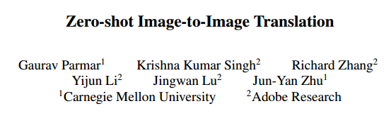
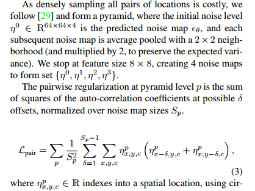

原文下载地址：[Arxiv 2023.02.06 Zero-shot Image-to-Image Translation](https://arxiv.org/abs/2302.03027)

## 1. Introduction
本文提出了一种基于diffusion模型的training-free promt-free的图像到图像的转换方法。用户只需要输入简单的从域倒域的编辑方向($cat \to dog$)，就能实现图像到图像的转换。

### Motivations & Arguments
1. 现有的text-to-image方法在编辑实际的图像时，存在两个问题。一个是对于真实世界的图像，用户很多时候并不能用合适的语言来描述。第二是现有的方法在编辑想要改变的地方的同时，也会对其他不需要编辑的内容造成改变。
2. 用户可能希望对一组不同的真实图像进行各种编辑。因此，对于每个图像和编辑类型微调大模型的成本太高了。

### Contributions
1. 本文提出了一种高效的，在只给定域到域的文本的情况下自动查找编辑方向的机制。大致的做法是用GPT-3生成大量的源域和目标域的文本，然后计算这些文本的CLIP embedding的平均值之差。这个过程只需要5s。
2. 为了不改变图像中无关的部分，本文提出了用cross-attention guidance。
3. 为了进一步提高结果质量和生成的速度，作者额外用了两个trick，一个是autocorrelation regularization（自相关正则化）和 Conditional GAN distillation。

## 2. Methodology
本文的方法基于LDM text-to-image，隐空间特征为 $64 \times 64 \times 4$

### 2.1 Inverting Real Images
为了编辑图像，首先要对其进行inversion，本文用的是DDIM deterministic inversion，但是作者指出DDIM inversion过程中的noise map并不能保证是服从标准正态分布的。一个高斯白噪声需要满足两个条件：
1. 任意两个位置之间没有关联
2. 均值为0，方差为1

因此本文对DDIM inversion过程网络预测的噪声加入了正则化。
首先是将预测的噪声降采样3次，得到不同尺度的feature，然后做pariwise正则化。(这部分没看的很明白)

之后加入了KL散度的约束，将二者组合得到最终的损失。

而正则化的做法就是用这个损失回传来对预测的 $\epsilon_{\theta}$ 进行修正。

### 2.2 Discovering Edit Directions
做法是用预训练好的GPT-3生成大量的句子，然后这些句子的CLIP embedding的差异的平均值作为edit direction $\triangle c_{edit}$。

### 2.3 Editing via Cross-Attention Guidance

 
