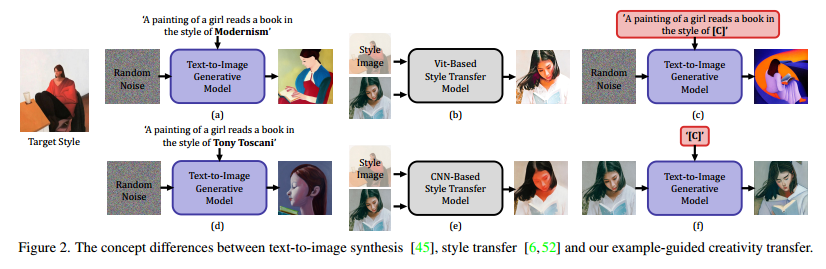
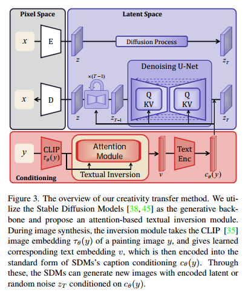
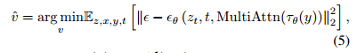
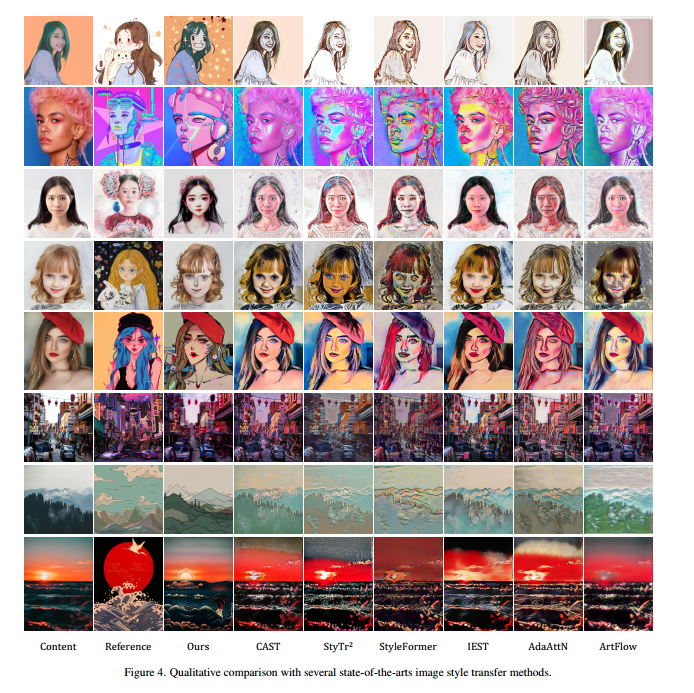

下载地址：[Arxiv 2022.11.23](https://arxiv.org/abs/2211.13203)
Code地址：https://github.com/zyxElsa/creativity-transfer

## 1. Introduction

### Motivations
1. 以前的任意示例引导的艺术图像生成方法（比如风格迁移）通常无法控制形状变化或传达语义元素。而预训练的text-to-image diffusion需要大量的文字描述才能准确描绘特定绘画的属性。
2. 本文的核心思想是从一幅画中学习艺术创造力，然后在不提供复杂的文字描述的情况下指导生成过程。

### Arguments

1. Style Transfer不能传递对象形状和语义元素等特定的创意属性。如图中的b，e
2. Text-guided Stylization从自然图像和文本提示中生成艺术图像，但是通常目标风格的文本提示只能是对材料的粗略描述。如图中a，d
3. Diffusion模型虽然可以生成高质量的结果，但是除了输入图像之外，如果我们想要再现一些生动的内容和风格，还需要详细的辅助文本输入来指导生成过程，这可能仍然难以在结果中再现特定绘画的创意

### Contributions
1. 本文提出了一种新任务：艺术创造力迁移的任务（Creativity Transfer）。给定一个单一的绘画图像，目标是通过使用自然图像或文本描述来控制内容，生成对其创作属性具有高保真度的新艺术图像。
2. 本文提出了一种基于注意力的单图像文本反转方法，可以快速准确地学习图像的整体语义和艺术技巧，从而捕捉绘画的完整创意。
3. 通过实验证明本文提出的创造性学习方法可以实现SOTA的性能和新颖的视觉效果

## 2. Methodology
主要思想是通过Textual Inversion将输入的艺术图像进行处理，得到其对应的包含了creativity的文本v，然后将v进行embedding后作为预训练好的Diffusion的条件输入。

### 2.1 Textual Inversion
做法是对于输入的条件图像y，利用CLIP image Encoder $\tau_{\theta}(y)$ 得到其对应的embedding，然后经过Attention后输出的v作为Diffusion要用的文本条件，经过Text encoder编码之后作为Diffusion的条件输入。

训练的目标则是Diffusion的目标

而在训练的时候，$\tau_{\theta}$ 和 $\epsilon_{\theta}$ 的参数是固定的。

### 2.2 Stochastic Inversion
本文指出，LDM生成图像的整体性由文本条件控制，而细节则有加入的噪声控制，因此本文固定了随机种子。

这个部分原文写的不太清楚，事实上本文我只给了两个S的一个重要原因就是文章好几个地方写的很不清楚，包括整体的训练和采样过程也没有详细给出。实验部分也是只有效果图，没有指标的比较。

## 3. Experiments

