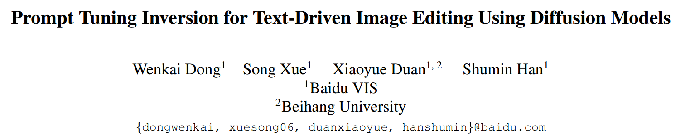
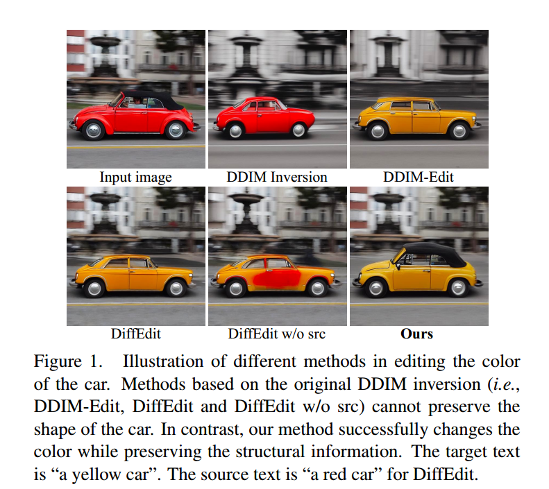
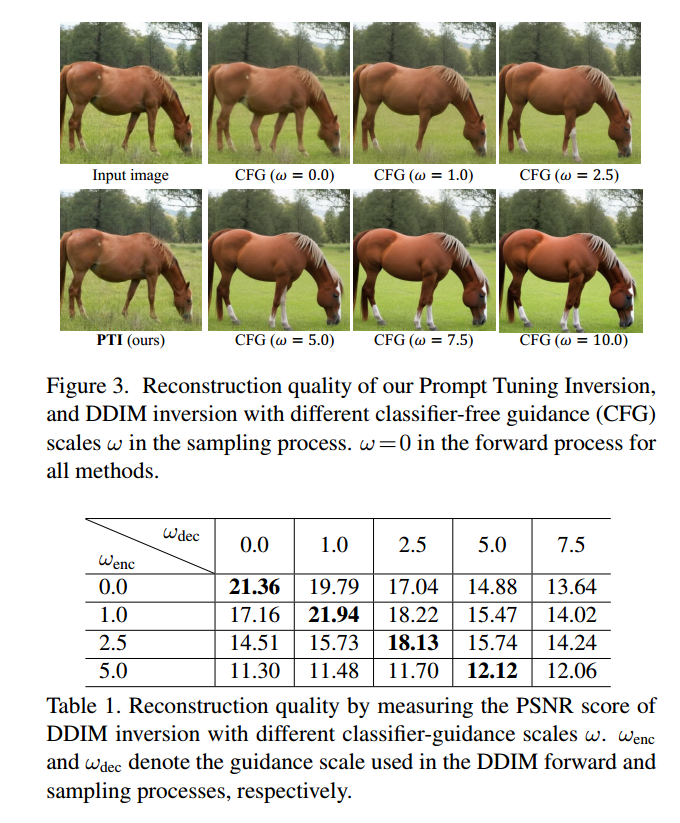
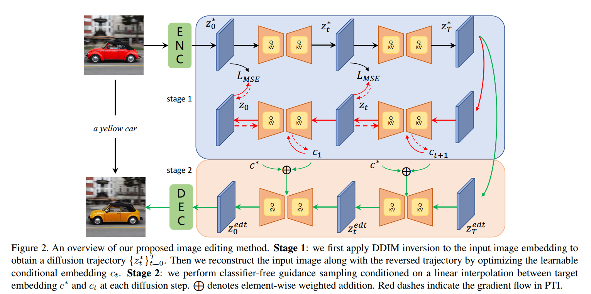
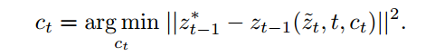
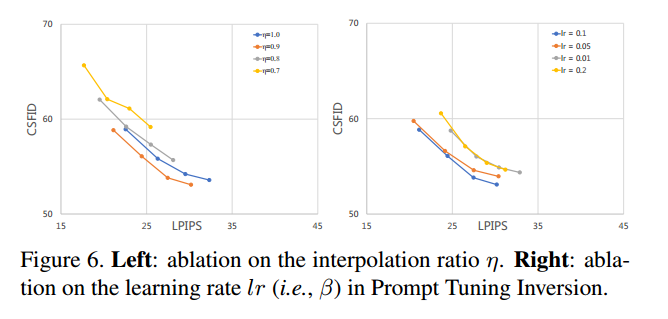

# 035_SSS_Prompt Tuning Inversion for Text-Driven Image Editing Using Diffusion Models

## 1. Motivations & Arguments

本文要利用Diffusion实现高保真高质量的文本-图像编辑，也就是既保证editability，又要保证fidelity。前者要求编辑后的图像应该包含与目标提示中提供的相应文本内容良好对齐的视觉内容，而后者期望编辑部分以外的区域应尽可能接近输入图像的区域。  

然而，大多数方法缺乏以下之一：用户友好性（例如，需要额外的掩码或输入图像的精确描述）、对更大域的泛化或对输入图像的高保真度。  

## 2. Contributions
1. 我们提出了一种用户友好的文本驱动的图像编辑方法，它只需要一个输入图像和一个目标文本进行编辑，不需要用户提供的掩码或输入图像的来源描述.  
2. 我们提出了一种用于扩散模型的 Prompt Tuning Inversion 方法，可以快速准确地重建原始图像，为对输入进行高保真度的编辑图像采样提供了坚实的基础  
3. 我们在定性和定量上与最先进的方法进行比较，表明我们的方法在可编辑性和保真度之间的权衡方面优于这些方法

## 3. Methodology

### 3.1 DDIM Inversion 的问题
先来看Classifier Free Guidance对DDIM Inversion的影响

可以看出无条件的DDIM Inversion的保真效果是最好的。但是加入条件信息之后，DDIM Inversion就不能保证保真了。因此直接用DDIM Inversion进行图像编辑效果很不好。

### 3.2 Prompt tuning for inversion

接下来是本文的方法。在固定网络参数的情况下，优化文本条件的编码。  

首先利用无条件的DDIM Inversion将源图像Inversion到对应的噪声上去，得到一个trajactory $\lbrace z_t^* \rbrace_{t=1}^T$, 然后初始化一系列的条件编码 $c_t$， 然后通过采样过程与inversion过程对齐来优化这一系列的条件编码 $c_t$。因为本文的方法不需要给定源图像的文本描述，所以这一步相当于是在寻找源图像对应的文本编码。而这一系列的条件编码就是在保证所得图像的保真度。  

### 3.3 Prompt Tuning For Editing
接下来用 $c^*$ 表示目标文本对应的编码，接下来为了在editability和fidelity之间进行权衡，一种直观的思路就是，将条件编码进行线性组合：  

本文作者同样尝试了另外一种方式，也就是将 $z_t$ 进行线性组合，这样不需要Prompt tuning，但是会产生杂乱的图像。  

于是可以得到本文的方法：

## 4. Experiments
本文inversion用无条件的，采样用Classifier Free Guidance，$\omega = 7.5$。
学习率 $\beta$ 和权重 $\eta$ 的影响：

以及本文方法的失败情况：

