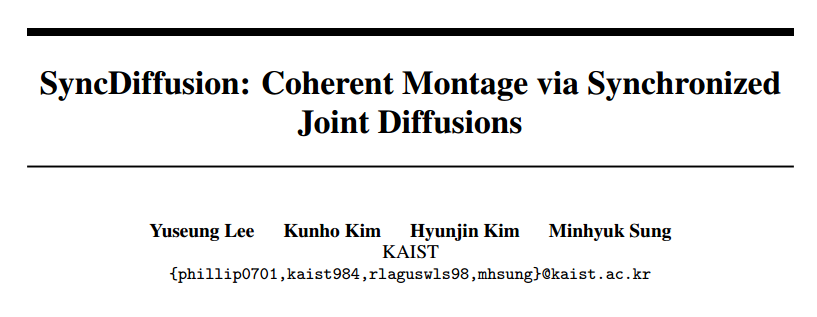
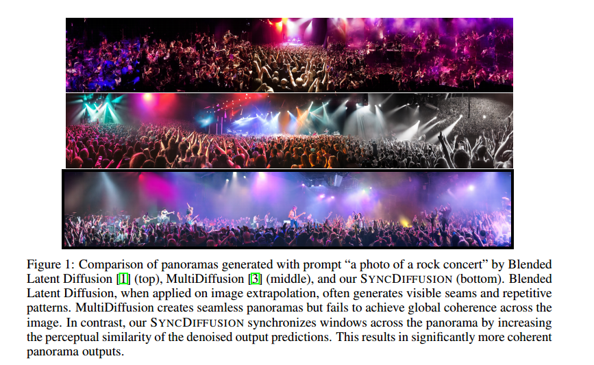

# SyncDiffusion: Coherent Montage via Synchronized Joint Diffusions

## 1. Motivations & Arguments & Contributions
本文提出了一种即插即用的用Diffusion生成全景图的方法。

Diffusion模型通常只能生成固定大小的图像，为了生成分辨率比较高的全景图。现有的方法分成两类：  
第一类方法是利用Inpainting的原理，给定一部分图像补全令一部分图像。但是这种方法不能做到无缝的生成高分图像，并且很容易重复相似的图像内容。  
第二类方法是joint diffusion，也就是在反向采样的过程中，同时采样多个视野部分的图像，然后每一步将这些图像重叠的部分取平均值。但是这种方法会在不同的视野部分出现不同的风格和内容，比如一幅图中同时有白天和黑夜的部分。

本文提出乐了一种用于扩散模型生成全景图的同步模块，称作SyncDiffusion。这个模块可以引导反向的采样过程实现全景图像不同区域之间的全局一致性。

## 2. Methodology
具体的做法就是，基于joint diffusion，反向过程同时采样整个全景图的所有部分，然后对于重叠的部分平均化。本文给joint diffusion加入了一个即插即用的模块，也就是在采样过程中的每一步，对于不同的视野的图片都与标记为锚点的图片做一个LPIPS和Style之类的损失，来保证全局的一致性。然后用这个损失更新每一步的采样预测的结果。

## 3.Experiments

