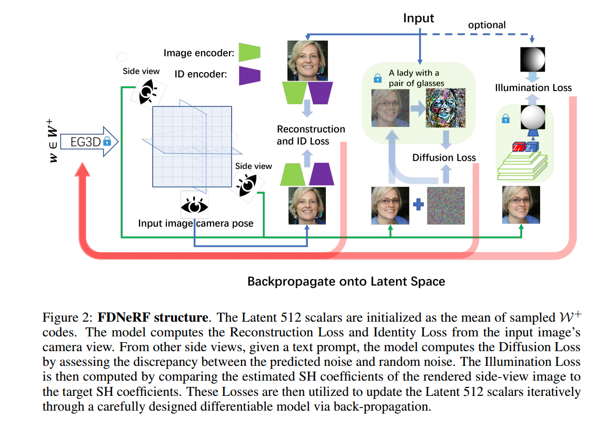
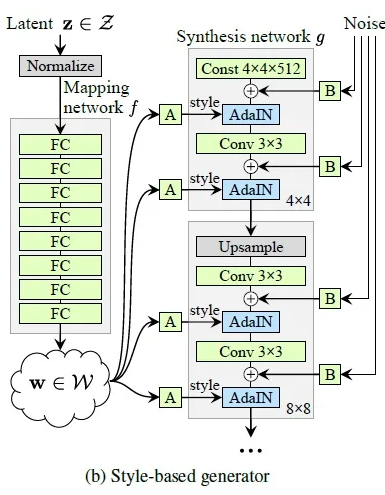
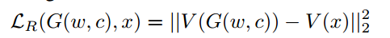
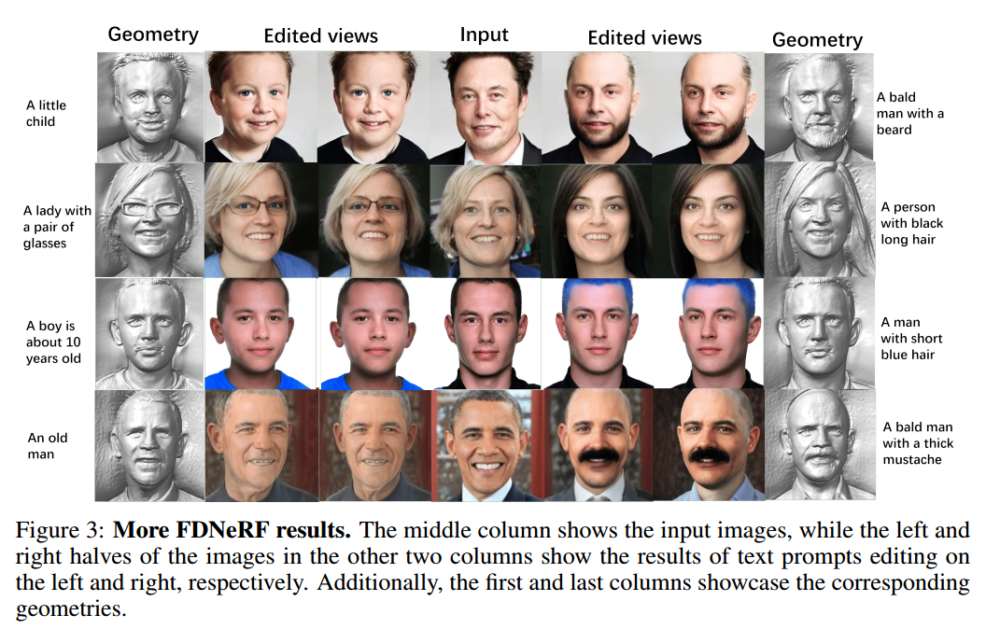
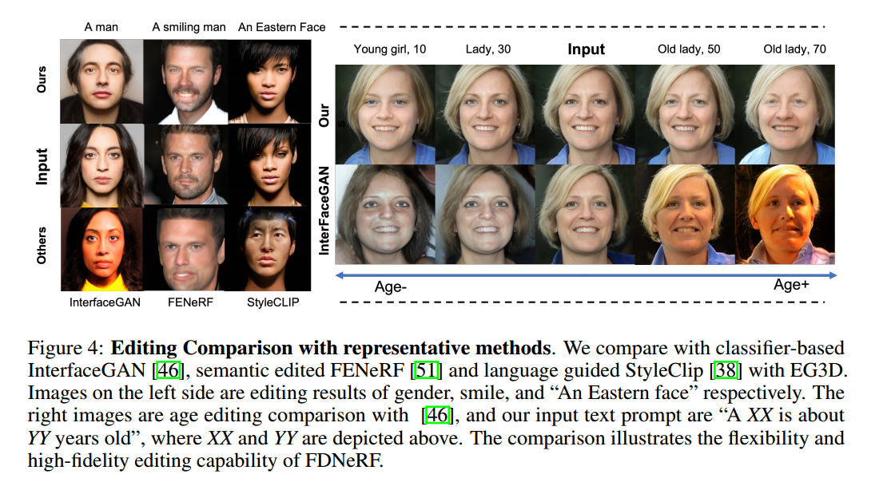

# FDNeRF: Semantics-Driven Face Reconstruction, Prompt Editing and Relighting with Diffusion Models

## 1. Motivations & Arguments & Contributions
本文提出了一种从单张图像重建高质量人脸NeRF的方法，并且具有语义编辑和重新设置照明的功能。  

#### Arguments
（1）EG3D可以从单张图像生成高质量的NeRF，但是这样生成的NeRF不容易控制和编辑。  
（2）一些方法使用逐像素分割图或用户提供的草图来指导 3D 编辑。但由于编辑要求高且可编辑属性有限，这些方法很难大规模推广  
（3）NeRF是在2D图像上训练的，想要改光照的话，也需要2D图像改光照，但是现在的2D relighting方法不能保证多视角的一致性  

#### Contributions
本文提出了第一个3D 语义驱动NeRF编辑的方法，在给定文本提示和目标光照的情况下，具有高真实感和重新照明。  

## 2. Methodology

本文的方法类似于GAN的inversion，利用预训练的EG3D，利用SDS loss，identity loss， feature loss，illumination loss等找到EG3D的隐变量。

### 2.1 EG3D及其 $W^+$ 空间
EG3D先把512维的隐变量z映射到 1 x 512 的隐变量w，然后w会经过StyleGAN2结构相似的卷积层，w所在的空间称作W空间。但是在实际应用中，只得到1x512的一个w的inversion效果，不如分别得到所有卷积层的Lx512个w的效果好，而这L x 512个w对应的空间就称作 $W^+$ 空间。

### 2.2 损失函数
G是EG3D生成器，c是输入的单张图像的camera pose（可以通过已有的方法估计得到），$c_s$是任意的camera pose，$l_{c_s}$ 则是对应camera pose下的目标光照信息。  
四项损失函数。第一个是identity loss，保证人是同一个，第二个损失是重建损失，第三个是SDS损失，第四个是光照损失。

#### Reconstruction Loss
重建损失用的是VGG16提取的特征的L2损失：  

  

#### Identity Loss
Identity loss用了现有方法Encoding in style: a stylegan encoder for image-to-image translation中预训练的网络。

  

#### Diffusion Loss
SDS损失，注意公式中的w(t)是Diffusion的参数，并不是本文的隐变量w，这是本文写的比较粗糙的地方。  

#### Illumination Loss
光照损失用了Deep single portrait image relighting中的方法，使用Hourglass Network  

首先用HN网络，$L_t$ 是目标光照， $I_s$是输入图像，得到的 $L^*_s$ 是输入图像的光照，$I^*_t$ 是目标图像。本文用Hn网络得到输入图像光照，$L^*_s$，然后计算损失：

## 3. Experiments

