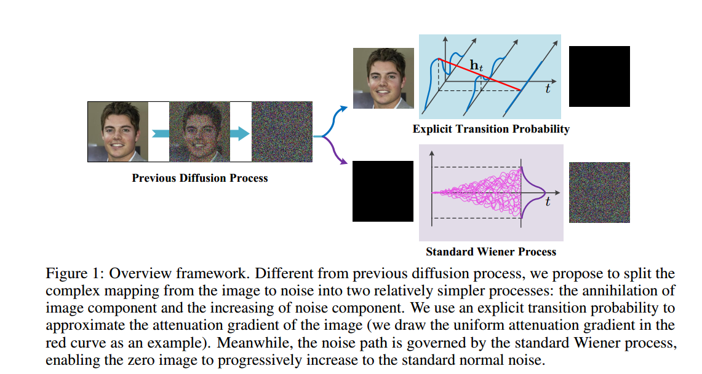
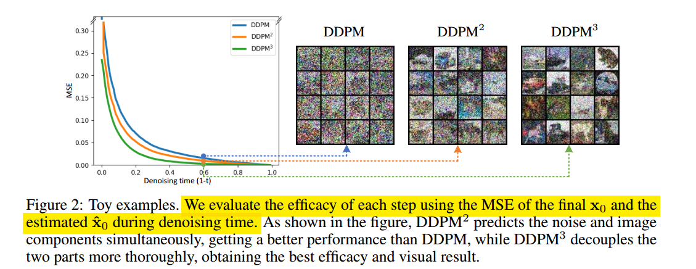
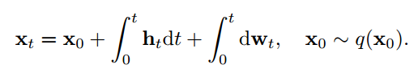
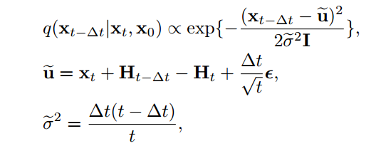
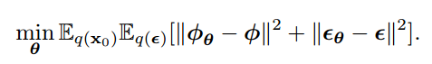
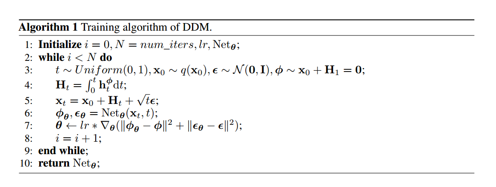

# Decoupled Diffusion Models with Explicit Transition Probability

## 1. Motivations & Arguments & Contributions
本文提出了一种将Diffusion的噪声和图像解耦进行生成的结构设计。  

#### Arguments
（1）现有的Diffusion架构，噪声和图像之间的耦合度太高，导致不能很好的区分噪声和图像从而造成生成质量下降。  
（2）现有的Diffusion反向采样过程需要大量的步数。  

为了验证（1）的说法，本文做了Toy实验：  

  

作者用每一步预测的x0与真实值的MSE loss作为指标，比较了三种不同结构的模型。  
第一种是原始DDPM，第二种 $DDPM^2$ 是在DDPM基础上网络输出除了预测噪声，同时还预测x0，第三种 $DDPM^3$是进一步修改了设计，也就是解耦图像和噪声的过程的结果：

  

#### Contributions
（1）本文提出了一种新的Diffusion架构称作Decoupled Diffusion Models (DDM)。将图像和噪声解耦。  
（2）作者为DDM推导出全新的前向SDE和反向SDE以及训练目标。  
（3）实验证明本文方法的有效性。  

## 2. Methodology
### Forward Process
本文的方法，Forward process拆分成了图像的湮灭和噪声的增强两个过程，其中噪声增强的过程就是标准的布朗运动：  

  

  

### Reverse Process
  

### Training Objective
训练目标是湮灭过程的参数和噪声  

  

  

  

### $h_t$的设计
关于湮灭过程选用的形式，作者尝试了固定值，线性，二次函数，指数函数四种形式，发现固定值的方式效果最好  

  

## 3. Experiments

  
