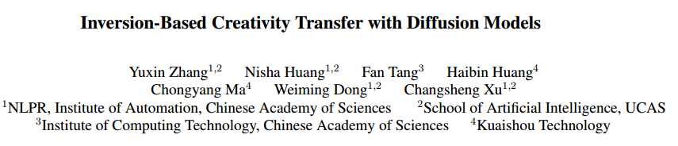
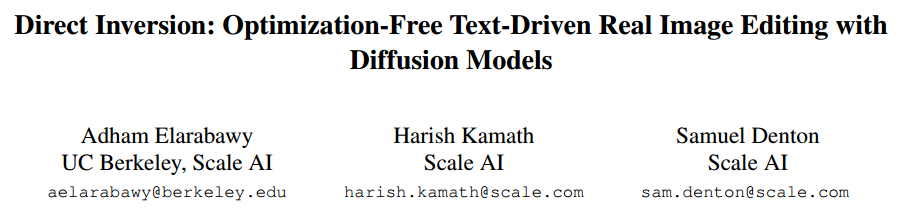
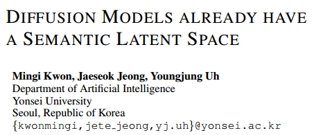
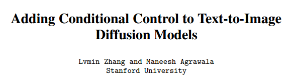
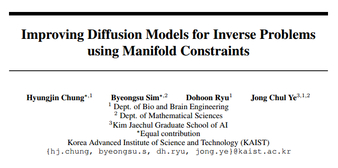
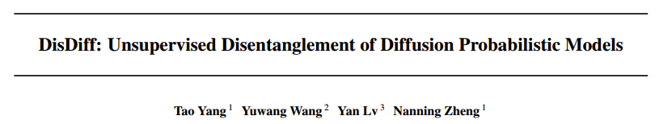
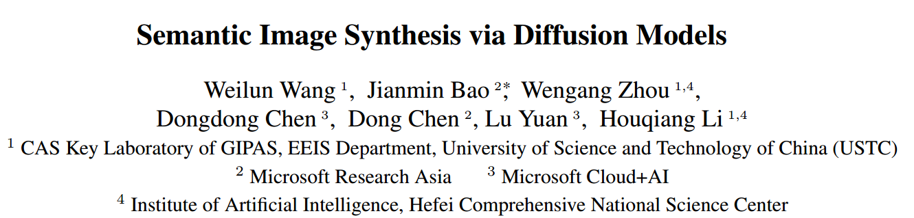

| Title | Author | Time & Source | Method | Manipulation Space | Application | Train/Fine-tune | Description | Code |
| - | - | - | - | - | - | - | - | - |
| - | - | - | - | - | - | - | - | - |
| Zero-shot Image-to-Image Translation |  | [Arxiv 2023.02.06](https://arxiv.org/abs/2302.03027) | Diffusion Inversion Based Image Editing | Text Embedding | Text Driven Image-to-Image Translation | No | 基于Diffusion Inversion 用GPT生成大量源域和目标域文本然后做CLIP embedding，求平均值的差作为edit direction。  [笔记链接](https://github.com/xuekt98/readed-papers/blob/main/2023/2023.02/032_SSS_Zero-shot%20Image-to-Image%20Translation.md)  | [Code链接](https://github.com/pix2pixzero/pix2pix-zero) |
| Inversion-Based Creativity Transfer with Diffusion Models |  | [Arxiv 2022.11.23](https://arxiv.org/abs/2211.13203) | Diffusion Inversion Based Image Editing | Text Embedding | Example-Guided Creativity Transfer | Train Textual Inversion Module | 本文基于Diffusion Inversion，通过对条件图进行Textual Inversion来控制生成与条件图风格一样的图像。[笔记链接](https://github.com/xuekt98/readed-papers/blob/main/2023/2023.02/033_SS_Inversion-Based%20Creativity%20Transfer%20with%20Diffusion%20Models.md) | [Code链接](https://github.com/zyxElsa/creativity-transfer) |
| EDICT: Exact Diffusion Inversion via Coupled Transformations |  | [Arxiv 2022.12.22](https://arxiv.org/abs/2211.12446) | Diffusion Inversion Based Image Editing | U-Net output | Exact Diffusion Inversion; Image Editing | No | 利用Flow的Couple layer的思想，实现更准确的Diffusion inversion | [Code链接](https://github.com/salesforce/EDICT) |
| Direct Inversion: Optimization-Free Text-Driven Real Image Editing with Diffusion Models |  | [Arxiv 2022.11.15](https://arxiv.org/abs/2207.00050) | Diffusion Inversion Based Image Editing | U-Net output | Text-Driven Image Editing | No | 基于Diffusion Inversion，利用inversion保存的网络输出与reverse过程的输出做Classifier-free guidance  [笔记链接](https://github.com/xuekt98/readed-papers/blob/main/2023/2023.02/027_SSS_Direct%20Inversion%20Optimization-Free%20Text-Driven%20Real%20Image%20Editing%20with%20Diffusion%20Models.md) | [Code链接](https://github.com/adham-elarabawy/direct-inversion) |
| SEGA- Instructing Diffusion using Semantic Dimensions |  | [Arxiv 2023.01.28](https://arxiv.org/abs/2301.12247) | Diffusion Inversion Based Image Editing | U-Net Output | Text-Driven Image Editing | No | 基于Diffusion inversion，通过不同的文本条件对方向进行修正。 | No Code |
| Diffusion Models Already Have a Semantic Latent Space | | [ICLR 2023](https://openreview.net/pdf?id=pd1P2eUBVfq) | Diffusion Inversion Based Image Editing | U-Net Bottleneck | Text-Driven Image Editing | Need to train a small network to predict edit direction | 基于Diffusion Inversion在U-Net的bottleneck添加语义方向的控制，需要串行训练 [笔记链接](https://github.com/xuekt98/readed-papers/blob/main/2022/2022.11/2022.11.14-2022.11.20/021_SSSS_Diffusion%20Models%20Already%20Have%20a%20Semantic%20Latent%20Space.md) | [Code链接](https://github.com/kwonminki/Asyrp_official) |
| Adding Conditional Control to Text-to-Image Diffusion Models |  | [Arxiv 2023.02.10](https://arxiv.org/pdf/2302.05543.pdf) | Add Conditional Control to Pretrained Diffusion | U-Net Middle Features | Conditional Image Synthesis | Fix Diffusion and train ControlNet | 本文提出了对于训练好的Stable Diffusion如何额外加入条件控制，为此作者设计了ControlNet，用来对U-Net中间的Feature进行改动。 | [Code 链接](https://github.com/lllyasviel/ControlNet) |
| Diffusion Autoencoders: Toward a Meaningful and Decodable Representation |  | [CVPR2022](https://openaccess.thecvf.com/content/CVPR2022/papers/Preechakul_Diffusion_Autoencoders_Toward_a_Meaningful_and_Decodable_Representation_CVPR_2022_paper.pdf) | Semantic Latent Space | Conditioanl Latent Space | Image Synthesis | Train diffusion autoencoder model | 将Diffusion当做解码器，额外引入编码器，编码的隐空间可以操作语义。 | [Code 链接](https://github.com/phizaz/diffae) |
| ---- | ---- | ---- | ---- | ---- | ---- | ---- | ---- | ---- |
| Diffusion Models as Plug-and-Play Priors |  | [NeurIPS 2022](https://openreview.net/forum?id=yhlMZ3iR7Pu) | Combine Diffusion with Pretrained Classifier | Classifier | Conditional Sythesis | Not sure | 大致是将DDPM和任意的分类器结合做条件生成，数学性很强，没看太明白。但是直观上来看，本文思路很好，值得仔细研究。 | [Code链接](https://github.com/AlexGraikos/diffusion_priors) |
| Improving Diffusion Models for Inverse Problems using Manifold Constraints |  | [NeurIPS 2022](https://openreview.net/forum?id=nJJjv0JDJju) | Improve Diffusion through Manifold Constraints | Not sure | Inpainting, Denoising | Not sure | 这个完全没看懂，只看出来是基于流形假设来修改采样过程 | [Code 链接](https://github.com/HJ-harry/MCG_diffusion) |
| Diffusion-based Image Translation using Disentangled Style and Content Representation |  | [ICLR 2023](https://arxiv.org/abs/2209.15264) | Diffusion Disentanglement | U-Net output | Text/Image guided image translation | No | 用预训练的VisionTransformer指导预训练的Diffusion的采样过程，通过加入不同的loss来修正方向 | ---- |
| ---- | ---- | ---- | ---- | ---- | ---- | ---- | ---- | ---- |
| DisDiff: Unsupervised Disentanglement of Diffusion Probabilistic Models |  | [Arxiv 2023.02.01](https://arxiv.org/abs/2301.13721) | Diffusion Disentanglement | Conditional Input | Disentangled Conditional Synthesis | Train Disentangle parts | 通过将输入数据进行解耦作为条件控制生成。 | No Code |
| ---- | ---- | ---- | ---- | ---- | ---- | ---- | ---- | ---- |
| Semantic Image Synthesis via Diffusion Models |  | [Arxiv 2022.11.22](https://arxiv.org/abs/2207.00050) | Conditional Diffusion Model | U-Net Structure | Semantic Image Synthesis | Retrain Difffusion | 重新设计了U-Net，加入SPADE实现语义控制 [笔记链接](https://github.com/xuekt98/readed-papers/blob/main/2022/2022.10/2022.10.17-2022.10.23/017_SSS_Semantic%20Image%20Synthesis%20via%20Diffusion%20Models.md) | [Code链接](https://github.com/WeilunWang/semantic-diffusion-model) |
