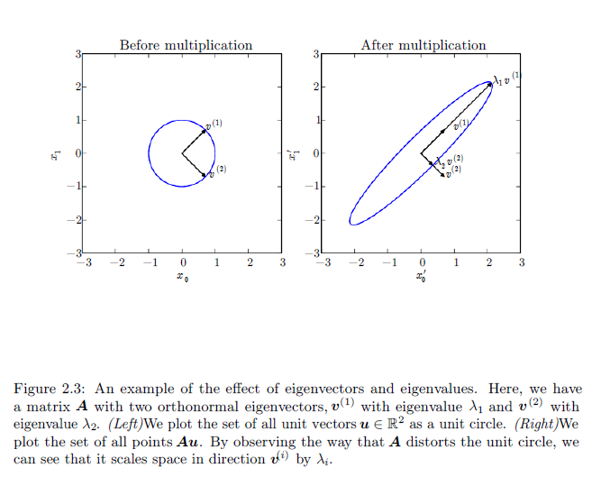

# Chapter 02 Linear Algebra

## 2.1 Scalars, Vectors, Matrices and Tensors

- **Scalars**: A scalar is just a single number  
- **Vectors**: A vector is an array of numbers
- **Matrices**: A matrix is a 2D array of numbers
- **Tensors**: A tensor is an array with more than two axes

## 2.2 Multiplying Matrices and Vectors

$$
\bm{A}(\bm{B} + \bm{C}) = \bm{A}\bm{B} + \bm{A}\bm{C} \\
\bm{A}(\bm{B}\bm{C})=(\bm{A}\bm{B})\bm{C} \\
(\bm{A}\bm{B})^T=\bm{B}^T\bm{A}^T
$$

## 2.3 Identity and Inverse Matrices

$$
\bm{A}^{-1}\bm{A} = I \\
\bm{A}\bm{A}^{-1} = I
$$

## 2.4 Linear Dependence and Span

A set of vectors is linearly independent if no vector in the set is a linear combination of the other vectors.

## 2.5 Norms

**measure the size of a vector**

the $L^p$ norm is given by:

$$
\lVert \bm{x} \rVert_p = (\sum_i|x_i|^p)^\frac{1}{p}
$$

for $p \in \mathbb{R}, p \ge 1$

A norm is any function $f$ that satisfies the following properties:

- $f(\bm{x}) = 0 \Rarr \bm{x} = \bm{0}$
- $f(\bm{x} + \bm{y}) \le f(\bm{x}) + f(\bm{y})$ (the triangle inequality)
- $\forall \alpha \in \mathbb{R} f(\alpha \bm{x}) = |\alpha|f(\bm{x})$

The $L^2$ norm, with $p = 2$, is known as the Euclidean norm, often denoted simply as $\| \bm{x} \|$

**measure the size of a matrix**

**Frobenius norm**

$$
\| A \|_F = \sqrt{\sum_{i,j}A^2_{i,j}}
$$

## 2.6 Special Kinds of Matrices and Vectors

Diagonal

Symmetric $A = A^T$

Orthogonal $A^{-1} = A^T$

## 2.7 Eigendecomposition

every real symmetric matrix can be decomposed into an expression using only real-valued eigenvectors and eigenvalues:

$$
\begin{aligned}
A\bm{v} &= \lambda\bm{v} \\
A &= V diag(\bm{\lambda})V^{-1} \\
A &= Q \Lambda Q^T
\end{aligned}
$$

where $Q$ is an orthogonal matrix $\Lambda$ is diagonal matrix.

  

## 2.8 Singular Value Decomposition

Singular Value Decomposition(SVD). Every real matrix has a singular value decomposition.

$$
A = UDV^T
$$

$A$ is an $m \times n$ matrix, $U$ is an $m \times m$ matrix, $V$ is an $n \times n$ matrix

$U, V$ are both orthogonal matrices, $D$ is diagonal matrix.  

$U$ are the eigenvectors of $AA^T$. $V$ are the eigenvectors of $A^TA$

Perhaps the most useful feature of the SVD is that we can use it to partially generalize matrix inversion to non-square matrices

## 2.9 The Moore-Penrose Pseudoinverse

The Moore-Penrose pseudoinverse of $A$ is defined as a matrix:

$$
A^+  = \lim_{\alpha \searrow 0}(A^TA + \alpha I)^{-1}A^T
$$

$$
A^+ = VD^+U^T
$$

where $U, D, V$ are the singular value decomposition of $A$, and the pseudoinverse $D^+$ of a diagonal matrix $D$ is obtained by taiking the reciprocal of its non-zero elements then taking the transpose of the resulting matrix.  

When $A$ has more columns than rows, then solving a linear equation using the pseudoinverse provides one of the many possible solutions. Specifically, it provides the solution $x = A+ y$ with minimal Euclidean norm $\|x\|2$ among all possible
solutions.

## 2.10 The Trace Operator

The trace operator gives the sum of all of the diagonal entries of a matrix:

$$
\mathrm{Tr}(A) = \sum_i A_{i,j}
$$

$$
\|A\|_F = \sqrt{\mathrm{Tr}(AA^T)}
$$

$$
\mathrm{Tr}(AB) = \mathrm{Tr}(BA)
$$

## 2.11 The Determinant

The determinant of a square matrix $det(A)$

## 2.12 Example: Principal Components Analysis

**principal components analysis** or PCA can be derived using only knowledge of basic linear algebra.  

lossy compression to a collection of $m$ points $\lbrace \bm{x}^{(1)}, ..., \bm{x}^{(m)} \rbrace$ in $\mathbb{R}^n$

encode function $f(\bm{x}) = \bm{c}$, decode funciton $\bm{x} = g(f(\bm{x}))$, where $\bm{c} \in \mathbb{R}^l, l \lt n$

PCA is defined by our choice of the decoding function. $g(\bm{c}) = D\bm{c}$

Computing the optimal code for this decoder could be a difficult problem. To keep the encoding problem easy, PCA constrains the columns of $D$ to be orthogonal to each other.

In the PCA, we use the $L^2$ norm to measure the distance:

$$
\bm{c}^* = \argmin_{\bm{c}} \| \bm{x} - g(\bm{c}) \|_2
$$

$$
\bm{c}^* = \argmin_{\bm{c}} \| \bm{x} - g(\bm{c}) \|_2^2
$$

minimize

$$
(\bm{x} - g(\bm{c}))^T(\bm{x} - g(\bm{c}))
$$

$$
\begin{aligned}
\bm{c}^* &= \argmin_{\bm{c}}-2\bm{x}^Tg(\bm{c}) + g(\bm{c})^Tg(\bm{c}) \\
&= \argmin_{\bm{c}}-2\bm{x}^TD\bm{c} + \bm{c}^TD^TD\bm{c} \\
&= \argmin_{\bm{c}}-2\bm{x}^TD\bm{c} + \bm{c}^TI_l\bm{c}
\end{aligned}
$$

$\bm{c} = D^T \bm{x}$

choose the encoding matrix $D$

$$
D^* = \argmin_D \sqrt{\sum_{i,j}(x_j^{(i)} - r(\bm{x}^{(i)})_j)^2}
$$
subject to $D^TD=I_l$

$r(\bm{x}) = g(f(\bm{x})) = DD^T\bm{x}$

the matrix $D$ is given by the l eigenvectors corresponding to the
largest eigenvalues of $X^TX$.