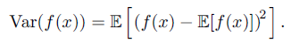

# Chapter 03 Probability and Information Theory

## 3.1 Why Probability?

1. Inherent stochasticity in the system being modeled.

2. Incomplete observability.

3. Incomplete modeling.

it is more practical to use a simple but uncertain rule rather than a complex but certain one.

The former kind of probability, related directly to the rates at which events occur, is known as **frequentist probability**'
The latter kind of probability, related to qualitative levels of certainty, is known as **Bayesian probability**

## 3.2 Random Variables

A **random variable** is a variable that can take on different values randomly.

## 3.3 Probability Distributions

A **probability distribution** is a description of how likely a random variable or
set of random variables is to take on each of its possible states.

### 3.3.1 Discrete Variables and Probability Mass Functions

A probability distribution over discrete variables may be described using a **probability mass function (PMF)**.

Probability mass functions can act on many variables at the same time. Such a probability distribution over many variables is known as a **joint probability distribution**.

**uniform distribution**

$$
P(\mathrm{x} = x_i) = \frac{1}{k}
$$

### 3.3.2 Continuous Variables and Probability Density Functions

When working with continuous random variables, we describe probability distributions using a **probability density function (PDF)** rather than a probability mass function.

## 3.4 Marginal Probability

The probability distribution over the subset is known as the marginal probability distribution.

$$
\forall x \in \mathrm{x}, P(\mathrm{x} = x) = \sum_y P(\mathrm{x}=x, \mathrm{y} = y) \\
p(x) = \int p(x, y) dy
$$

## 3.5 Conditional Probability

$$
P(\mathrm{y}=y | \mathrm{x}=x) = \frac{P(\mathrm{y}=y, \mathrm{x}=x)}{P(\mathrm{x}=x)}
$$

## 3.6 The Chain Rule of Conditional Probabilities

## 3.7 Independence and Conditional Independence

## 3.8 Expectation, Variance and Covariance

**variance, standard deviation**

## 3.9 Common Probability Distributions

### 3.9.1 Bernoulli Distribution

### 3.9.2 Multinoulli Distribution

### 3.9.3 Gaussian Distribution

### 3.9.4 Exponential and Laplace Distributions

### 3.9.5 The Dirac Distribution and Empirical Distribution

### 3.9.6 Mixtures of Distributions

## 3.10 Useful Properties of Common Functions

## 3.11 Bayes’ Rule

## 3.12 Technical Details of Continuous Variables

## 3.13 Information Theory

## 3.14 Structured Probabilistic Models

