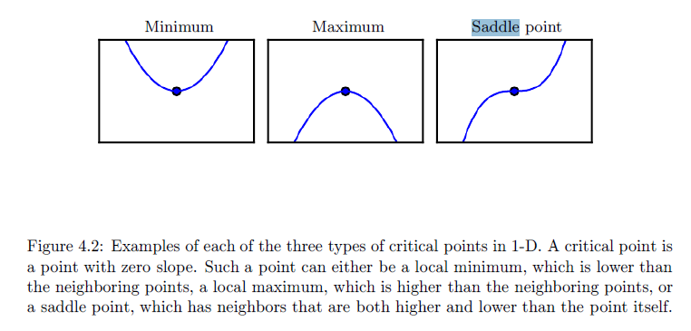
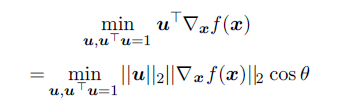
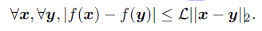

# Chapter 04 Numerical Computation

## 4.1 Overflow and Underflow

**Underflow** occurs when numbers near zero are rounded to zero.

**Overflow** occurs when numbers with large magnitude are approximated as ∞ or −∞

## 4.2 Poor Conditioning

**Conditioning** refers to how rapidly a function changes with respect to small changes in its inputs.

## 4.3 Gradient-Based Optimization

The function we want to minimize or maximize is called the **objective function or criterion**. When we are minimizing it, we may also call it the **cost function, loss function, or error function**.

The **derivative** 导数

**critical points or stationary points** 临界点,导数为零的点

**saddle point** 鞍点

**partial derivatives** 偏导数

The directional derivative in direction $u$ (a unit vector) is the slope of the function $f$ in direction $u$.  

### 4.3.1 Beyond the Gradient: Jacobian and Hessian Matrices

A Lipschitz continuous function is a function $f$ whose rate of change is bounded by a Lipschitz constant $\cal{L}$

This property is useful because it allows us to quantify our assumption that a small change in the input made by an algorithm such as gradient descent will have a small change in the output. Lipschitz continuity is also a fairly weak constraint, and many optimization problems in deep learning can be made Lipschitz continuous with relatively minor modifications.

## 4.4 Constrained Optimization

we may wish to find the maximal or minimal value of $f(x)$ for values of $x$ in some set $\mathbb{S}$.  

The Karush–Kuhn–Tucker (KKT) approach provides a very general solution to constrained optimization. With the KKT approach, we introduce a new function called the generalized Lagrangian or generalized Lagrange function.

## 4.5 Example: Linear Least Squares

