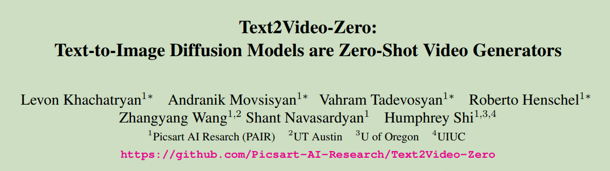
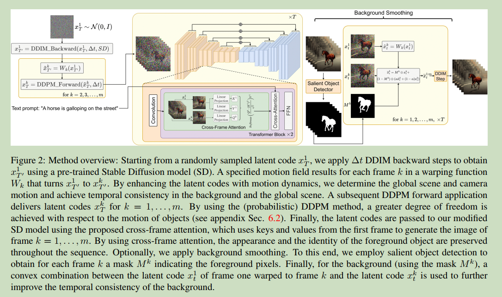
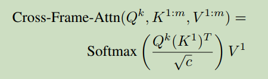
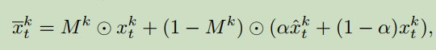
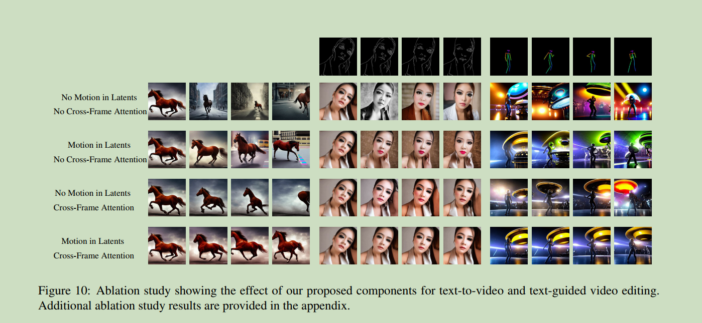
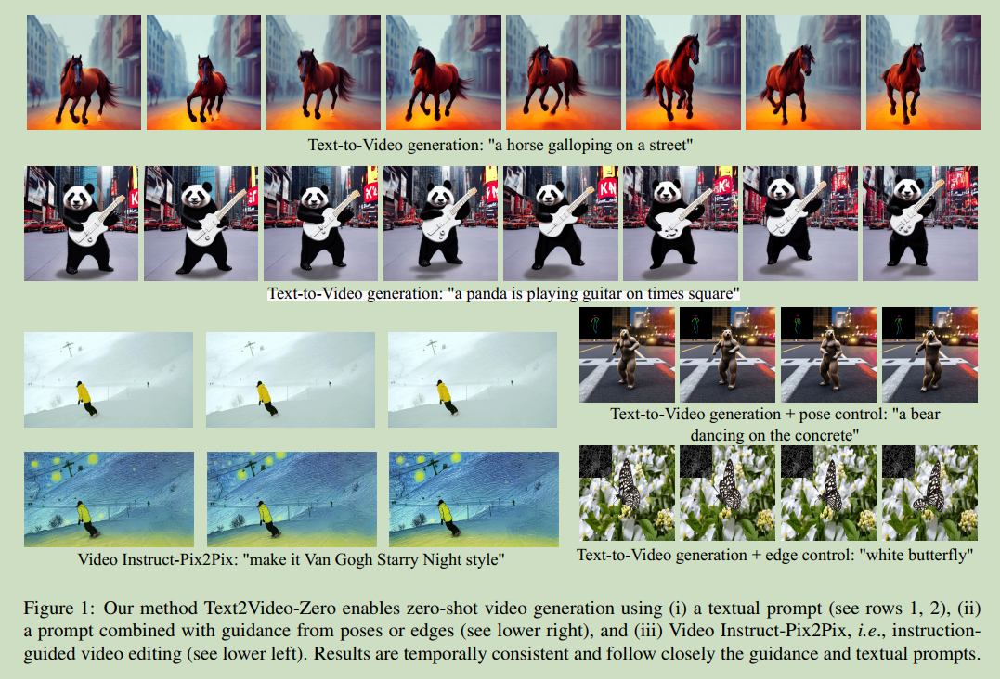

# 006 Text2Video-Zero: Text-to-Image Diffusion Models are Zero-Shot Video Generators  

  

### Origin: ICCV2023, Picsart AI Resarch
### Code: https://github.com/Picsart-AI-Research/Text2Video-Zero
### Label: zero-shot; text-to-video; Stable Diffusion 

**本文首次提出了，zero-shot text-to-video generation问题。**  

 

## 1. Arguments & Motivations & Contributions

data efficient; cost efficient

**Contributions:**  
1. A new problem setting of zero-shot text-to-video synthesis  
2. Two novel post-hoc techniques to enforce temporally consistent generation  
3. A broad variety of applications that demonstrate our
method’s effectiveness  

 

## 2. Method

面临的问题即时空连续性问题

与free bloom解决时空连续性和一致性的思路较为类似：对于多帧图像Stable Diffusion的初始采样噪声和采样过程的attention进行额外处理。  

  

 

### 2.1 Motion Dynamics in Latent Codes

这一部分即对于多帧初始采样噪声的处理

Step 1: 随机采样得到第一帧的Latent code $x_T^1 \sim \mathcal{N}(0, I)$  

Step 2: DDIM采样 $\triangle t$, 得到对应的Latent code $x_{T'}^1, T'=T-\triangle t$  

Step 3: 定义全局场景和相机运动方向 $\delta = (\delta_x, \delta_y) \in \mathbb{R}^2$ , default $\delta_x = \delta_y = 1$  

Step 4: 对于每一帧 $k=1,2,...,m$ , 计算global translation vector $\delta^k = \lambda (k-1) \delta$  其中 $\lambda$ 为超参数  

Step 5: 通过 $\delta^{1:m}$ 得到的 warping function 对于 $x_{T'}^1$ 进行操作, 称作Motion flow  

$$\tilde{x}^k_{T'} = W_k(x_{T'}^1)$$  

Step 6: 对 $\tilde{x}^{2:m}_{T'}$ 执行$\triangle t$ DDPM 前向过程, 得到相应的Latent code  $x^{2:m}_{T}$  

**lead to a better temporal consistency of the global scene as well as the background.**  

 

### 2.2 Reprogramming Cross-Frame Attention

本文也用了帧间的attention, 即 K 和 V 都用第一帧的, 作用是:  

**preserve the infromation about(in particular) the foreground object's appearance, shape, and identity throughout the generated video.** 

 

### 2.3 Background Smoothing(Optional)

(这个部分没看的很明白, 需要看源代码)

对于生成的视频提取前景mask, 然后对首帧进行warp, 之后按照mask进行组合  

  

 

### 2.4 Conditional and Specialized Text-to-Video
### 2.5 Video Instruct-Pix2Pix

这两部分主要利用不同的Diffusion来实现, 主要方法是cross-frame attention.  

  

 

## 3. Experiments

 