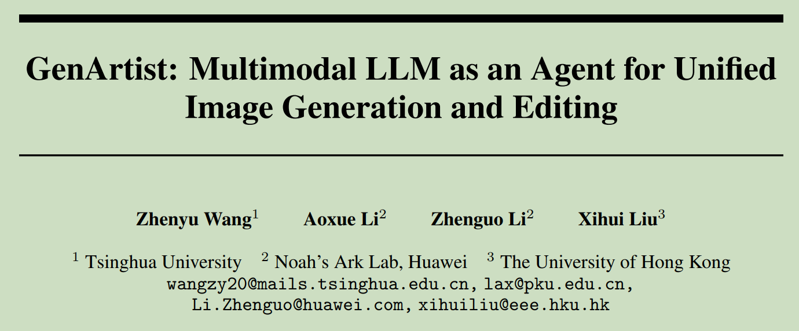
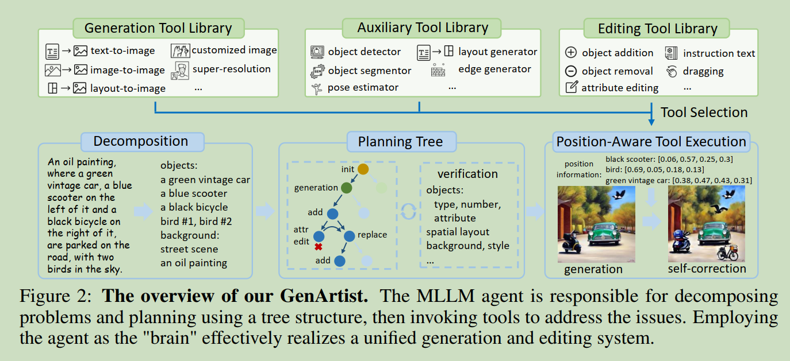
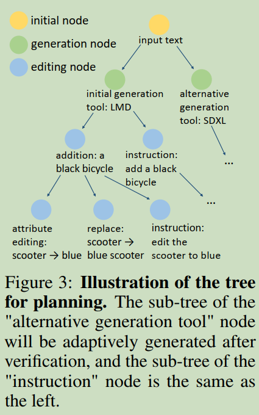
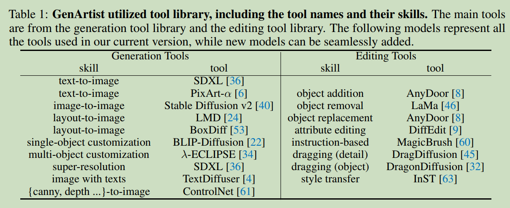
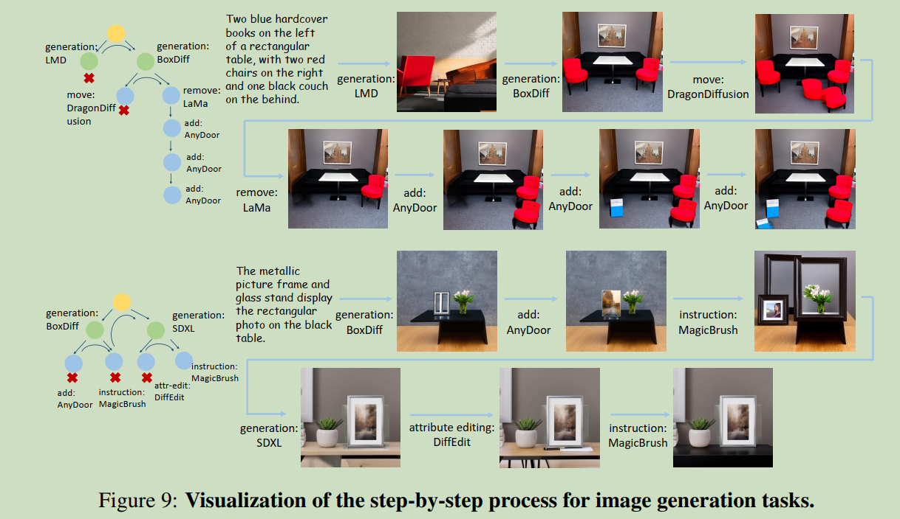
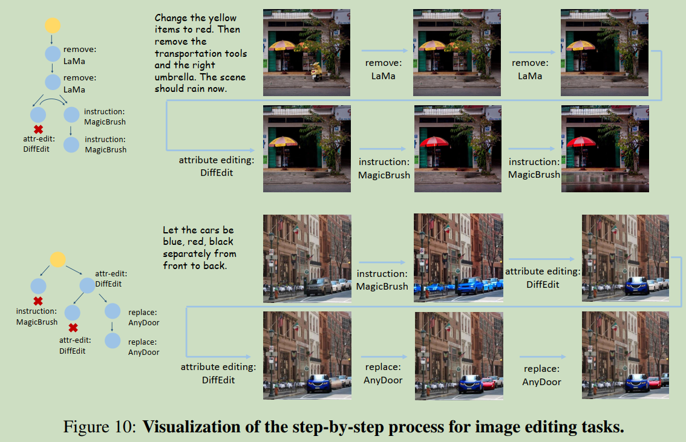

# GenArtist: Multimodal LLM as an Agent for Unified Image Generation and Editing

  

#### Origin: Arxiv202407, Tsinghua University   
#### Code:  https://zhenyuw16.github.io/GenArtist_page/
#### Label: MLLM; Image Genaration; Image Editing

 

## 1. Arguments & Motivations & Contributions

**Arguments:**  
1. The demand for image generation and editing is highly diverse and variable. General models may be weaker than some finetuned models in certain aspects, but they can exhibit better performance in out-of-distribution data.  
2. Models still struggle with complex problems. Since texts are highly variable, flexible, and can be easy to combine, there are always complex problems that a trained model cannot effectively handle.  
3. Generated images sometimes fail to accurately correspond to the content of user prompts. Existing models lack the ability to autonomously assess the correctness of generated images, not to mention self-correcting them, making generated images unreliable.  

**Motivations:**  
**Should be a unified image generation and editing system, which can satisfy nearly all human requirements while producing reliable image results.**

**Contributions:**  
propose GenArtist, a unified image generation and editing system.

 

## 2. Method

  

### 2.1 Planning Tree with step-by-step verification

#### Decomposition:  

利用MLLM对于不同的复杂任务进行分解.  

对于生成任务,分解为object和Background,object有其对应属性的描述,而背景则包含整体的场景和风格等描述.  

对于编辑任务,则分解为不同的编辑操作,如add,move,remove等.  

#### Tree Construction:  

  

将所有的操作整合为树状, 包含三种节点:initial nodes, Generation nodes, editing nodes.  

**initial nodes:** the root of the tree, marking the beginning of the system.  

**generation nodes:** using tools from the generation tool library  

**editing nodes:** performing a single generation operation using tools from the editing tool library.  

对于image editing任务, 则没有Generation node.  

对于image Generation任务, 生成图像之后, 经过self-correction, 然后利用MLLM给出修正的editing operations.  

editing operation可以有多个不同的tool实现, 被MLLM选中的tool放在最左侧作为最优子节点.  

#### Planning

树形结构建立了之后, 整个过程可以看作是先序遍历的过程. 如果一个节点的操作成功, 则删除其sibling nodes, 并转向其最左子节点. 若失败, 则转向其sibling nodes, 而删除其子树. 整个过程在叶子节点结束, 或是可以指定操作次数, 深度等.  

#### Verification

利用MLLM来对生成你的图像进行评估, 主要包括生成的物体及其颜色,形状等属性与文本的一致性, 与其他物体的关系等; 背景以及整体风格等.  

**整个过程是提前定好的, 所以并不能完全动态的进行调整, 一个改进的方向是根据MLLM的反馈, 动态的决定后续的操作增减节点.**

 

### 2.2 Tool Library

整合了不同的模型. 需要将每个tool所能完成的任务, 需要的输入形式, 以及其特点和优势传递给MLLM.    

  

 

### 2.3 Position-Aware Tool Execution

人类输入会遗漏一些关键的位置信息

#### Position-related input compensation

通过引入auxiliary tools来弥补位置信息缺失的问题.  

(1) localization model  
(2) preprocessors of ControNet  
(3) LLM-implemented tools  

MLLM会根据需要调用不同的辅助工具获取位置信息.  

 

## 3. Experiments

  

  
