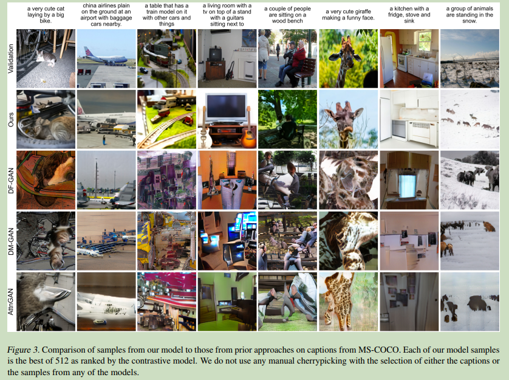

# DALL-E Zero-Shot Text-to-Image Generation

  

**Origin:** PMLR2021; OpenAI; **[[Project Code](https://github.com/openai/DALL-E)]**  
**Authors:** Aditya Ramesh, Mikhail Pavlov, Gabriel Goh, etc.    
**Label:** text-to-image; transformer;   
**Abastract:** DALL-E, text-to-image generation using transformer.   

 

## 1. Arguments & Motivations & Contributions

text-to-image generation based on a transformer that autoregressively models the text and image tokens as a single stream of data.  

 

## 2. Methodology

### 2.1 Model Architecture

**Likelihood objectives tend to prioritize modeling short-range dependencies between pixels, so much of the modeling capacity would be spent capturing high-frequency details instead of the low-frequency structure that makes objects visually recognizable to us.**

two-stage training procedure.  

#### Stage 1:
train a discrete variational autoencoder(dVAE) to compress each 256x256 RGB image into a 32x32 grid of image tokens.  

#### Stage 2:
concatenate up to 256 BPE-encoded text tokens with the 32x32=1024 image tokens, and train an autoregressive transformer to model the joint distribution over the text and image tokens.  

The text and image tokens are concatenated and modeled autoregressively as a single stream of data.  

The transformer is a decoder-only model.  

### 2.2 Data Collection

Conceptual Captions, a dataset of 3.3 million text-image pairs that was developed as an extension to MS-COCO  

 

## 3. Experiments

  