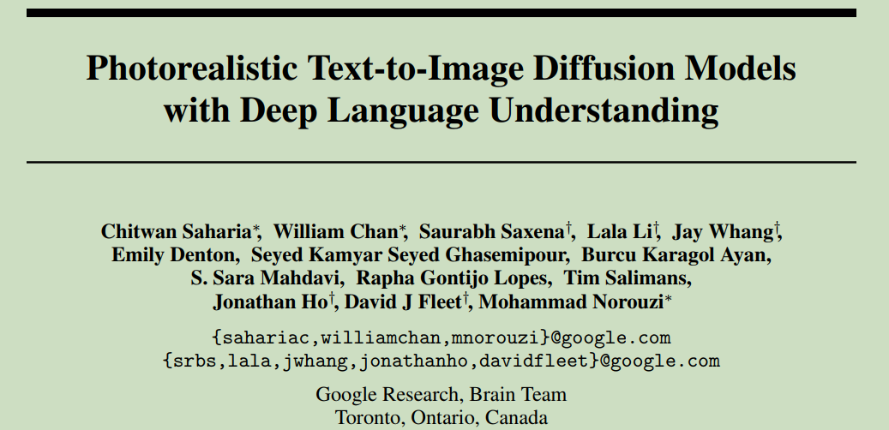
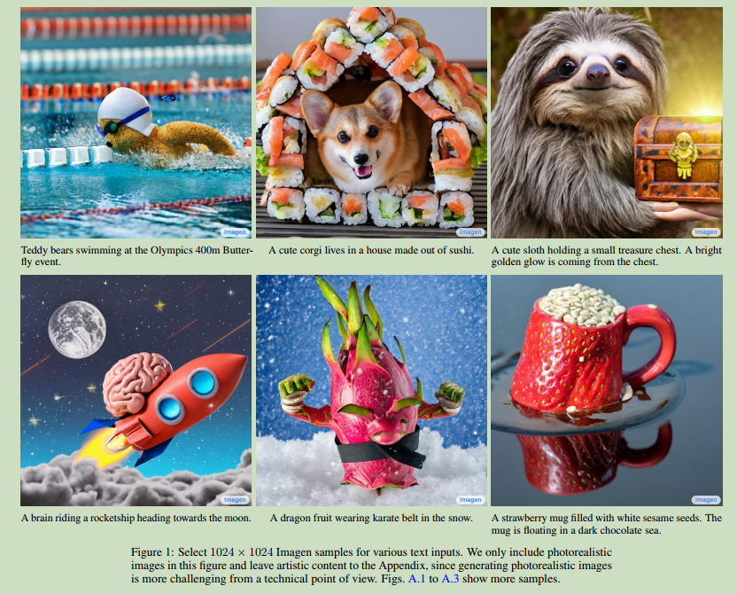
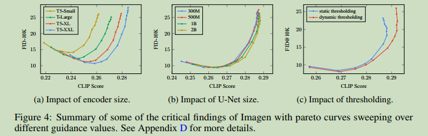

# Photorealistic Text-to-Image Diffusion Models with Deep Language Understanding

  

**Origin:** NIPS2022; Google; **[[Project Code](imagen.research.google)]**  
**Authors:** Chitwan Saharia, William Chan, etc.    
**Label:** text-to-image; diffusion model; LLM   
**Abastract:**Imagen builds on the power of large transformer language models in understanding text and hinges on the strength of diffusion models in high-fidelity image generation.     

 

## 1. Arguments & Motivations & Contributions

### Contributions

1. We discover that large frozen language models trained only on text data are surprisingly very effective text encoders for text-to-image generation, and that scaling the size of frozen text encoder improves sample quality significantly more than scaling the size of image diffusion model.  

2. We introduce dynamic thresholding, a new diffusion sampling technique to leverage high guidance weights and generating more photorealistic and detailed images than previously possible.  

3. propose Efficient U-Net, a new architecture variant which is simpler, converges faster and is more memory efficient  

4. We achieve a new state-of-the-art COCO FID of 7.27.  

5. We introduce DrawBench, a new comprehensive and challenging evaluation benchmark for the text-to-image task.  

 

## 2. Methodology

两个主要组成部分, text-encoder和diffusion. text-encoder将text映射到sequence of embeddings. conditional diffusion则把text embeddings映射到图像, 之后利用super-resolution模块提高图像的分辨率.  

### 2.1 Pretrained text encoders

本文比较了不同的text encoder, 包括BERT, CLIP和T5. 本文通过直接freeze text encoder的参数实现. 发现 T5-XXL和CLIP 在MS-COCO等benchmarks的表现相似, 但是human evaluator则表示人们更倾向于 T5-XXL.  

### 2.2 Diffusion with classifier-free guidance

包含三个部分: 64x64的Diffusion模型, 64x64到256x256的超分辨率Diffusion模型以及256x256到1024x1024的超分辨率Diffusion模型.  

### 2.3 Large guidance weight samplers

Static thresholding: clipping the x-prediction to [−1; 1] as static thresholding. static thresholding is essential to sampling with large guidance weights and prevents generation of blank images.  

dynamic thresholding method: at each sampling step we set s to a certain percentile absolute pixel value in $x^t_0$ if s > 1, then we threshold $x^t_0$ to the range [−s; s] and then divide by s.  

 

## 3. Experiments

Dataset: MS-COCO; DrawBench  

Evaluation: FID; CLIP score; human evaluation  

  

  

 