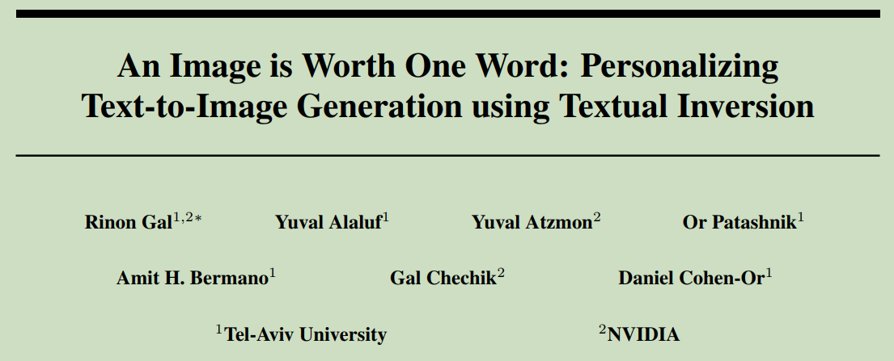
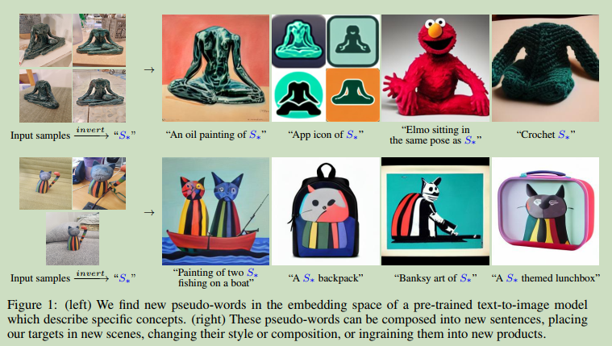
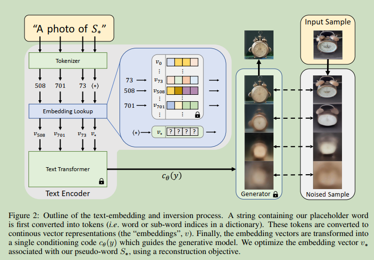

# An Image is Worth One Word: Personalizing Text-to-Image Generation using Textual Inversion

  

**Origin:** ICLR2023; Tel-Aviv University, Nvidia; **[[Project Code](https://github.com/rinongal/textual_inversion)]**  
**Authors:** Rinon Gal; Yuval Alaluf; Yuval Atzmon; etc.    
**Label:** text-to-image; latent diffusion model; personalization; textual-inversion   
**Abastract:** using textual inversion to find a pseudo-word to represent a specific concept.   

 

  

  