# 020 Modulating Pretrained Diffusion Models for Multimodal Image Synthesis

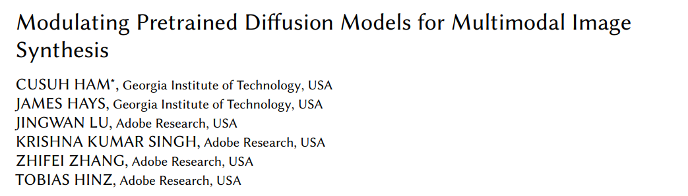  

**Origin:** SIGGRAPH2023; Georgia Institute of Technology, USA **[[no Code](nocode)]**  
**Authors:**CUSUH HAM; JAMES HAYS; JINGWAN LU; etc.    
**Label:** text-to-image; sketch-to-image; conditional generation; layout-to-image   
**Abastract:** 额外训练小模块对于多模态的layout和sketch信息进行输入, 输出 $\gamma$ 和 $v$ 从而对预测的噪声进行修正. 冻结unet, 训练小模块  

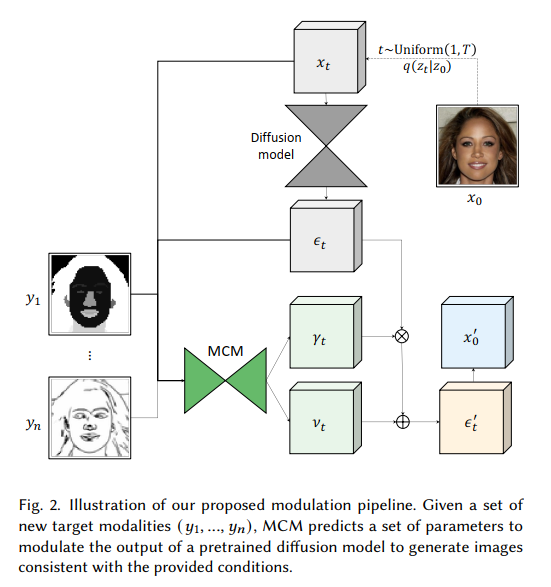  

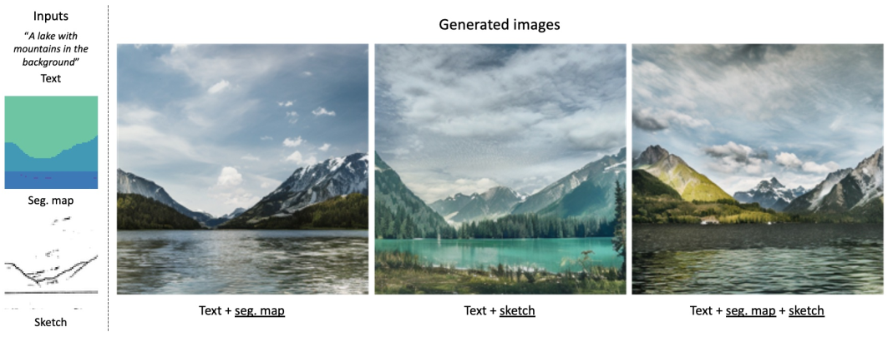  

 
 
 

# 021 Freestyle Layout-to-Image Synthesis

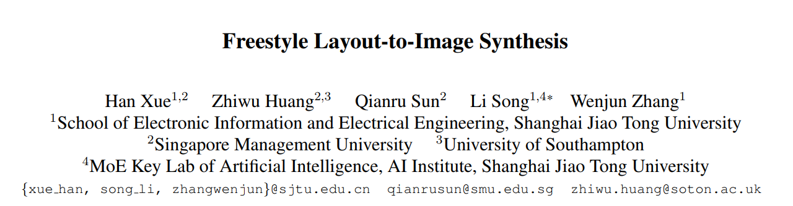  

**Origin:** CVPR2023; Shanghai Jiao Tong University **[[no Code](nocode)]**  
**Authors:**Han Xue; Zhiwu Huang; Qianru Sun; etc.    
**Label:** text-to-image; conditional generation; layout-to-image   
**Abastract:** 利用layout mask对Attention区域进行修正, 区域内为1, 区域外为-inf. 需要微调  

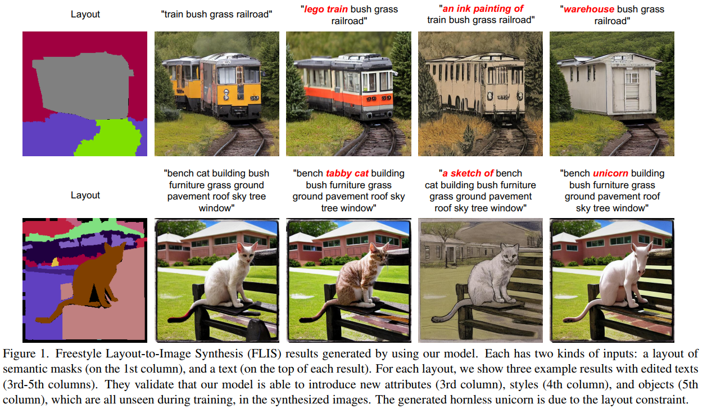  

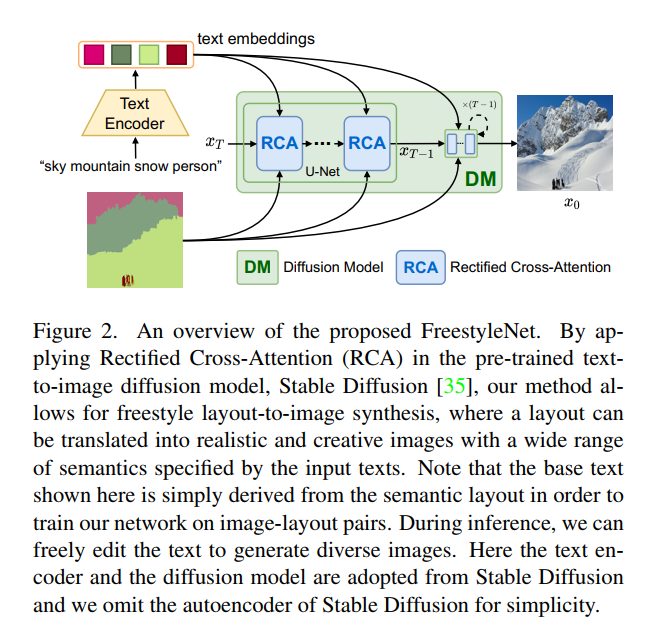  

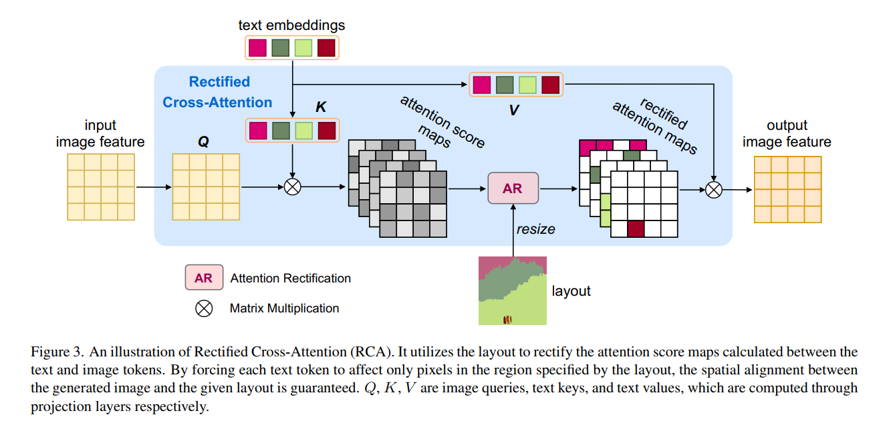  

 
 
 

# 022 SpaText: Spatio-Textual Representation for Controllable Image Generation

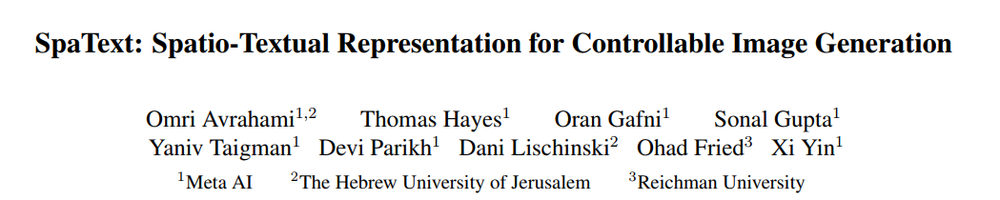  

**Origin:** CVPR2023; Meta AI **[[Project Code](https://omriavrahami.com/spatext)]**  
**Authors:**Omri Avrahami; Thomas Hayes; Oran Gafni; etc.    
**Label:** text-to-image; conditional generation; layout-to-image   
**Abastract:** 将CLIP编码后的图像特征构建成图像作为额外的条件输入. 需要微调  

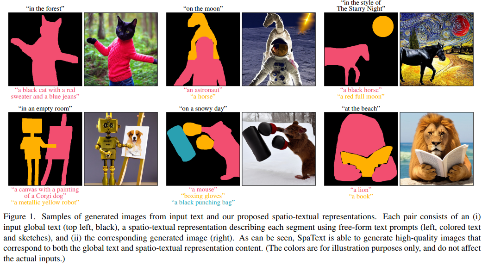  

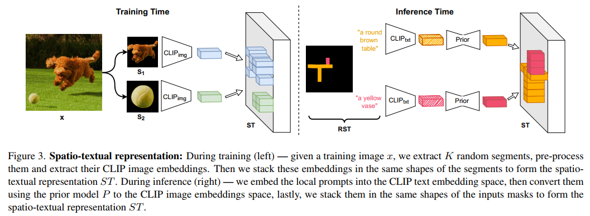  

 
 
 

# 023 InteractDiffusion: Interaction Control in Text-to-Image Diffusion Models

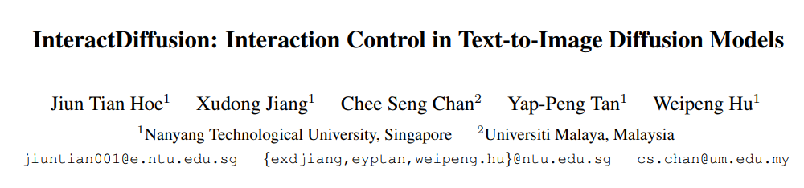  

**Origin:** CVPR2024; Nanyang Technological University **[[Project Code](https://jiuntian.github.io/interactdiffusion)]**  
**Authors:**Jiun Tian Hoe; Xudong Jiang; Yap-Peng Tan; etc.    
**Label:** text-to-image; conditional generation; layout-to-image   
**Abastract:** 加入了Interaction Attention来额外加入<subject, action, object>条件信息. 需要训练    

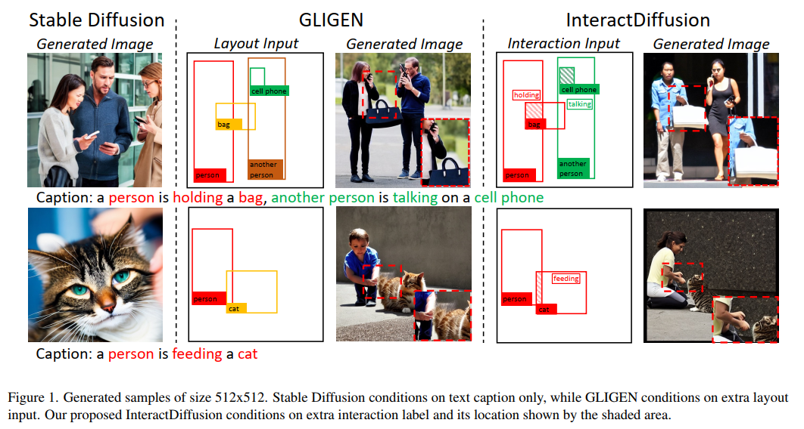  

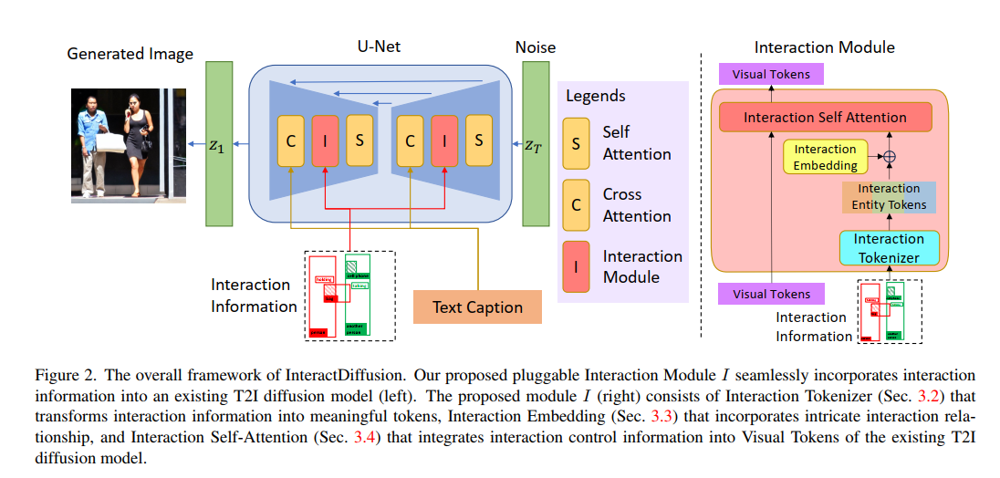  

 
 
 

# 024 LayoutDiffusion: Controllable Diffusion Model for Layout-to-image Generation

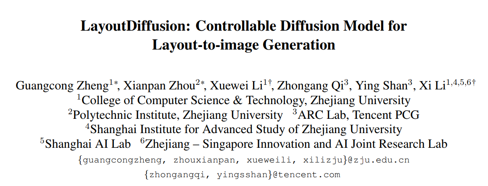  

**Origin:** CVPR2023; Zhejiang University **[[Project Code](https://github.com/ZGCTroy/LayoutDiffusion)]**  
**Authors:**Guangcong Zheng; Xianpan Zhou; Xuewei Li; etc.    
**Label:** text-to-image; conditional generation; layout-to-image   
**Abastract:** 加入了特殊设计的layout-fusion-module. 需要训练   

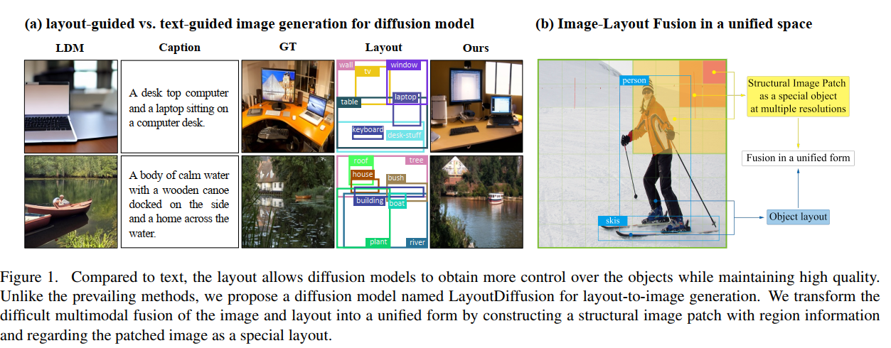  

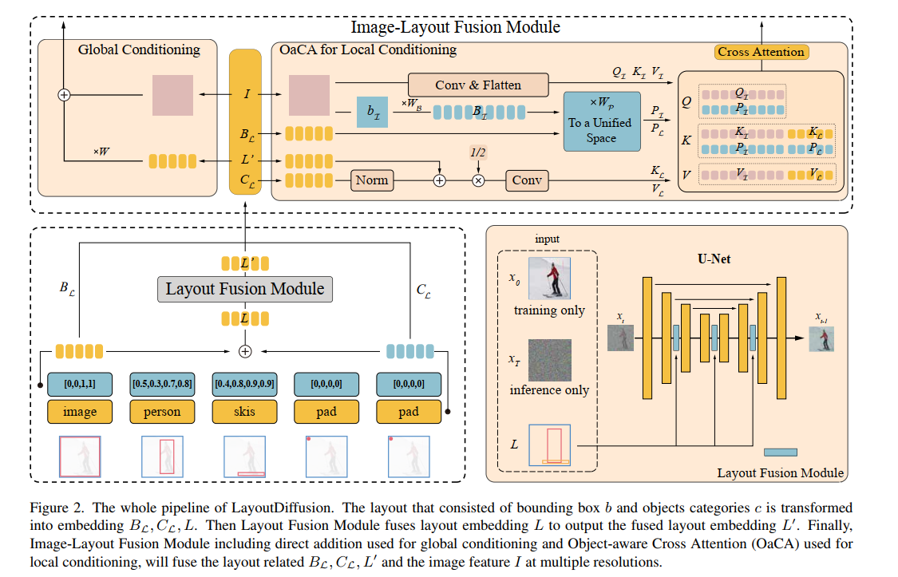  