## 001 Free-Bloom: Zero-Shot Text-to-Video Generator with LLM Director and LDM Animator

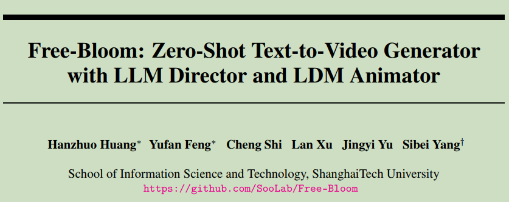  

#### Origin: NIPS2023, Shanghai Tech University 
#### Code: https://github.com/SooLab/Free-Bloom
#### Label: zero-shot; text-to-video; LLM

### 1. Arguments & Motivations & Contributions

**Motivations:**  

data-efficient and cost efficient zero-shot text-to-video generation

To generate a semantic-coherent video,
exhibiting a rich portrayal of temporal semantics such as the whole process of
flower blooming rather than a set of “moving images”

**Arguments:**  

1. text-to-video generation requires quantities of annotated text-video data and considerable computational resources.  
2. "moving images"  

**Contributions:**

1. Free-Bloom: harness large language models (LLMs) as the director, while pretrained image diffusion models as the frame animator.  
2. a video generation module incorporating joint noise sampling and step-aware attention shift, ensuring identical coherence and temporal coherence while expressing the semantic content. (生成低帧率但是语义一致的视频)  
3. We introduce a training-free dual-path interpolation strategy, ensuring consistency with context while maintaining fidelity. (插值生成高帧率的视频)  
4. Free-Bloom can generate impressive videos imbued with semantic significance corresponding with the contextual narrative.  

### 2. Method

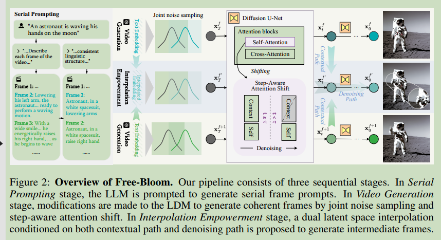  

整体包含三个部分的内容，Serial prompting；Video Generation；interpolation empowerment

#### 2.1 Serial Prompting

LLMs incorporate extensive world knowledge and can provide temporal transition knowledge.  

首先将文本text给到LLM，得到initial description（存在着free linguistic strcture 和 discource coherence）。将 initial description 进一步交给LLM进行处理，得到 $f$ 帧中每一帧的精细 prompt $\mathcal{T}^{1:T}=\lbrace \mathcal{T}^1, ..., \mathcal{T}^f \rbrace$ 。

#### 2.2 Video Generation

**Joint Noise Sampling:**  
(1) LDM每一帧的初始噪声相同，在相似的文本信息引导下会生成相似的内容，这个性质可以提高temporal coherence，但是会限制物体的变化，降低生成的视频质量。  
(2) LDM每一帧的噪声相互独立，可以使得物体有变化，但是不能保证consistency across frames  

本文提出了一种joint noise sampling，初始噪声包含不变的部分和变动的部分，最终用到的噪声为二者的组合：  

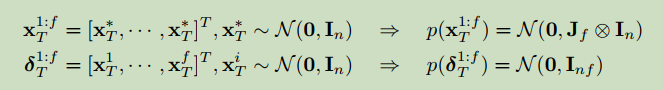  

Kronecker product

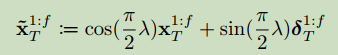  

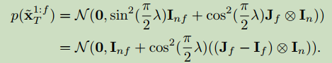  

其中 $\lambda$ 为超参数。

**Step-aware attention shift:**
furthur maintain identical coherence and semantic coherence.  

通过在当前帧的self-attention中加入前一帧和第一帧的Key和Value来得到：  

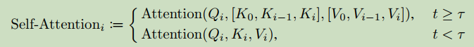  

其中 $\tau$ 是时间步阈值。

#### 2.3 Interpolation Empowerment

本文提出了dual Interpolation path。  

首先将前一帧和后一帧的textual prompt进行插值作为当前帧的prompt。

之后对于LDM采样过程中的每一步进行插值，来保证插值语义的相关性，称作contextual path：

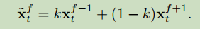  

将contextual path与去噪过程得到的结果再一次进行线性组合，称作Denoising path：  

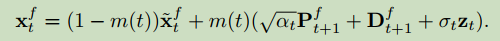  

#### 2.4 Extensions

本文的方法可以和现有的扩散模型的应用进行结合，从而实现 (1) Personalization (2) Making an image move

### 3. Experiments

LLM: ChatGPT  LDM: Stable Diffusion

先生成 f=6 的 512x512 的低帧率视频，之后进行插帧。

最后用ESRGAN超分辨率。

单个NVIDIA GeForce RTX 3090Ti

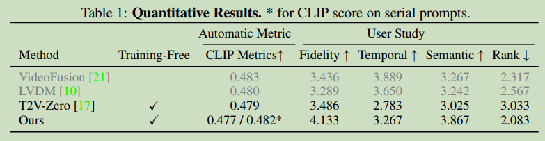  

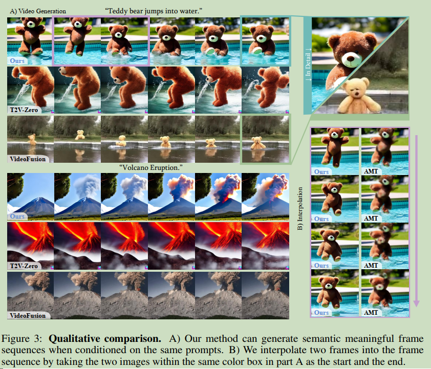  

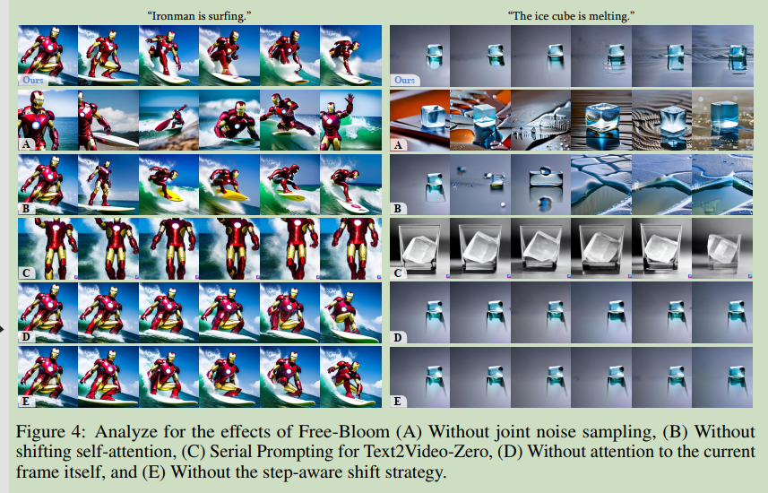  