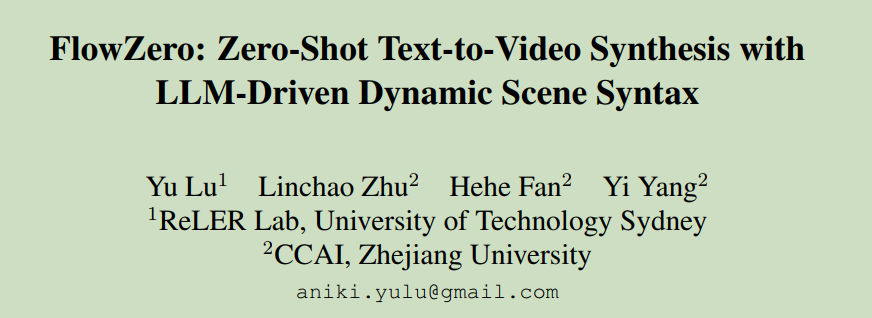
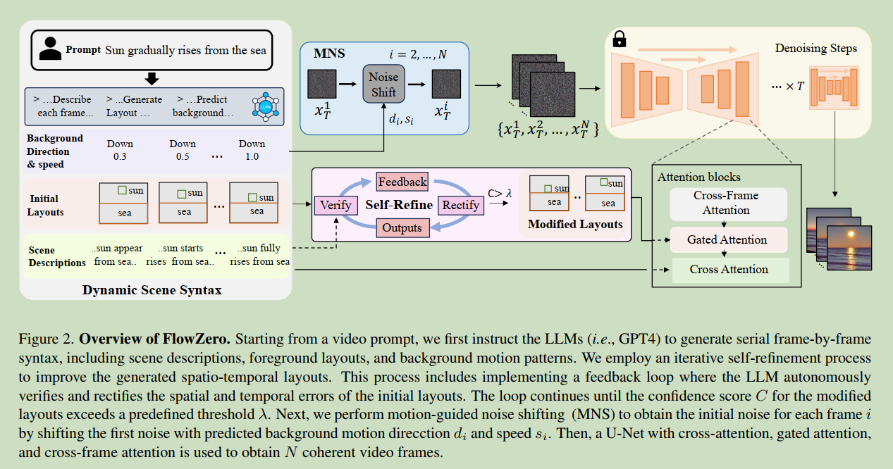
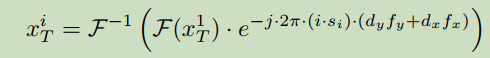
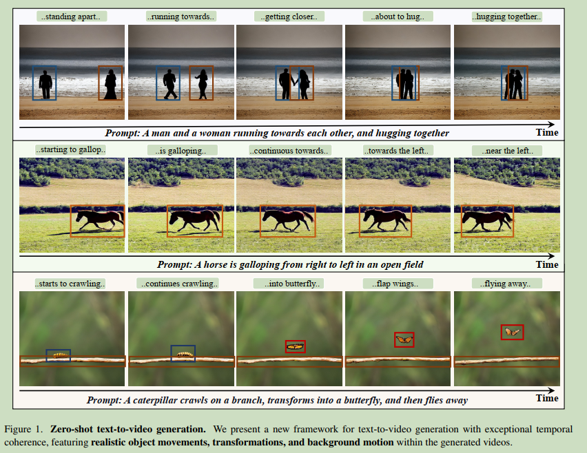

# 009 FlowZero: Zero-Shot Text-to-Video Synthesis with LLM-Driven Dynamic Scene Syntax

  

### Origin: Arxiv 2023.11, University of Technology Sydney
### Code: https://flowzero-video.github.io/  (Code repository is empty)
### Label: zero-shot; text-to-video; LLM

 

## 1. Arguments & Motivations & Contributions

**Arguments:**  

1. Computationally expensive  
2. struggle to capture  the intricate object dynamics and background motion of videos, often leading to less expressive and coherent video generation.  

**Contributions:**  

1. uses LLMs to convert text into Dynamic Scene Syntax, leading to accurate frame-by-frame video instructions.  
2. improves the global coherence of videos with adaptively controlled background motion through motion-guided noise shifting, increasing the realism of scene and camera motion.  
3. experiments and evaluations

 

## 2. Method

  

 

### 2.1 Dynamic Scene Syntax Generation

**Scene Descriptions:**  

providing a description for each frame

**Foreground Layout:**  

generate a sequence of frame-specific layouts that outline the spatial arrangement of foreground entities in each frame  

**Background Motion:**  

categorize potential background motion into eight moving directions: {left, right,up, down, left up, left down, right up, right down} and include a “random” option for non-directional movement.  

define a motion speed that ranges from 0 (no movement) to 1.0 (rapid movement).  

use LLMs to determine the most appropriate background motion direction and speed for each frame.  

**Iterative Self-Refinement:**  

 iterative self-refinement process to address potential misalignments between the initial spatiotemporal layouts and the textual prompts  

 

### 2.2 Video Synthesis from Dynamic Scene Syntax

有了背景的移动方向和速度,直白的做法是直接shift noise for each frame, 但是这会造成abrupt changes in low-level visual effects.  

本文提出了shift the phase of noises in the frequency domain.  

  

 

## 3. Experiments  

  