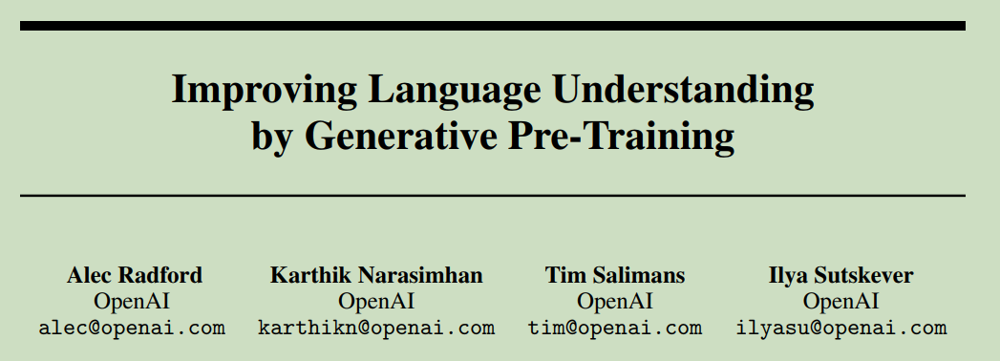
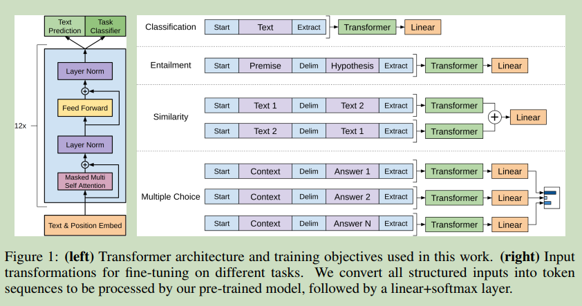
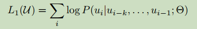
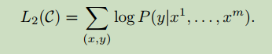
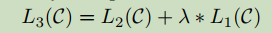
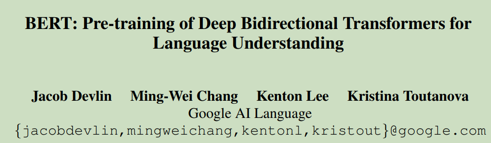
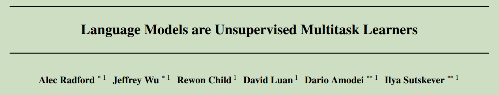
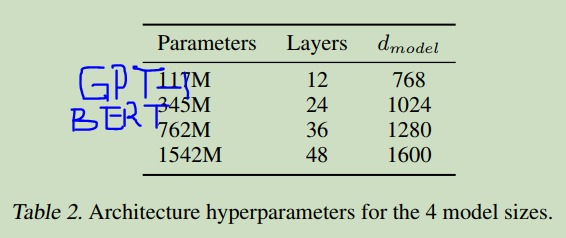
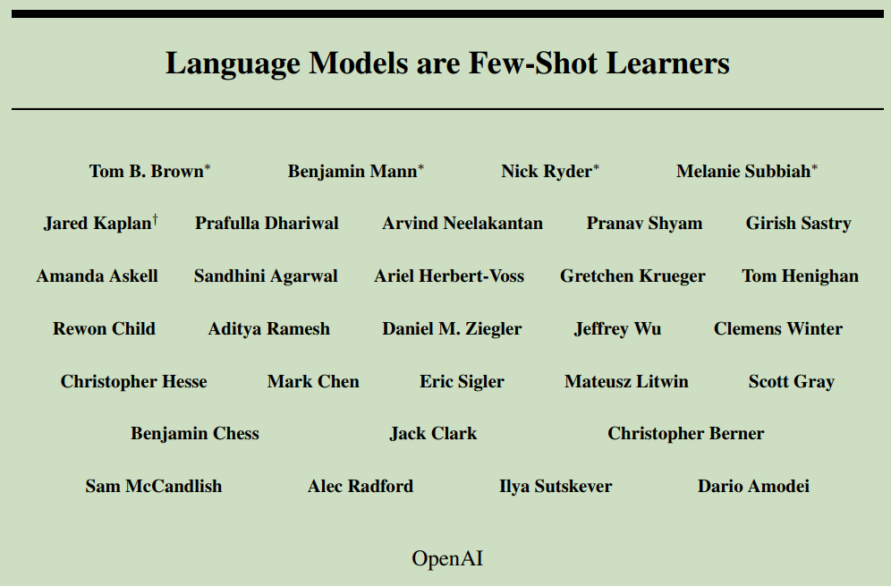

## 002 (GPT-1) Improving Language Understanding by Generative Pre-Training

#### Origin: OpenAI 2018
#### Code: no code
#### Label: GPT-1; LLM

最大的模型有1.3B参数量。

### 1. Arguments & Motivations & Contributions

**Arguments & Motivations:**  
(1) Most deep learning methods require substantial amounts of manually labeled data.  
(2) Learning good representations in an unsupervised fashion can provide a significant performance boost.  

**Challenges:**  
(1) It is unclear what type of optimization objectives are most effective at learning text representations that are useful for transfer.  
(2) there is no consensus on the most effective way to transfer these learned representations to the target task.  

**Contributions:**  
(1) First, we use a language modeling objective on the unlabeled data to learn the initial parameters of a neural network model.  
(2) Subsequently, we adapt these parameters to a target task using corresponding supervised objective.  

### 2. Method

#### 2.1 Unsupervised pre-training

在大语料库上使用了multi-layer Transformer Decoder，无监督训练目标：  

#### 2.2 Supervised fine-tuning

额外增加一层输出层来适应下游任务。  

在微调时包含无监督的目标有两个好处：  
(1) improving generalization of the supervised model  
(2) accelerating convergence  

 
 
 
 
 
 

## 003 BERT: Pre-training of Deep Bidirectional Transformers for Language Understanding

#### Origin: Proceedings of NAACL-HLT, 2019; Google
#### Code: https://github.com/google-research/bert
#### Label: LLM; Transformer

BERT is designed to pretrain deep bidirectional representations from unlabeled text by jointly conditioning on both left and right context in all layers.  

the pre-trained BERT model can be finetuned with just one additional output layer to create state-of-the-art models for a wide range of tasks.  

整体的思路和GPT-1相似，都是先预训练，然后在指定的任务上进行微调。主要区别是用的双向的Transformer。  

 
 
 
 
 
 

## 004 (GPT-2) Language Models are Unsupervised Multitask Learners

#### Origin: OpenAI Blog 2019
#### Code: no code
#### Label: GPT-2; LLM

### 1. Arguments & Motivations & Contributions  

We demonstrate that language models begin to learn these tasks without any explicit supervision when trained on a new dataset of millions of webpages called WebText.  

The capacity of the language model is essential to the success of zero-shot task transfer and increasing it improves performance in a log-linear fashion across tasks.    

### 2. Method

#### 2.1 Training Dataset

WebText dataset, contains the text subset of these 45 million links

#### 2.2 Input Representation

Byte Pair Encoding (BPE) (Sennrich et al., 2015) is a practical middle ground between character and word level language modeling which effectively interpolates between word level inputs for frequent symbol sequences and character level inputs for infrequent symbol sequences.

We observed BPE including many versions of common words like dog since they occur in many variations such as dog. dog! dog? . This results in a sub-optimal allocation of limited vocabulary slots and model capacity. To avoid this, we prevent BPE from merging across character categories for any byte sequence.

#### 2.3 Model

Transformer Decoder as GPT-1

1. Layer normalization was moved to the input of each sub-block  
2. an additional layer normalization was added after the final self-attention block  
3. scale the weights of residual layers at initialization by a factor of 1=pN where N is the number of residual layers  
4. The vocabulary is expanded to 50,257  
5.  increase the context size from 512 to 1024 tokens and a larger batchsize of 512 is used  

 
 
 
 
 
 

## 005 (GPT-3) Language Models are Few-Shot Learners

#### Origin: NeurIPS2020 OpenAI, 2020
#### Code: no code
#### Label: GPT-3; LLM

