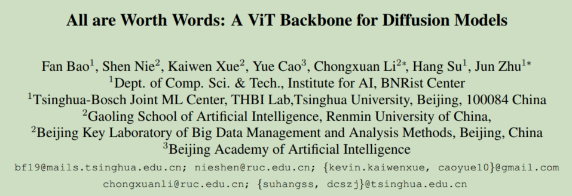
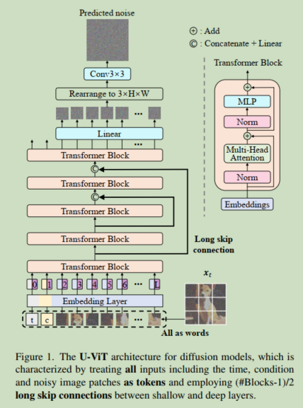
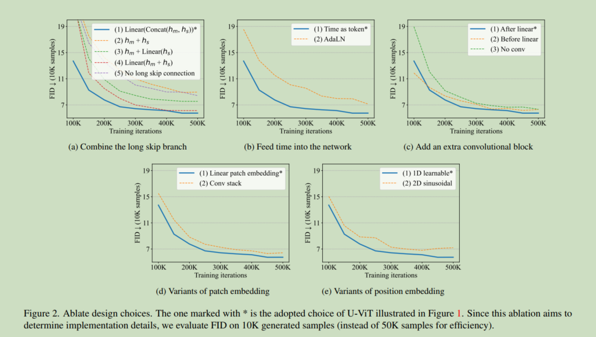
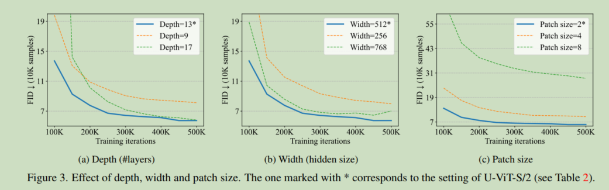
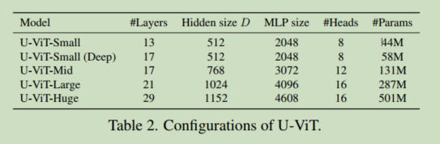
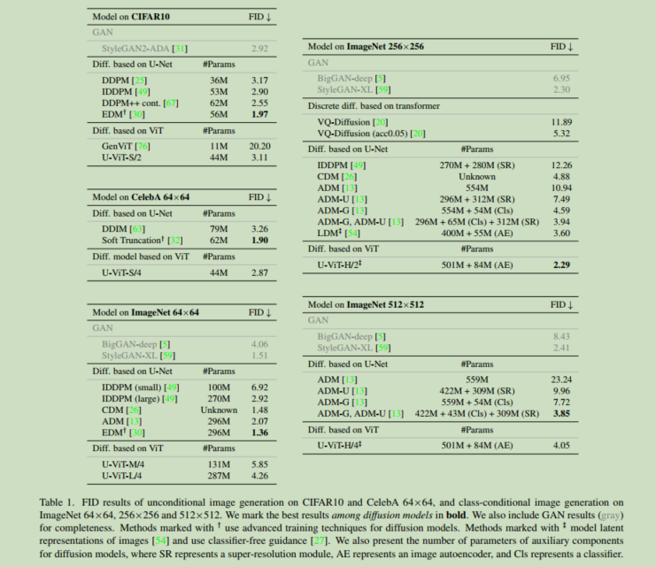
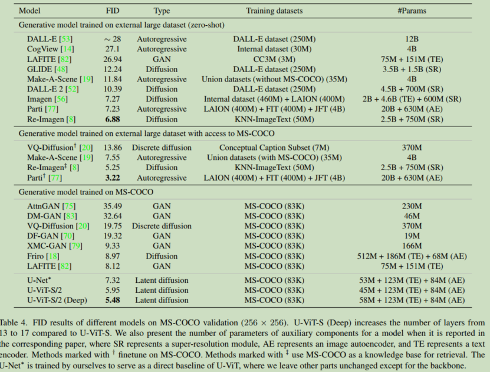

# 010 All are Worth Words: A ViT Backbone for Diffusion Models

  

#### Origin: CVPR2023, Tsinghua University   
#### Code: https://github.com/baofff/U-ViT
#### Label: ViT; Diffusion; U-ViT

 

## 1. Arguments & Motivations & Contributions

whether the reliance of the CNN-based U-Net is necessary in diffusion models?  

We design a simple and general ViT-based architecture (named U-ViT) for image generation with diffusion models.  

 

## 2. Method

  

It takes time $t$, the condition $c$ and the noisy image $x_t$ as inputs to predicts the noise injected into $x_t$.  

The training objective is a pixel-level prediction task and is sensitive to low-level features. The long skip connections provide shortcuts for the low-level features and therefore ease the training of the noise prediction network.   

a $3 \times 3$ convolutional block before output.  

 

### 2.1 Implementation details

  

**The way to combine the long skip branch:**  

(1) concatenating them and then performing a linear projection $Linear(Concat(h_m, h_s))$ **效果最好**  
(2) directly adding them $h_m + h_s$  
(3) performing a linear projection to $h_s$ and then adding them $h_m + Linear(h_s)$  
(4) adding them and then performing a linear projection $Linear(h_m + h_s)$  
(5) long skip connection is dropped  

**The way to feed the time into the network:**  

(1) treat it as a token **效果最好**  
(2) incorporate the time after the layer normalization  

**The way to add an extra convolutional block after the transformer:**  

(1) convolutional block after the linear projection that maps the token embeddings to image patches. **效果最好**  
(2) conv before this linear projection  
(3) drop the extra conv block  

**Variants of the patch embedding:**  

(1) a linear projection that maps a patch to a token embedding **效果最好**  
(2) a stack of 3×3 convolutional blocks followed by a 1×1 convolutional block to map an image to token embeddings  

**Variants of the position embedding:**  

(1) 1-dimensional learnable position embedding proposed in the original ViT **效果最好**  
(2) 2-dimensional sinusoidal position embedding  
(3) not use any position embedding (can not generate meaningful images)  

 

### 2.2 Effect of depth, width and patch size

  

the performance improves as the depth (i.e., the number of layers) increases from 9 to 13. Nevertheless, UViT does not gain from a larger depth like 17 in 50K training
iterations.  

increasing the width (i.e., the hidden size) from 256 to 512 improves the performance, and further increase to 768 brings no gain;  

decreasing the patch size from 8 to 2 improves the performance, and further decrease to 1 brings no gain.  

 

## 3. Experiments

### 3.1 U-ViT configurations 

  

### 3.2 Unconditional and Class-Conditional Image Generation

  

### 3.3 Text-to-Image Generation

  