# LLM-grounded Diffusion: Enhancing Prompt Understanding of Text-to-Image Diffusion Models with Large Language Models

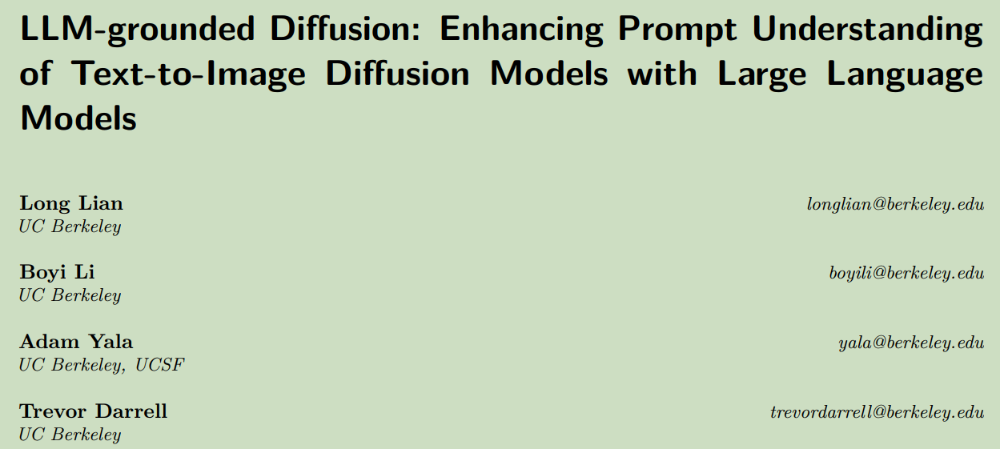  

**Origin:** TMLR2024; UC Berkley; **[[Project Code](https://llm-grounded-diffusion.github.io/)]**  
**Authors:** Long Lian; Boyi Li; Adam Yala; Trevor Darrell  
**Label:** LMD; training free; text-to-image; layout-to-image   
**Abastract:** In the first stage, the LLM generates a scene layout that comprises captioned bounding boxes from a given prompt describing the desired image. In the second stage, a novel controller guides an off-the-shelf diffusion model for layout-grounded image generation.  

 

## 1. Arguments & Motivations & Contributions  

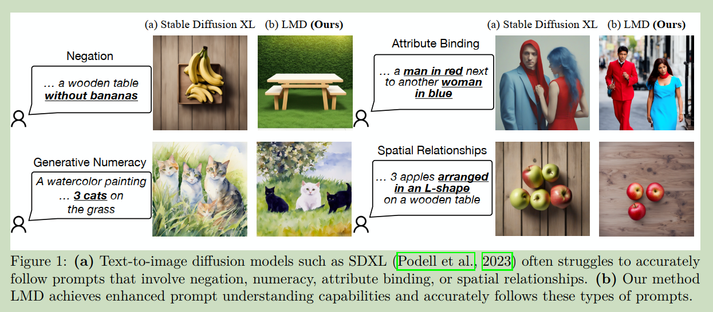  

### Arguments:
Current text-to-image diffusion models struggle with complex prompts, such as those that involve numeracy and spatial reasoning.  

### Motivations:
enhance prompt understanding capabilities in diffusion models.

### Contributions:

* We propose a training-free two-stage generation pipeline that introduces LLMs to improve the prompt understanding ability of text-to-image diffusion models.  

* We introduce layout-grounded Stable Diffusion, a novel controller that steers an off-the-shelf diffusion model to generate images grounded on instance-level box layouts from the LLM.  

* LMD enables instruction-based scene specification and allows broader language support in the prompts.  

* We propose a benchmark to assess the prompt understanding ability of a text-to-image model and demonstrate the superior performance of LMD over recent baselines.  

 

## 2. Method

整体分为两个阶段, 第一个阶段利用LLM由文本得到layout, 第二阶段由layout和文本生成图像.

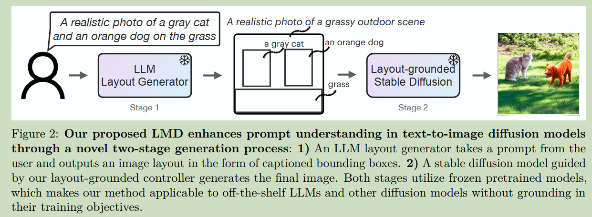  

 

### 2.1 LLM-based Layout Generation

由LLM得到的layout表示包含前景和背景两个组成部分:

* a captioned bounding box for each foreground object, with coordinates specified in the (x, y, width, height) format  

* a simple and concise caption describing the image background along with an optional negative prompt indicating what should not appear in a generated image.  

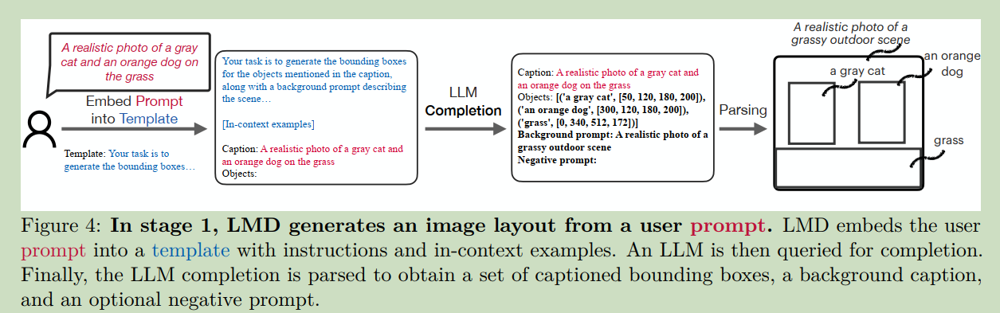  

LLM 的输入采用了 In-context learning, 包含三个部分:

* **Instructions:**

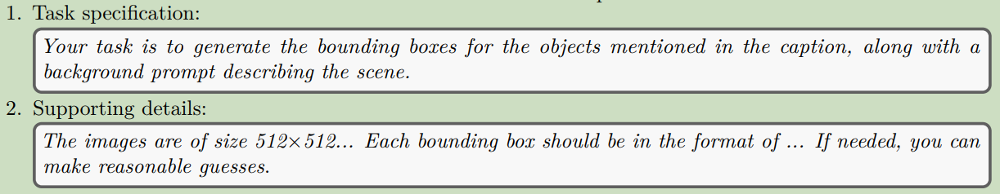  

* **In-context learning:**

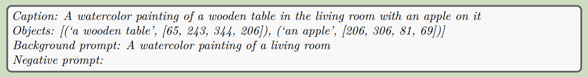  

* **LLM Completion:**

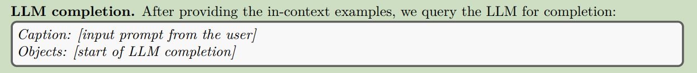  

 

### 2.2 Layout-grounded Stable Diffusion

传统的region control method的缺陷是: 缺乏instance-level control

LMD enables instance-level grounding by first generating masked latents for each individual bounding box and then composing the masked latents as priors to guide the overall image generation.

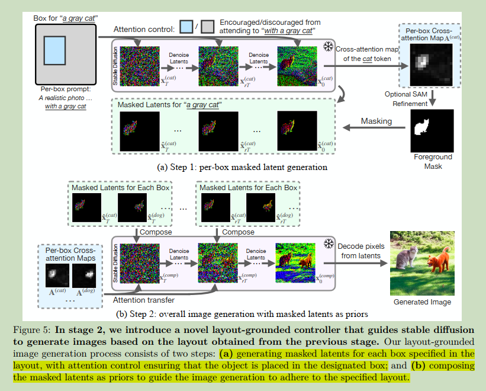  

* **Per-box masked latents:**  

对于每个前景box单独生成, 初始噪声全部设置相同. 通过计算文本与图像的Attention map, 并对Attention map通过能量函数进行约束.  

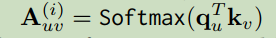  
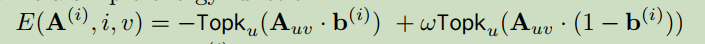  
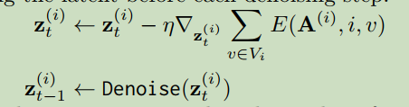  

之后加入 masked instance latents:  

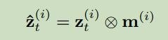  

* **Masked Latents as priors for instance-level control**  

将 masked instance Latents 对最终图像生成的噪声进行替换. 

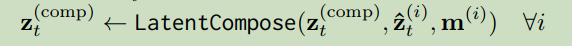  

之后利用能量函数来进一步约束采样过程:  

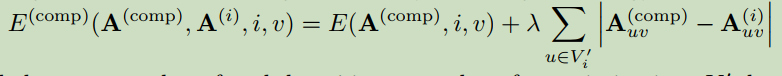  

* **Integration with training-based method**

本文的方法可以和类似于GLIGEN的training-based方法进行结合. 称作LMD+  

### 2.3 Additional Capabilities of LMD

* **Instruction-based scene specification**

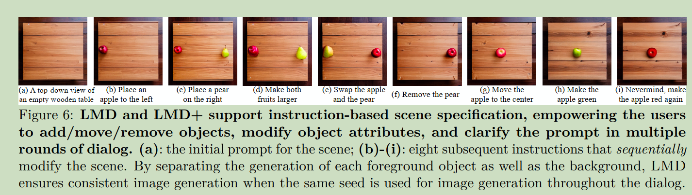  

* **Supporting more languages**

By giving an in-content example of a non-English user prompt and an English layout output4, the LLM layout generator accepts non-English user prompts and outputs layouts with English captions. 

 

## 3. Experiments

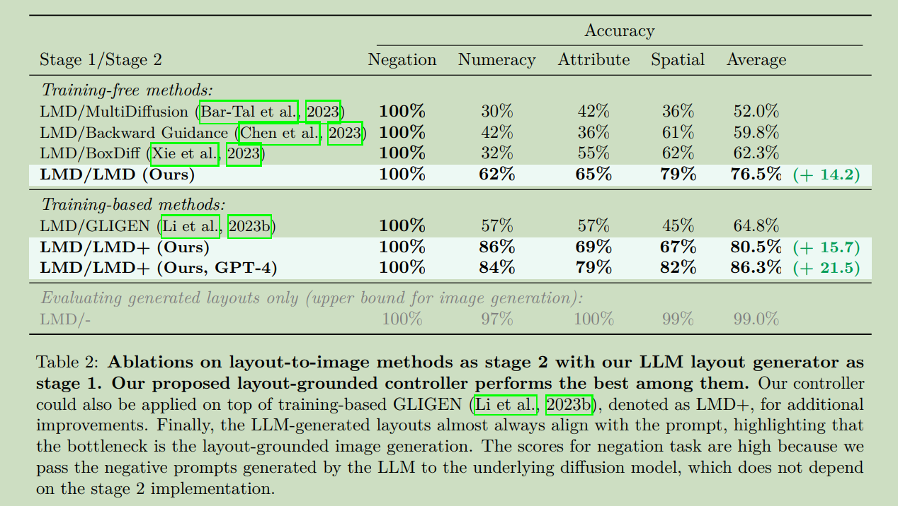  

* **Text-to-layout stage. Ablating in-context examples**

While GPT-3.5 benefits from more in-context examples, GPT-4 is able to successfully generate all the layouts even when given only one in-context example.