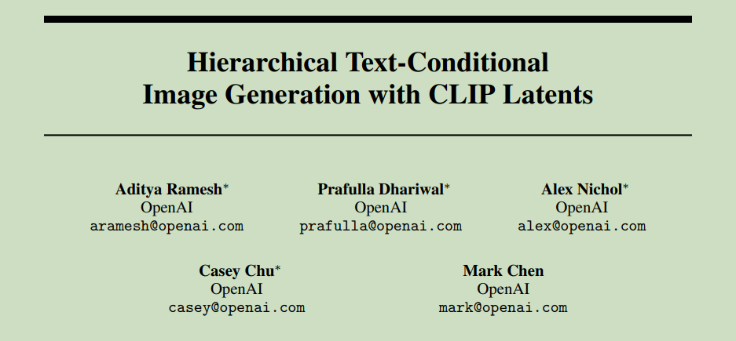
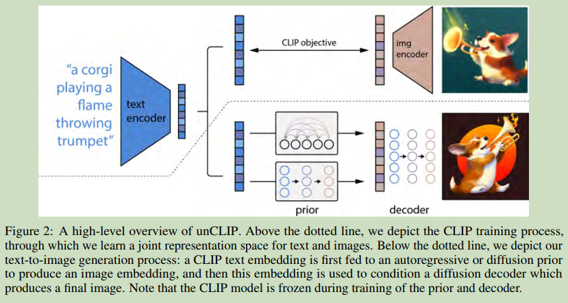
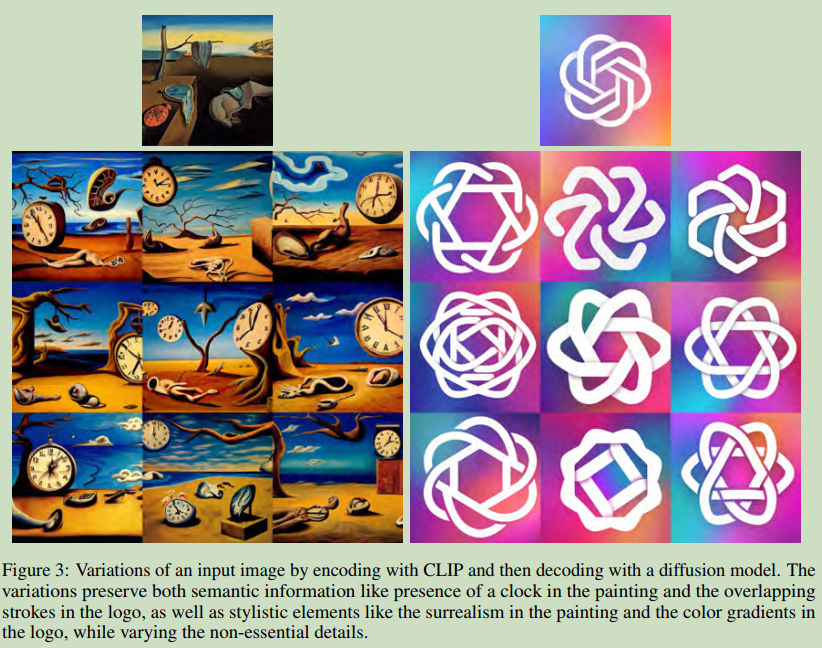
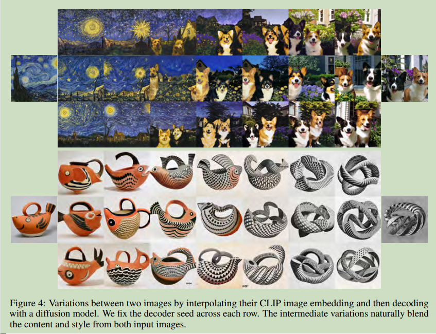
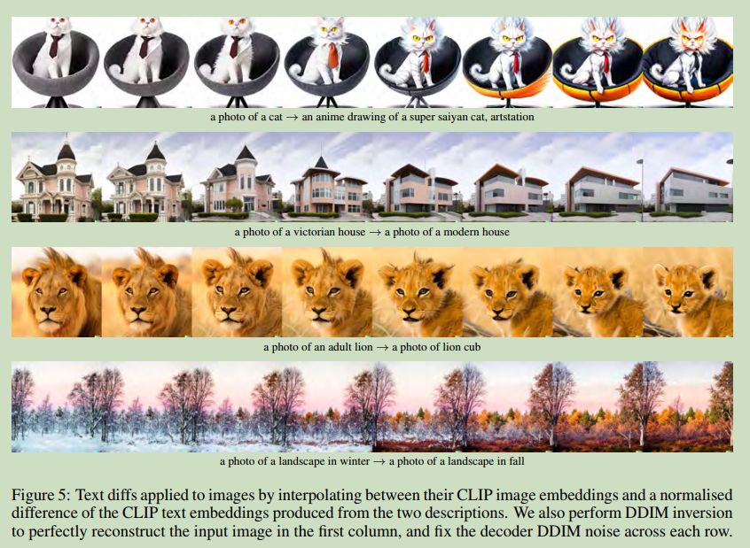
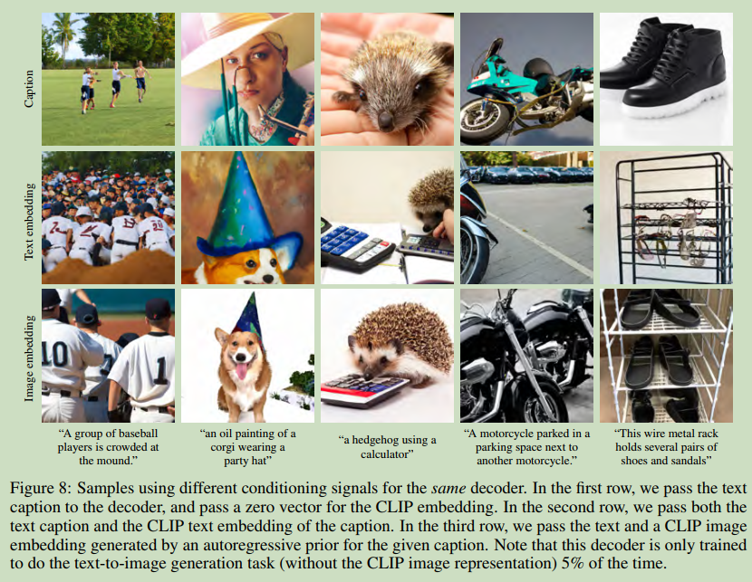

# Hierarchical Text-Conditional Image Generation with CLIP Latents

  

**Origin:** Arxiv2204; OpenAI; **[[No Code]()]**  
**Authors:** Aditya Ramesh; Prafulla Dhariwal; Alex Nichol; etc.    
**Label:** text-to-image; diffusion model; unCLIP; CLIP   
**Abastract:**DALL-E2; unCLIP; a prior that generates a CLIP image embedding given a text caption, and a diffusion decoder that generates an image conditioned on the image embedding.     

 

## 1. Arguments & Motivations & Contributions

### Motivations

CLIP embeddings have a number of
desirable properties: they are robust to image distribution shift, have impressive zero-shot capabilities, and have been fine-tuned to achieve state-of-the-art results on a wide variety of vision and language tasks.  

diffusion models

one notable advantage of using the CLIP latent space is the ability to semantically modify images by moving in the direction of any encoded text vector

### Contributions

1. train a diffusion decoder to invert the CLIP image decoder.  
2. a prior model generates possible CLIP image embeddings from a given text caption.  

 

## 2. Method

一个prior模型用来得到image embedding, 64x64的Diffusion, 以及后续64x64 $\to$ 256x256 $\to$ 1024x1024两个超分辨率Diffusion

  

### 2.1 Decoder

train diffusion model as decoder to produce images conditioned on CLIP image embeddings.  

projecting and adding CLIP embeddings to the existing timestep embedding.  

projecting CLIP embedding into four extra tokens and concatenate to the sequence of outputs from the CLIDE text encoder.  

enable classifier-free guidance by randomly setting the CLIP embedding to zero.  

### 2.2 prior model

two different model classes for the prior model:

* Autoregressive prior(AR)

* Diffusion prior

 

## 3. Image Manipulations

### 3.1 Variations

通过调整不同的DDIM sampling的 $\eta$ 在保证语义一致性的同时拥有采样的多样性.  

  

### 3.2 Interpolation

对于CLIP embedding的Interpolation, 通过spherical Interpolation. 对于Diffusion的Interpolation, 有两种方案, 第一种是对于DDIM inversion的Latent进行spherical Interpolation, 另一种是fixing DDIM Latent. 图中是fixing DDIM Latent 的结果.    

  

### 3.3 Text Diffs

对于文本embedding之间的插值.  

  

 

## 4. Probing the CLIP latent space

decoder model provides a unique opportunity to explore CLIP latent space by allowing us to directly visualize what the CLIP image encoder is seeing

 

## 5. Text-to-Image Generation

尽管可以直接用CLIP text embedding来作为decoder的输入, 但是实验证明使用 prior 可以有更好的结果.  

  