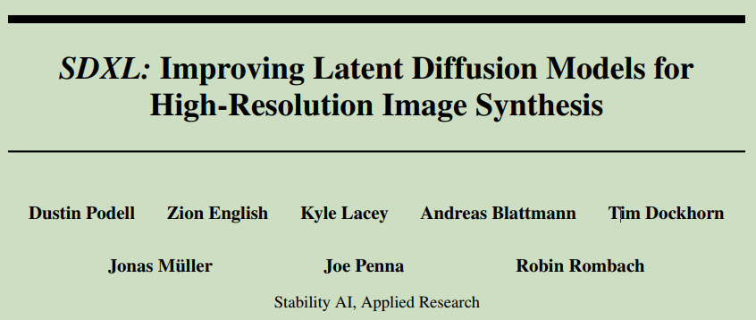
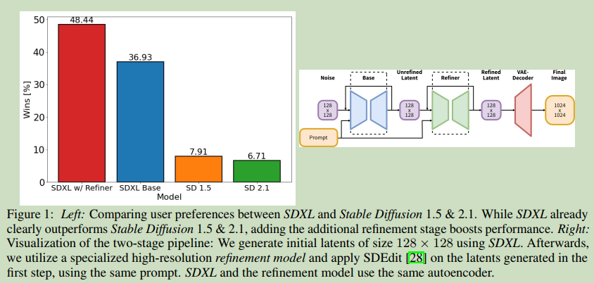
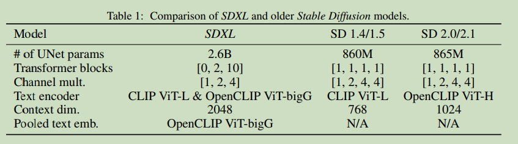
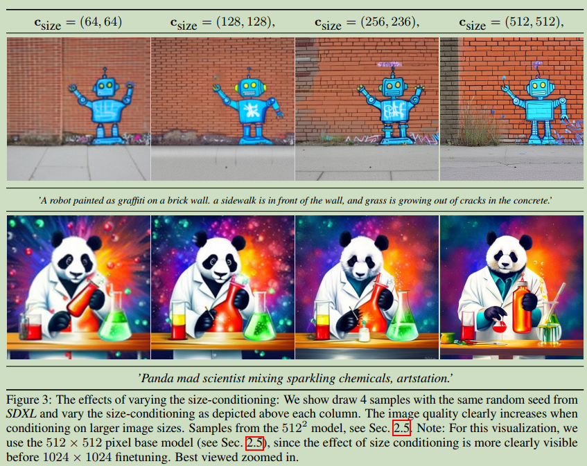
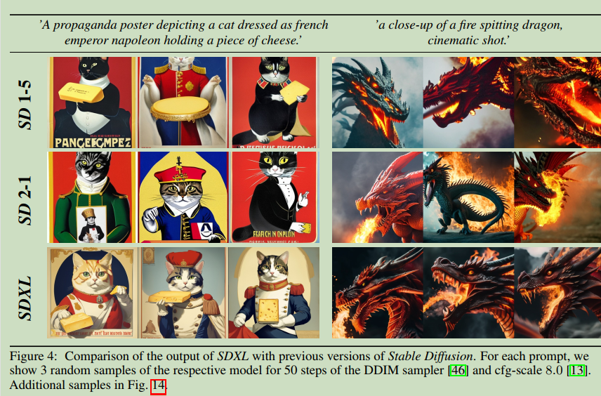
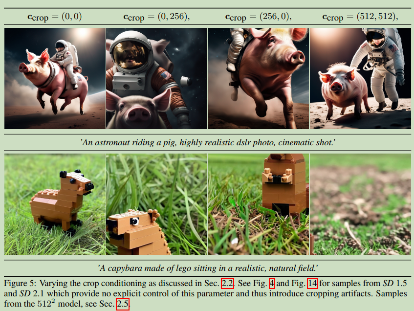
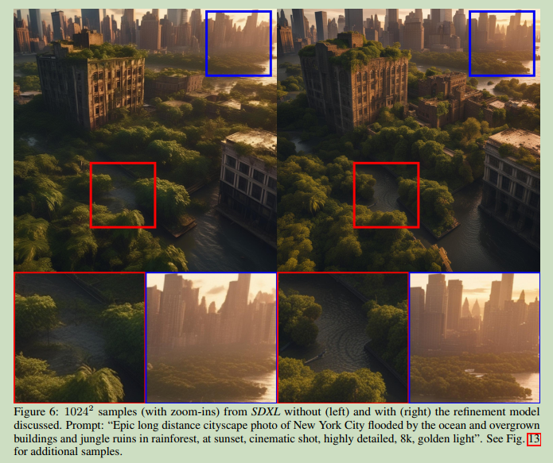

# SDXL: Improving Latent Diffusion Models for High-Resolution Image Synthesis

  

**Origin:** ICLR2024 Spotlight; Stability AI; **[[Project Code](https://github.com/Stability-AI/generative-models)]**  
**Authors:** Aditya Ramesh; Prafulla Dhariwal; Alex Nichol; etc.    
**Label:** text-to-image; latent diffusion model; stable diffusion;   
**Abastract:**Stable Diffusion XL; improved latent diffusion model; SDXL leverages a three times larger UNet backbone; a refinement model which is used to improve the visual fidelity of samples generated by SDXL using a post-hoc image-to-image technique.     

 

## 1. Arguments & Motivations & Contributions

### Contributions

1. a 3× larger UNet-backbone compared to previous Stable Diffusion models  
2. two simple yet effective additional conditioning techniques which do not require any form of additional supervision  
3. a separate diffusion-based refinement model which applies a noising-denoising process to the latents produced by SDXL to improve the visual quality of its samples  

 

## 2. Method

  

### 2.1 Architecture

  

### 2.2 Micro-Conditioning

#### Conditioning the Model on Image Size

A notorious shortcoming of the LDM paradigm is the fact that training a model requires a minimal image size, due to its two-stage architecture.  

**The two main approaches to tackle this problem are either to discard all training images below a certain minimal resolution or, alternatively, upscale images that are too small. the former method can lead to significant portions of the training data being discarded, what will likely lead to a loss in performance and hurt generalization. The second method, on the other hand, usually introduces upscaling artifacts which may leak into the final model outputs, causing, for example, blurry samples** 

SDXL condition the UNet model on the original image resolution, which is trivially available during training. we provide the original (i.e., before any rescaling) height and width of the images as an additional conditioning to the model. Each component is independently embedded using a Fourier feature encoding, and these encodings are concatenated into a single vector that we feed into the model by adding it to the timestep embedding.   

  

#### Conditioning the Model on Cropping Parameters  

  

the cut-off head of the cat.  

explanation: random cropping during training of the model  

**PyTorch requires tensors of the same size, a typical processing pipeline is to (i) resize an image such that the shortest size matches the desired target size, followed by (ii) randomly cropping the image along the longer axis.**  

Solution: During dataloading, we uniformly sample crop coordinates ctop and cleft (integers specifying the amount of pixels cropped from the top-left corner along the height and width axes, respectively) and feed them into the model as conditioning parameters via Fourier feature embeddings, similar to the size conditioning described above.

  

### 2.3 Multi-Aspect Training

Real-world datasets include images of widely varying sizes and aspect-ratios  

We finetune our model to handle multiple aspect-ratios simultaneously: partition the data into buckets of different aspect ratios, where we keep the pixel count as close to 1024x1024 pixels as possibly, varying height and width accordingly in multiples of 64.    

During optimization, a training batch is composed of images from the same bucket, and we alternate between bucket sizes for each training step. the model receives the bucket size (or, target size) as a conditioning  

In practice, we apply multi-aspect training as a finetuning stage after pretraining the model at a fixed aspect-ratio and resolution and combine it with the conditioning techniques via concatenation along the channel axis. 

### 2.4 Improved Autoencoder

we can improve local, high-frequency details in generated images by improving the autoencoder of LDM. We train the same autoencoder architecture used for the original Stable Diffusion at a larger batch-size (256 vs 9) and additionally track the weights with an exponential moving average.  

### 2.5 Putting Everything Together

First, we pretrain a base model on an internal dataset whose height- and width-distribution is visualized in Fig. 2 for 600 000 optimization steps at a resolution of 256 × 256 pixels and a batch-size of 2048, using sizeand crop-conditioning as described in Sec. 2.2. We continue training on 512 × 512 pixel images for another 200 000 optimization steps, and finally utilize multi-aspect training (Sec. 2.3) in combination with an offset-noise [11, 25] level of 0.05 to train the model on different aspect ratios (Sec. 2.3, App. I) of ∼ 1024 × 1024 pixel area.  

#### Refinement Stage

To improve sample quality, we train a separate LDM in the same latent space, which is specialized on high-quality, high resolution data and employ a noising-denoising process as introduced by SDEdit on the samples from the base model.  

  

 

## 3. Future Work

1. Single Stage  
2. Text synthesis  
3. Architecture  
4. Distillation  