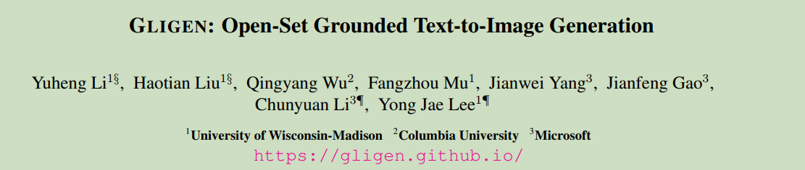
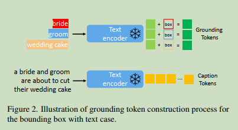
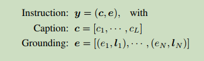
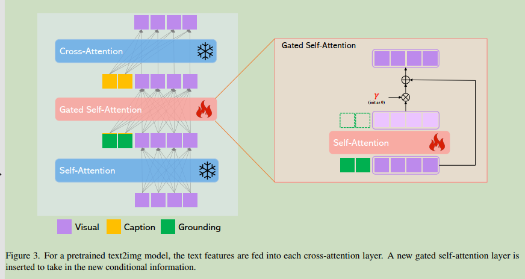
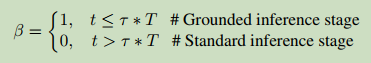
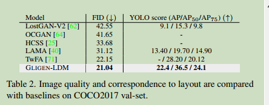
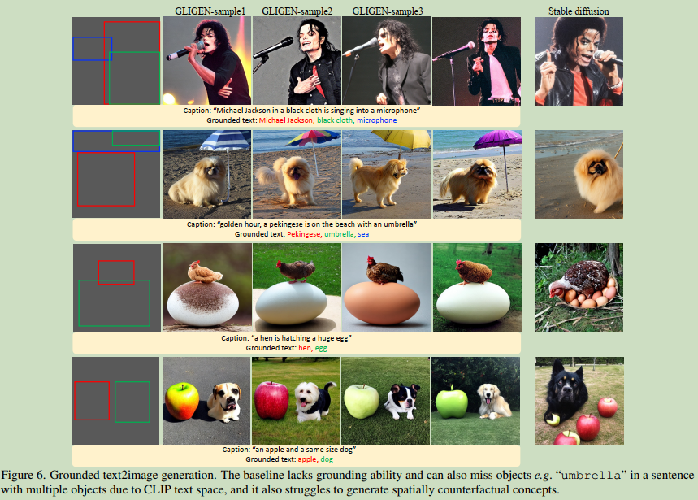
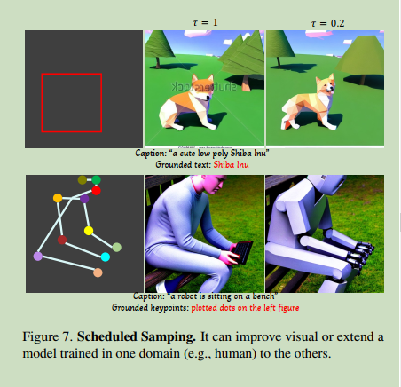

# GLIGEN: Open-Set Grounded Text-to-Image Generation

  

**Origin:** CVPR2023; University of Wisconsin-Madison; Columbia University; Microsoft; **[[Project Code](https://github.com/Stability-AI/generative-models)]**  
**Authors:**Yuheng Li; Haotian Liu; Qingyang Wu; etc.    
**Label:** text-to-image; latent diffusion model; conditional generation;   
**Abastract:**a new text2img generation method that endows new grounding controllability over existing text2img diffusion models by preserving the pre-trained weights and learning to gradually integrate the new localization layers.  

 

## 1. Arguments & Motivations & Contributions

### Arguments

existing large-scale text-toimage generation models cannot be conditioned on other input modalities apart from text, and thus lack the ability to precisely localize concepts, use reference images, or other conditional inputs to control the generation process.  

### Motivations

Can we build upon existing pretrained diffusion models and endow them with new conditional input modalities?  

### Contributions

1) We propose a new text2img generation method that endows new grounding controllability over existing text2img diffusion models. 
2) By preserving the pretrained weights and learning to gradually integrate the new localization layers, our model achieves open-world grounded text2img generation with bounding box inputs, i.e., synthesis of novel localized concepts unobserved in training. 
3) Our model’s zero-shot performance on layout2img tasks significantly outperforms the prior state-of-the-art, demonstrating the power of building upon large pretrained generative models for downstream tasks.  

 

## 2. Method

### 2.1 Grounding Instruction Input

  

  

条件信息包含两个部分, 第一部分是文本描述caption $c$, 第二部分是每个实体entity $e_i$ 及其对应的条件信息, 这里以物体的位置location $l_i$ 为例.  

caption token部分的处理与LDM相同, 即利用text encoder得到其embedding $h^c = [h_1^c, ..., h_L^c] = f_{text}(c)$  

grounding token部分先把每个实体的文本 $e_i$ 用text encoder进行编码, 位置信息 $l_i$ 用 Fourier embedding, 之后将两者经过MLP得到最终的表示

$$
h^e = MLP(f_{text}(e), Fourier(l))
$$

除了使用位置信息之外, 还可以换成image prompt, keypoint等其他形式.  

### 2.2 Continual Learning for Grounded Generation

#### Gated Self-Attention

  

在self-Attention和cross-Attention之间加入gated-Attention.  

$$
v = v + Selfattn(v) \\ 
v = v + \beta \cdot tanh(\gamma) \cdot TS(SelfAtten([v, h^e]))  \\
v = v + Crossattn(v, h^c)
$$

$TS(\cdot)$ is a token selection operation.  
$\gamma$ is a learnable scalar which is initialized as 0.  
$\beta$ is set as 1 during the entire training process.  

#### Learning Procedure

固定预训练的Diffusion的参数, 只更新添加的层的参数.  

#### Scheduled Sampling in Inference

通过设置不同的 $\beta$ 值来决定是否加入gated-Attention.  

  

 

## 3. Experiments

  

  

  