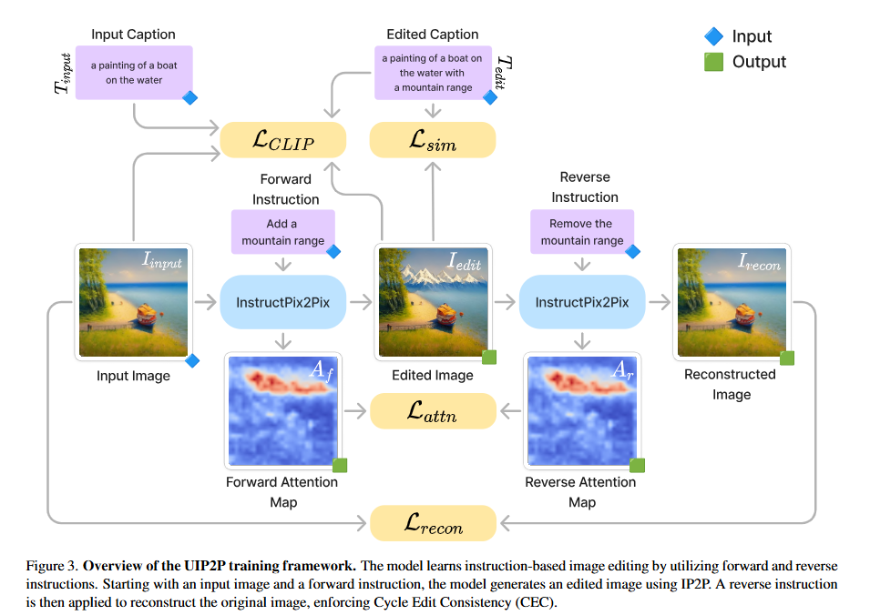
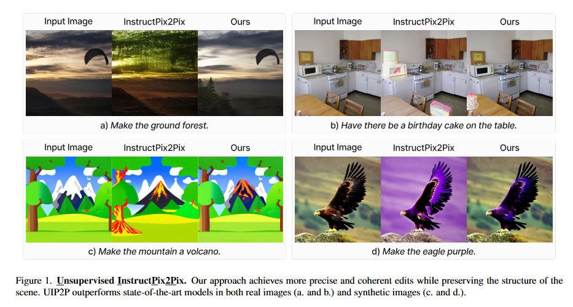

## 1. [UIP2P: Unsupervised Instruction-based Image Editing via Cycle Edit Consistency](https://arxiv.org/pdf/2412.15216)

an unsupervised model for instruction-based image editing that eliminates the need for ground-truth edited images during training. Cycle Edit Consistency (CEC), which applies forward and backward edits in one training step and enforces consistency in image and attention spaces.  

  

  

## 2. [EnvGS: Modeling View-Dependent Appearance with Environment Gaussian](https://arxiv.org/pdf/2412.15215)  

