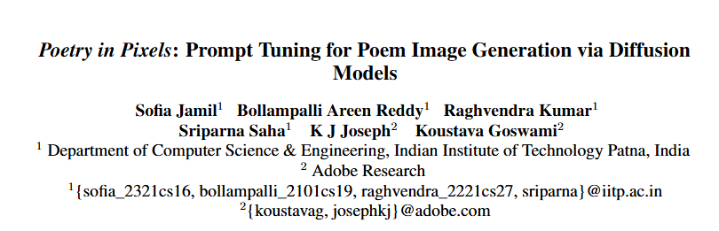
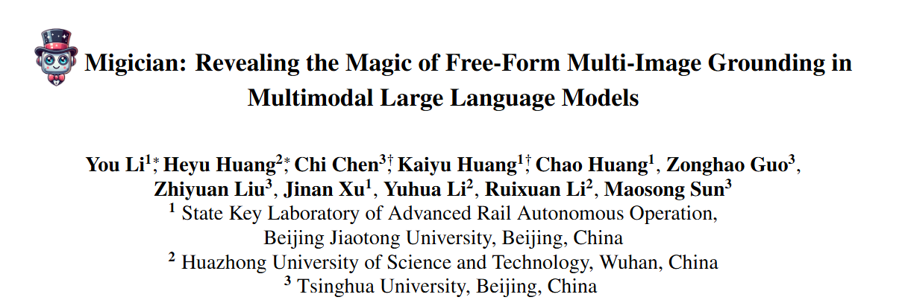

# 1. Image Processing

#### 1-001 [Improving Zero-Shot Object-Level Change Detection by Incorporating Visual Correspondence](https://arxiv.org/pdf/2501.05555)

Detecting object-level changes between two images across possibly different views. We introduce a novel method that leverages change correspondences (a) during training to improve change detection accuracy, and (b) at test time, to minimize false positives. That is, we harness the supervision labels of where an object is added or removed to supervise change detectors, improving their accuracy over previous work by a large margin.

 

#### 1-002 [Alignment without Over-optimization: Training-Free Solution for Diffusion Models](https://arxiv.org/pdf/2501.05803)

Diffusion models excel in generative tasks, but aligning them with specific objectives while maintaining their versatility remains challenging. Addressing these limitations, we propose a training-free sampling method based on Sequential Monte Carlo (SMC) to sample from the reward-aligned target distribution.

 

#### 1-003 [Beyond Flat Text: Dual Self-inherited Guidance for Visual Text Generation](https://arxiv.org/pdf/2501.05892)

In this paper, we introduce a new training-free framework, STGen, which accurately generates visual texts in challenging scenarios (\eg, slanted or curved text layouts) while harmonizing them with the text background.

 

#### 1-004 [Poetry in Pixels: Prompt Tuning for Poem Image Generation via Diffusion Models](https://arxiv.org/pdf/2501.05839)

The task of text-to-image generation has encountered significant challenges when applied to literary works. We propose a PoemToPixel framework designed to generate images that visually represent the inherent meanings of poems.

 

# 2. Video Processing

#### 2-001 [OVO-Bench: How Far is Your Video-LLMs from Real-World Online Video Understanding?](https://arxiv.org/pdf/2501.05510)

We present OVO-Bench (Online-VideO-Benchmark), a novel video benchmark that emphasizes the importance of timestamps for advanced online video understanding capability benchmarking. OVO-Bench evaluates the ability of video LLMs to reason and respond to events occurring at specific timestamps under three distinct scenarios: (1) Backward tracing: trace back to past events to answer the question. (2) Real-time understanding: understand and respond to events as they unfold at the current timestamp. (3) Forward active responding: delay the response until sufficient future information becomes available to answer the question accurately.

 

#### 2-002 [Tuning-Free Long Video Generation via Global-Local Collaborative Diffusion](https://arxiv.org/pdf/2501.05484)

Creating high-fidelity, coherent long videos is a sought-after aspiration. We propose GLC-Diffusion, a tuning-free method for long video generation. It models the long video denoising process by establishing denoising trajectories through Global-Local Collaborative Denoising to ensure overall content consistency and temporal coherence between frames.

 

#### 2-003 [Multi-subject Open-set Personalization in Video Generation](https://arxiv.org/pdf/2501.06187)

Video personalization methods allow us to synthesize videos with specific concepts such as people, pets, and places. Our model is built on a new Diffusion Transformer module that fuses each conditional reference image and its corresponding subject-level text prompt with cross-attention layers. 

 

#### 2-004 [VideoAuteur: Towards Long Narrative Video Generation](https://arxiv.org/pdf/2501.06173)

In this paper, we present a large-scale cooking video dataset designed to advance long-form narrative generation in the cooking domain. We further introduce a Long Narrative Video Director to enhance both visual and semantic coherence in generated videos and emphasize the role of aligning visual embeddings to achieve improved overall video quality.

 

#### 2-005 [Text-to-Edit: Controllable End-to-End Video Ad Creation via Multimodal LLMs](https://arxiv.org/pdf/2501.05884)

The exponential growth of short-video content has ignited a surge in the necessity for efficient, automated solutions to video editing. We propose an innovative end-to-end foundational framework, ultimately actualizing precise control over the final video content editing.

# 3. 3D Processing

#### 3-001 [Implicit Guidance and Explicit Representation of Semantic Information in Points Cloud: A Survey](https://arxiv.org/pdf/2501.05473)

This paper provides a comprehensive review of the diverse applications and recent advancements in the integration of semantic information within point clouds.

 

#### 3-002 [CamCtrl3D: Single-Image Scene Exploration with Precise 3D Camera Control](https://arxiv.org/pdf/2501.06006)

We propose a method for generating fly-through videos of a scene, from a single image and a given camera trajectory. We build upon an image-to-video latent diffusion model. We condition its UNet denoiser on the camera trajectory.
 
  

# 4. LLM & VLM

#### 4-001 [Vision-Language Models for Autonomous Driving: CLIP-Based Dynamic Scene Understanding](https://arxiv.org/pdf/2501.05566)

Scene understanding is essential for enhancing driver safety, generating human-centric explanations for Automated Vehicle (AV) decisions, and leveraging Artificial Intelligence (AI) for retrospective driving video analysis. This study developed a dynamic scene retrieval system using Contrastive Language-Image Pretraining (CLIP) models, which can be optimized for real-time deployment on edge devices.

 

#### 4-002 [Migician: Revealing the Magic of Free-Form Multi-Image Grounding in Multimodal Large Language Models](https://arxiv.org/pdf/2501.05767)

 Existing MLLMs still face challenges in achieving precise grounding in complex multi-image scenarios. We introduce Migician, the first multi-image grounding model capable of performing free-form and accurate grounding across multiple images.

 

#### 4-003 [Language and Planning in Robotic Navigation: A Multilingual Evaluation of State-of-the-Art Models](https://arxiv.org/pdf/2501.05478)

This study presents the first-ever work in Arabic language integration within the Vision-and-Language Navigation (VLN) domain in robotics, an area that has been notably underexplored in existing research. We perform a comprehensive evaluation of state-of-the-art multi-lingual Small Language Models (SLMs), including GPT-4o mini, Llama 3 8B, and Phi-3 medium 14B, alongside the Arabic-centric LLM, Jais.

 

#### 4-004 [LlamaV-o1: Rethinking Step-by-step Visual Reasoning in LLMs](https://arxiv.org/pdf/2501.06186)

Reasoning is a fundamental capability for solving complex multi-step problems, particularly in visual contexts where sequential step-wise understanding is essential. To this end, we propose a comprehensive framework for advancing step-by-step visual reasoning in large language models (LMMs).

 

#### 4-005 [Valley2: Exploring Multimodal Models with Scalable Vision-Language Design](https://arxiv.org/pdf/2501.05901)

Vision-language models have made remarkable progress, demonstrating outstanding capabilities in various tasks such as image captioning and video understanding. We introduce Valley2, a novel multimodal large language model designed to enhance performance across all domains and extend the boundaries of practical applications in e-commerce and short video scenarios. 

# 5. Embodied AI

#### 5-001 [Semantic Mapping in Indoor Embodied AI -- A Comprehensive Survey and Future Directions](https://arxiv.org/pdf/2501.05750)

While existing surveys in embodied AI focus on general advancements or specific tasks like navigation and manipulation, this paper provides a comprehensive review of semantic map-building approaches in embodied AI, specifically for indoor navigation. 