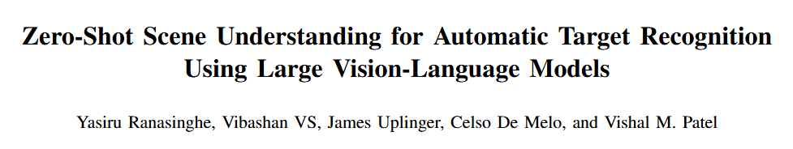

# 1. Image Processing

#### 1-001 [MatchAnything: Universal Cross-Modality Image Matching with Large-Scale Pre-Training](https://arxiv.org/pdf/2501.07556)

Image matching, which aims to identify corresponding pixel locations between images, is crucial in a wide range of scientific disciplines, aiding in image registration, fusion, and analysis. We propose a large-scale pre-training framework that utilizes synthetic cross-modal training signals, incorporating diverse data from various sources, to train models to recognize and match fundamental structures across images. 

 

#### 1-002 [Zero-Shot Scene Understanding for Automatic Target Recognition Using Large Vision-Language Models](https://arxiv.org/pdf/2501.07396)

Automatic target recognition (ATR) plays a critical role in tasks such as navigation and surveillance, where safety and accuracy are paramount. we propose a novel pipeline that combines the detection capabilities of open-world detectors with the recognition confidence of LVLMs, creating a robust system for zero-shot ATR of novel classes and unknown domains. 

 

#### 1-003 [Enhancing Image Generation Fidelity via Progressive Prompts](https://arxiv.org/pdf/2501.07070)

 we propose a coarse - to - fine generation pipeline for regional prompt - following generation. Specifically, we first utilize the powerful large language model (LLM) to generate both high - level descriptions of the image (such as content, topic, and objects) and low - level descriptions (such as details and style). Then, we explore the influence of cross - attention layers at different depths. We find that deeper layers are always responsible for high - level content control, while shallow layers handle low - level content control. 

 

#### 1-004 [Personalized Preference Fine-tuning of Diffusion Models](https://arxiv.org/abs/2501.06655)

We introduce PPD, a multi-reward optimization objective that aligns diffusion models with personalized preferences. With PPD, a diffusion model learns the individual preferences of a population of users in a few-shot way, enabling generalization to unseen users. 

 

#### 1-005 [Generalized and Efficient 2D Gaussian Splatting for Arbitrary-scale Super-Resolution](https://arxiv.org/pdf/2501.06838)

We overcome these challenges by developing two novel techniques. Firstly, to generalize GS for ASR, we elaborately design an architecture to predict the corresponding image-conditioned Gaussians of the input low-resolution image in a feed-forward manner. Secondly, we implement an efficient differentiable 2D GPU/CUDA-based scale-aware rasterization to render super-resolved images by sampling discrete RGB values from the predicted contiguous Gaussians.

 

# 2. Video Processing

#### 2-001 [Training-Free Motion-Guided Video Generation with Enhanced Temporal Consistency Using Motion Consistency Loss](https://arxiv.org/pdf/2501.07563)

In this paper, we address the challenge of generating temporally consistent videos with motion guidance. In this work, we propose a simple yet effective solution that combines an initial-noise-based approach with a novel motion consistency loss, the latter being our key innovation. Specifically, we capture the inter-frame feature correlation patterns of intermediate features from a video diffusion model to represent the motion pattern of the reference video.

 

#### 2-002 [SST-EM: Advanced Metrics for Evaluating Semantic, Spatial and Temporal Aspects in Video Editing](https://arxiv.org/pdf/2501.07554)

Video editing models have advanced significantly, but evaluating their performance remains challenging. We present SST-EM (Semantic, Spatial, and Temporal Evaluation Metric), a novel evaluation framework that leverages modern Vision-Language Models (VLMs), Object Detection, and Temporal Consistency checks. 

 

#### 2-003 [IP-FaceDiff: Identity-Preserving Facial Video Editing with Diffusion](https://arxiv.org/pdf/2501.07530)

Facial video editing has become increasingly important for content creators, enabling the manipulation of facial expressions and attributes. To address these challenges, we propose a novel facial video editing framework that leverages the rich latent space of pre-trained text-to-image (T2I) diffusion models and fine-tune them specifically for facial video editing tasks.  

 

# 3. 3D Processing

#### 3-001 [RMAvatar: Photorealistic Human Avatar Reconstruction from Monocular Video Based on Rectified Mesh-embedded Gaussians](https://arxiv.org/pdf/2501.07104)

We introduce RMAvatar, a novel human avatar representation with Gaussian splatting embedded on mesh to learn clothed avatar from a monocular video.

 

#### 3-002 [3DGS-to-PC: Convert a 3D Gaussian Splatting Scene into a Dense Point Cloud or Mesh](https://arxiv.org/pdf/2501.07478)

In this work we introduce 3DGS-to-PC, a flexible and highly customisable framework that is capable of transforming 3DGS scenes into dense, high-accuracy point clouds. 

 

# 4. LLM & VLM

#### 4-001 [Imagine while Reasoning in Space: Multimodal Visualization-of-Thought](https://arxiv.org/pdf/2501.07542)

Chain-of-Thought (CoT) prompting has proven highly effective for enhancing complex reasoning in Large Language Models (LLMs) and Multimodal Large Language Models (MLLMs). Yet, it struggles in complex spatial reasoning tasks. Nonetheless, human cognition extends beyond language alone, enabling the remarkable capability to think in both words and images. Inspired by this mechanism, we propose a new reasoning paradigm, Multimodal Visualization-of-Thought (MVoT). It enables visual thinking in MLLMs by generating image visualizations of their reasoning traces.

 

# 5. Embodied AI

# 6. datasets

#### 6-001 [UnCommon Objects in 3D](https://arxiv.org/abs/2501.07574)

We introduce Uncommon Objects in 3D (uCO3D), a new object-centric dataset for 3D deep learning and 3D generative AI. uCO3D is the largest publicly-available collection of high-resolution videos of objects with 3D annotations that ensures full-360∘ coverage

 

#### 6-002 [OCORD: Open-Campus Object Removal Dataset](https://arxiv.org/pdf/2501.07397) 

this paper introduces a novel approach to object removal by constructing a high-resolution real-world dataset through long-duration video capture with fixed camera settings. 

# 7. Survey

#### 7-001 [The Quest for Visual Understanding: A Journey Through the Evolution of Visual Question Answering](https://arxiv.org/pdf/2501.07109)

Visual Question Answering (VQA) is an interdisciplinary field that bridges the gap between computer vision (CV) and natural language processing(NLP), enabling Artificial Intelligence(AI) systems to answer questions about images. This survey traces the journey of VQA from its early days, through major breakthroughs, such as attention mechanisms, compositional reasoning, and the rise of vision-language pre-training methods. 