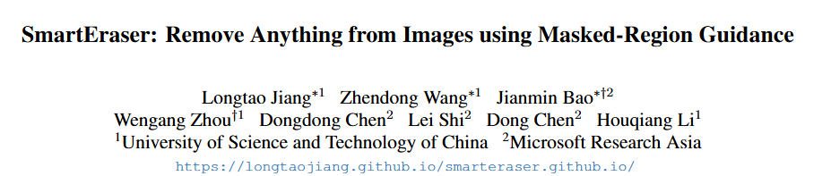

# 1. Image Processing

#### 1-001 [MangaNinja: Line Art Colorization with Precise Reference Following](https://arxiv.org/pdf/2501.08332)

Derived from diffusion models, MangaNinjia specializes in the task of reference-guided line art colorization. We incorporate two thoughtful designs to ensure precise character detail transcription, including a patch shuffling module to facilitate correspondence learning between the reference color image and the target line art, and a point-driven control scheme to enable fine-grained color matching.  

 

#### 1-002 [SmartEraser: Remove Anything from Images using Masked-Region Guidance](https://arxiv.org/pdf/2501.08279)

Object removal has so far been dominated by the mask-and-inpaint paradigm, where the masked region is excluded from the input, leaving models relying on unmasked areas to inpaint the missing region. In this work, we introduce SmartEraser, built with a new removing paradigm called Masked-Region Guidance. This paradigm retains the masked region in the input, using it as guidance for the removal process. It offers several distinct advantages: (a) it guides the model to accurately identify the object to be removed, preventing its regeneration in the output; (b) since the user mask often extends beyond the object itself, it aids in preserving the surrounding context in the final result.

 

# 2. Video Processing

#### 2-001 [Go-with-the-Flow: Motion-Controllable Video Diffusion Models Using Real-Time Warped Noise](https://arxiv.org/abs/2501.08331)

 In this work, we enhance video diffusion models by allowing motion control via structured latent noise sampling. This is achieved by just a change in data: we pre-process training videos to yield structured noise. Consequently, our method is agnostic to diffusion model design, requiring no changes to model architectures or training pipelines. 

 

#### 2-002 [GameFactory: Creating New Games with Generative Interactive Videos](https://arxiv.org/pdf/2501.08325)

 In this paper, we present GameFactory, a framework focused on exploring scene generalization in game video generation. To enable the creation of entirely new and diverse games, we leverage pre-trained video diffusion models trained on open-domain video data. To bridge the domain gap between open-domain priors and small-scale game dataset, we propose a multi-phase training strategy that decouples game style learning from action control, preserving open-domain generalization while achieving action controllability. Using Minecraft as our data source, we release GF-Minecraft, a high-quality and diversity action-annotated video dataset for research. Furthermore, we extend our framework to enable autoregressive action-controllable game video generation, allowing the production of unlimited-length interactive game videos.  

  

 #### 2-003 [Diffusion Adversarial Post-Training for One-Step Video Generation](https://arxiv.org/pdf/2501.08316)

The diffusion models are widely used for image and video generation, but their iterative generation process is slow and expansive. While existing distillation approaches have demonstrated the potential for one-step generation in the image domain, they still suffer from significant quality degradation. In this work, we propose Adversarial Post-Training (APT) against real data following diffusion pre-training for one-step video generation. To improve the training stability and quality, we introduce several improvements to the model architecture and training procedures, along with an approximated R1 regularization objective.

 

#### 2-004 [LayerAnimate: Layer-specific Control for Animation](https://arxiv.org/pdf/2501.08295)

In this paper, we introduce LayerAnimate, a novel architectural approach that enhances fine-grained control over individual animation layers within a video diffusion model, allowing users to independently manipulate foreground and background elements in distinct layers. To address the challenge of limited layer-specific data, we propose a data curation pipeline that features automated element segmentation, motion-state hierarchical merging, and motion coherence refinement.

 

# 3. 3D Processing

#### 3-001 [DAViD: Modeling Dynamic Affordance of 3D Objects using Pre-trained Video Diffusion Models](https://arxiv.org/abs/2501.08333)

Understanding the ability of humans to use objects is crucial for AI to improve daily life. Existing studies for learning such ability focus on human-object patterns (e.g., contact, spatial relation, orientation) in static situations, and learning Human-Object Interaction (HOI) patterns over time (i.e., movement of human and object) is relatively less explored. In this paper, we introduce a novel type of affordance named Dynamic Affordance. For a given input 3D object mesh, we learn dynamic affordance which models the distribution of both (1) human motion and (2) human-guided object pose during interactions.  

 

#### 3-002 [Make-A-Character 2: Animatable 3D Character Generation From a Single Image](https://arxiv.org/pdf/2501.07870)

This report introduces Make-A-Character 2, an advanced system for generating high-quality 3D characters from single portrait photographs, ideal for game development and digital human applications. Make-A-Character 2 builds upon its predecessor by incorporating several significant improvements for image-based head generation. 

 

# 4. LLM & VLM

#### 4-001 [Omni-RGPT: Unifying Image and Video Region-level Understanding via Token Marks](https://arxiv.org/pdf/2501.08326)

We present Omni-RGPT, a multimodal large language model designed to facilitate region-level comprehension for both images and videos. To achieve consistent region representation across spatio-temporal dimensions, we introduce Token Mark, a set of tokens highlighting the target regions within the visual feature space. These tokens are directly embedded into spatial regions using region prompts (e.g., boxes or masks) and simultaneously incorporated into the text prompt to specify the target, establishing a direct connection between visual and text tokens. 

 

#### 4-002 [MiniMax-01: Scaling Foundation Models with Lightning Attention](https://arxiv.org/abs/2501.08313)

We introduce MiniMax-01 series, including MiniMax-Text-01 and MiniMax-VL-01, which are comparable to top-tier models while offering superior capabilities in processing longer contexts. The core lies in lightning attention and its efficient scaling. To maximize computational capacity, we integrate it with Mixture of Experts (MoE), creating a model with 32 experts and 456 billion total parameters, of which 45.9 billion are activated for each token.

 

# 5. Embodied AI

#### 5-001 [Predicting 4D Hand Trajectory from Monocular Videos](https://arxiv.org/pdf/2501.08329)

We present HaPTIC, an approach that infers coherent 4D hand trajectories from monocular videos. We repurpose a state-of-the-art image-based transformer to take in multiple frames and directly predict a coherent trajectory. We introduce two types of lightweight attention layers: cross-view self-attention to fuse temporal information, and global cross-attention to bring in larger spatial context.

 

# 6. Dataset

# 7. Survey

#### 7-001 [State-of-the-Art Transformer Models for Image Super-Resolution: Techniques, Challenges, and Applications](https://arxiv.org/abs/2501.07855)

Image Super-Resolution (SR) aims to recover a high-resolution image from its low-resolution counterpart, which has been affected by a specific degradation process. This is achieved by enhancing detail and visual quality. Recent advancements in transformer-based methods have remolded image super-resolution by enabling high-quality reconstructions surpassing previous deep-learning approaches like CNN and GAN-based. This effectively addresses the limitations of previous methods, such as limited receptive fields, poor global context capture, and challenges in high-frequency detail recovery. Additionally, the paper reviews recent trends and advancements in transformer-based SR models, exploring various innovative techniques and architectures that combine transformers with traditional networks to balance global and local contexts. 
