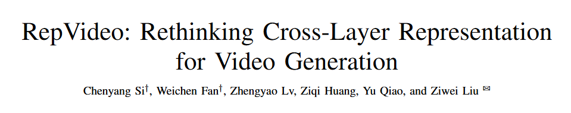
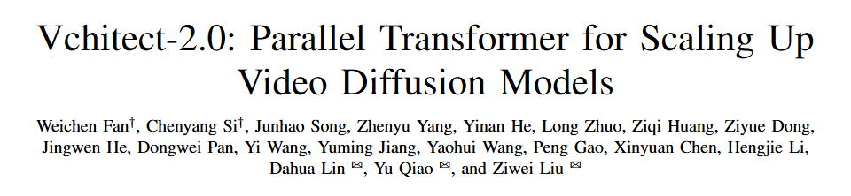
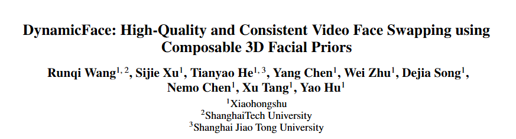
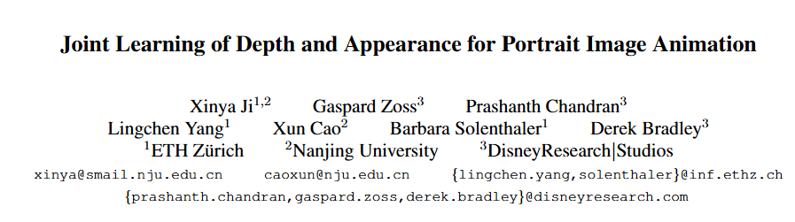
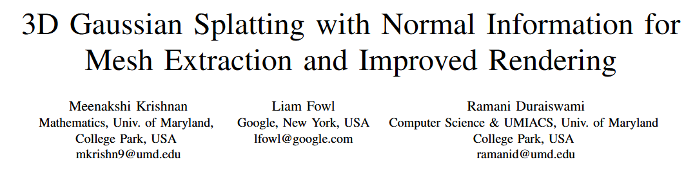
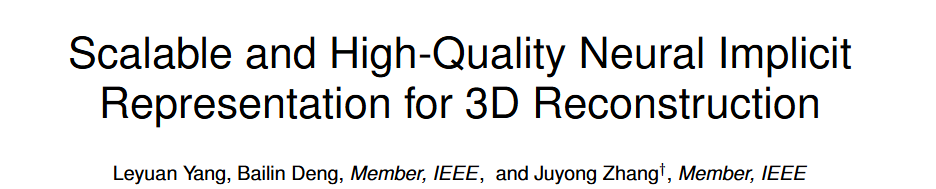
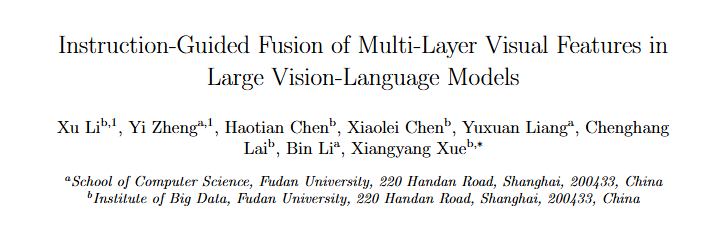

# 1. Image Processing

# 2. Video Processing

#### 2-001 [RepVideo: Rethinking Cross-Layer Representation for Video Generation](https://arxiv.org/pdf/2501.08994)

Video generation has achieved remarkable progress with the introduction of diffusion models, which have significantly improved the quality of generated videos. In this paper, we initially investigate the characteristics of features in intermediate layers, finding substantial variations in attention maps across different layers. These variations lead to unstable semantic representations and contribute to cumulative differences between features, which ultimately reduce the similarity between adjacent frames and negatively affect temporal coherence. To address this, we propose RepVideo, an enhanced representation framework for text-to-video diffusion models.  

 

#### 2-002 [Vchitect-2.0: Parallel Transformer for Scaling Up Video Diffusion Models](https://arxiv.org/abs/2501.08453)

We present Vchitect-2.0, a parallel transformer architecture designed to scale up video diffusion models for large-scale text-to-video generation. The overall Vchitect-2.0 system has several key designs. (1) By introducing a novel Multimodal Diffusion Block, our approach achieves consistent alignment between text descriptions and generated video frames, while maintaining temporal coherence across sequences. (2) To overcome memory and computational bottlenecks, we propose a Memory-efficient Training framework that incorporates hybrid parallelism and other memory reduction techniques, enabling efficient training of long video sequences on distributed systems. (3) Additionally, our enhanced data processing pipeline ensures the creation of Vchitect T2V DataVerse, a high-quality million-scale training dataset through rigorous annotation and aesthetic evaluation.

 

#### 2-003 [DynamicFace: High-Quality and Consistent Video Face Swapping using Composable 3D Facial Priors](https://arxiv.org/pdf/2501.08553)

Face swapping transfers the identity of a source face to a target face while retaining the attributes like expression, pose, hair, and background of the target face. We propose a novel method DynamicFace that leverages the power of diffusion model and plug-and-play temporal layers for video face swapping. First, we introduce four fine-grained face conditions using 3D facial priors. All conditions are designed to be disentangled from each other for precise and unique control. Then, we adopt Face Former and ReferenceNet for high-level and detailed identity injection. 

 

#### 2-004 [Joint Learning of Depth and Appearance for Portrait Image Animation](https://arxiv.org/abs/2501.08649)

2D portrait animation has experienced significant advancements in recent years. In our work, we propose to jointly learn the visual appearance and depth simultaneously in a diffusion-based portrait image generator. Our method embraces the end-to-end diffusion paradigm and introduces a new architecture suitable for learning this conditional joint distribution, consisting of a reference network and a channel-expanded diffusion backbone.  

# 3. 3D Processing

#### 3-001 [3D Gaussian Splatting with Normal Information for Mesh Extraction and Improved Rendering](https://arxiv.org/pdf/2501.08370)

Differentiable 3D Gaussian splatting has emerged as an efficient and flexible rendering technique for representing complex scenes from a collection of 2D views and enabling high-quality real-time novel-view synthesis. However, its reliance on photometric losses can lead to imprecisely reconstructed geometry and extracted meshes, especially in regions with high curvature or fine detail. We propose a novel regularization method using the gradients of a signed distance function estimated from the Gaussians, to improve the quality of rendering while also extracting a surface mesh.  

 

#### 3-002 [Scalable and High-Quality Neural Implicit Representation for 3D Reconstruction](https://arxiv.org/pdf/2501.08577)

In this paper, we propose a versatile, scalable and high-quality neural implicit representation to address these issues. We integrate a divide-and-conquer approach into the neural SDF-based reconstruction. Specifically, we model the object or scene as a fusion of multiple independent local neural SDFs with overlapping regions. The construction of our representation involves three key steps: (1) constructing the distribution and overlap relationship of the local radiance fields based on object structure or data distribution, (2) relative pose registration for adjacent local SDFs, and (3) SDF blending. 

 

# 4. LLM & VLM

#### 4-001 [Instruction-Guided Fusion of Multi-Layer Visual Features in Large Vision-Language Models](https://arxiv.org/pdf/2501.08443)

Large Vision-Language Models (LVLMs) have achieved significant success in multimodal tasks by combining pre-trained vision encoders and large language models. However, current LVLMs mainly rely on features from the final layers of the vision encoder, neglecting complementary information in shallower layers. While recent methods have explored multi-layer features, they are often task-agnostic. We investigate the contributions of visual features from different encoder layers across 18 benchmarks and 6 task categories. Our results show that multi-layer features provide complementary strengths with varying task dependencies, and uniform fusion performs suboptimally. Based on these findings, we propose an instruction-guided vision aggregator that dynamically integrates multi-layer features based on textual instructions, without increasing the number of visual tokens.  

 

# 5. Embodied AI

# 6. Dataset

# 7. Survey