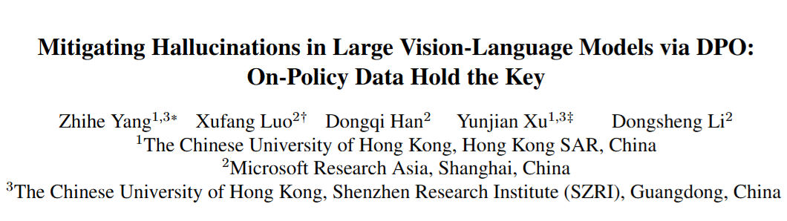

# 1. Image Processing

#### 001 [SynthLight: Portrait Relighting with Diffusion Model by Learning to Re-render Synthetic Faces](https://arxiv.org/pdf/2501.09756)

We introduce SynthLight, a diffusion model for portrait relighting. Our approach frames image relighting as a re-rendering problem, where pixels are transformed in response to changes in environmental lighting conditions. Using a physically-based rendering engine, we synthesize a dataset to simulate this lighting-conditioned transformation with 3D head assets under varying lighting. We propose two training and inference strategies to bridge the gap between the synthetic and real image domains: (1) multi-task training that takes advantage of real human portraits without lighting labels; (2) an inference time diffusion sampling procedure based on classifier-free guidance that leverages the input portrait to better preserve details. 

 

#### 002 [Learnings from Scaling Visual Tokenizers for Reconstruction and Generation](https://arxiv.org/abs/2501.09755)

Visual tokenization via auto-encoding empowers state-of-the-art image and video generative models by compressing pixels into a latent space. Our work aims to conduct an exploration of scaling in auto-encoders to fill in this blank. We first study how scaling the auto-encoder bottleneck affects both reconstruction and generation -- and find that while it is highly correlated with reconstruction, its relationship with generation is more complex. We next explored the effect of separately scaling the auto-encoders' encoder and decoder on reconstruction and generation performance. Crucially, we find that scaling the encoder yields minimal gains for either reconstruction or generation, while scaling the decoder boosts reconstruction but the benefits for generation are mixed.  

 

#### 003 [Inference-Time Scaling for Diffusion Models beyond Scaling Denoising Steps](https://arxiv.org/pdf/2501.09732)

In this work, we explore the inference-time scaling behavior of diffusion models beyond increasing denoising steps and investigate how the generation performance can further improve with increased computation. Specifically, we consider a search problem aimed at identifying better noises for the diffusion sampling process. We structure the design space along two axes: the verifiers used to provide feedback, and the algorithms used to find better noise candidates. Through extensive experiments on class-conditioned and text-conditioned image generation benchmarks, our findings reveal that increasing inference-time compute leads to substantial improvements in the quality of samples generated by diffusion models, and with the complicated nature of images, combinations of the components in the framework can be specifically chosen to conform with different application scenario.

 

#### 004 [AnyStory: Towards Unified Single and Multiple Subject Personalization in Text-to-Image Generation](https://arxiv.org/pdf/2501.09503)

 In this paper, we propose AnyStory, a unified approach for personalized subject generation. AnyStory not only achieves high-fidelity personalization for single subjects, but also for multiple subjects, without sacrificing subject fidelity. Specifically, AnyStory models the subject personalization problem in an "encode-then-route" manner.

  

# 2. Video Processing

#### 001 [VanGogh: A Unified Multimodal Diffusion-based Framework for Video Colorization](https://arxiv.org/pdf/2501.09499)

Video colorization aims to transform grayscale videos into vivid color representations while maintaining temporal consistency and structural integrity. we introduce VanGogh, a unified multimodal diffusion-based framework for video colorization. VanGogh tackles these challenges using a Dual Qformer to align and fuse features from multiple modalities, complemented by a depth-guided generation process and an optical flow loss, which help reduce color overflow. Additionally, a color injection strategy and luma channel replacement are implemented to improve generalization and mitigate flickering artifacts.  

 

# 3. 3D Processing

# 4. LLM & VLM

#### 001 [Practical Continual Forgetting for Pre-trained Vision Models](https://arxiv.org/pdf/2501.09705)

For privacy and security concerns, the need to erase unwanted information from pre-trained vision models is becoming evident nowadays. We define this problem as continual forgetting and identify three key challenges. (i) For unwanted knowledge, efficient and effective deleting is crucial. (ii) For remaining knowledge, the impact brought by the forgetting procedure should be minimal. (iii) In real-world scenarios, the training samples may be scarce or partially missing during the process of forgetting. To address them, we first propose Group Sparse LoRA (GS-LoRA). Specifically, towards (i), we introduce LoRA modules to fine-tune the FFN layers in Transformer blocks for each forgetting task independently, and towards (ii), a simple group sparse regularization is adopted, enabling automatic selection of specific LoRA groups and zeroing out the others.  

 

#### 002 [Mitigating Hallucinations in Large Vision-Language Models via DPO: On-Policy Data Hold the Key]()

Hallucination remains a major challenge for Large Vision-Language Models (LVLMs). We identify a crucial factor here: outcomes are largely contingent on whether the constructed data aligns on-policy w.r.t the initial (reference) policy of DPO. Theoretical analysis suggests that learning from off-policy data is impeded by the presence of KL-divergence between the updated policy and the reference policy.

 

# 5. Embodied AI

# 6. Autonomous Driving

#### 001 [Distilling Multi-modal Large Language Models for Autonomous Driving](https://arxiv.org/pdf/2501.09757)

Using LLMs at test time introduces high computational costs. To address this, we propose DiMA, an end-to-end autonomous driving system that maintains the efficiency of an LLM-free (or vision-based) planner while leveraging the world knowledge of an LLM. DiMA distills the information from a multi-modal LLM to a vision-based end-to-end planner through a set of specially designed surrogate tasks. Under a joint training strategy, a scene encoder common to both networks produces structured representations that are semantically grounded as well as aligned to the final planning objective. 

 

# 7. Dataset

#### 001 [Vision-Language Models Do Not Understand Negation](https://arxiv.org/pdf/2501.09425)

We introduce NegBench, a new benchmark designed to evaluate negation understanding across 18 task variations and 79k examples spanning image, video, and medical datasets. The benchmark consists of two core tasks designed to evaluate negation understanding in diverse multimodal settings: Retrieval with Negation and Multiple Choice Questions with Negated Captions. Our evaluation reveals that modern VLMs struggle significantly with negation, often performing at chance level. 

# 8. Survey

#### 001 [Image Segmentation with transformers: An Overview, Challenges and Future](https://arxiv.org/pdf/2501.09372)

This paper explores the shortcomings of CNN-based models and the shift towards transformer architectures -to overcome those limitations. This work reviews state-of-the-art transformer-based segmentation models, addressing segmentation-specific challenges and their solutions. The paper discusses current challenges in transformer-based segmentation and outlines promising future trends, such as lightweight architectures and enhanced data efficiency. This survey serves as a guide for understanding the impact of transformers in advancing segmentation capabilities and overcoming the limitations of traditional models.