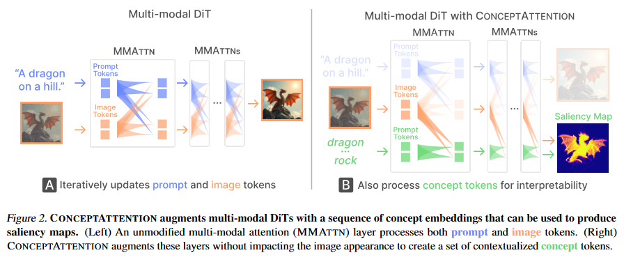
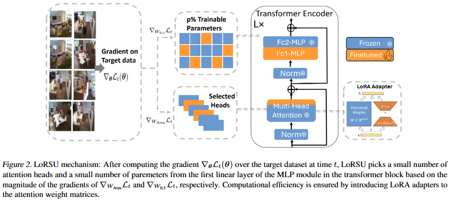

# 1. Image Processing

#### 001 [ConceptAttention: Diffusion Transformers Learn Highly Interpretable Features](https://arxiv.org/pdf/2502.04320)

We introduce ConceptAttention, a novel method that leverages the expressive power of DiT attention layers to generate high-quality saliency maps that precisely locate textual concepts within images. Without requiring additional training, ConceptAttention repurposes the parameters of DiT attention layers to produce highly contextualized concept embeddings, contributing the major discovery that performing linear projections in the output space of DiT attention layers yields significantly sharper saliency maps compared to commonly used cross-attention mechanisms.

 

#### 002 [Variational Control for Guidance in Diffusion Models](https://arxiv.org/pdf/2502.03686)

We revisit guidance in diffusion models from the perspective of variational inference and control, introducing Diffusion Trajectory Matching (DTM) that enables guiding pretrained diffusion trajectories to satisfy a terminal cost. DTM unifies a broad class of guidance methods and enables novel instantiations. We introduce a new method within this framework that achieves state-of-the-art results on several linear and (blind) non-linear inverse problems without requiring additional model training or modifications.

 

#### 003 [CLIP Behaves like a Bag-of-Words Model Cross-modally but not Uni-modally](https://arxiv.org/pdf/2502.03566)

In this work, we investigate why CLIP exhibits this BoW-like behavior. We find that the correct attribute-object binding information is already present in individual text and image modalities. Instead, the issue lies in the cross-modal alignment, which relies on cosine similarity. To address this, we propose Linear Attribute Binding CLIP or LABCLIP. It applies a linear transformation to text embeddings before computing cosine similarity. This approach significantly improves CLIP's ability to bind attributes to correct objects, thereby enhancing its compositional understanding.

 

#### 004 [Scaling Laws in Patchification: An Image Is Worth 50,176 Tokens And More](https://arxiv.org/pdf/2502.03738)

In this work, we aim to thoroughly examine the information loss caused by this patchification-based compressive encoding paradigm and how it affects visual understanding. We conduct extensive patch size scaling experiments and excitedly observe an intriguing scaling law in patchification: the models can consistently benefit from decreased patch sizes and attain improved predictive performance, until it reaches the minimum patch size of 1x1, i.e., pixel tokenization. This conclusion is broadly applicable across different vision tasks, various input scales, and diverse architectures such as ViT and the recent Mamba models. 

 

#### 005 [PartEdit: Fine-Grained Image Editing using Pre-Trained Diffusion Models](https://arxiv.org/pdf/2502.04050)

We present the first text-based image editing approach for object parts based on pre-trained diffusion models.  To address this, we propose to expand the knowledge of pre-trained diffusion models to allow them to understand various object parts, enabling them to perform fine-grained edits. We achieve this by learning special textual tokens that correspond to different object parts through an efficient token optimization process. These tokens are optimized to produce reliable localization masks at each inference step to localize the editing region. 

# 2. Video Processing

#### 001 [UniForm: A Unified Diffusion Transformer for Audio-Video Generation](https://arxiv.org/pdf/2502.03897)

we propose UniForm, a unified diffusion transformer designed to enhance cross-modal consistency. By concatenating auditory and visual information, UniForm learns to generate audio and video simultaneously within a unified latent space, facilitating the creation of high-quality and well-aligned audio-visual pairs

 

#### 002 [Learning Real-World Action-Video Dynamics with Heterogeneous Masked Autoregression](https://arxiv.org/pdf/2502.04296)

We propose Heterogeneous Masked Autoregression (HMA) for modeling action-video dynamics to generate high-quality data and evaluation in scaling robot learning. Building interactive video world models and policies for robotics is difficult due to the challenge of handling diverse settings while maintaining computational efficiency to run in real time.

# 3. 3D Processing

# 4. LLM & VLM

#### 001 [The Hidden Life of Tokens: Reducing Hallucination of Large Vision-Language Models via Visual Information Steering](https://arxiv.org/pdf/2502.03628)

In this paper, we investigate the internal dynamics of hallucination by examining the tokens logits rankings throughout the generation process, revealing three key patterns in how LVLMs process information: (1) gradual visual information loss -- visually grounded tokens gradually become less favored throughout generation, and (2) early excitation -- semantically meaningful tokens achieve peak activation in the layers earlier than the final layer. (3) hidden genuine information -- visually grounded tokens though not being eventually decided still retain relatively high rankings at inference. Based on these insights, we propose VISTA (Visual Information Steering with Token-logit Augmentation), a training-free inference-time intervention framework that reduces hallucination while promoting genuine information.

 

#### 002 [Efficient Few-Shot Continual Learning in Vision-Language Models](https://arxiv.org/pdf/2502.04098)

we propose LoRSU (Low-Rank Adaptation with Structured Updates), a robust and computationally efficient method for selectively updating image encoders within VLMs. LoRSU introduces structured and localized parameter updates, effectively correcting performance on previously error-prone data while preserving the model's general robustness. Our approach leverages theoretical insights to identify and update only the most critical parameters, achieving significant resource efficiency. 

 

# 5. Embodied AI

# 6. Autonomous Driving

# 7. Dataset

# 8. Survey / Book

#### 001 [Generative Adversarial Networks Bridging Art and Machine Intelligence](https://arxiv.org/pdf/2502.04116)

This book begins with a detailed introduction to the fundamental principles and historical development of GANs, contrasting them with traditional generative models and elucidating the core adversarial mechanisms through illustrative Python examples.