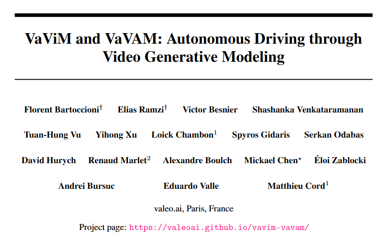
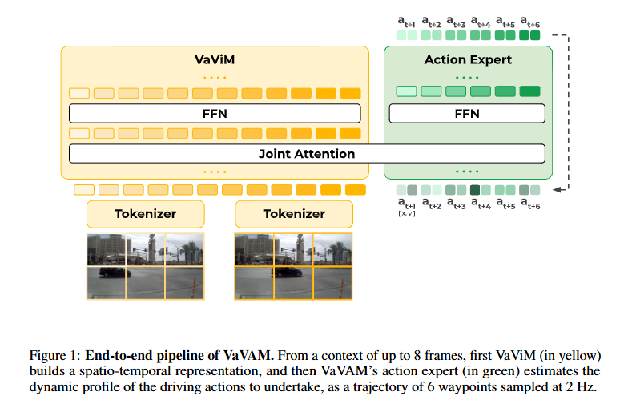
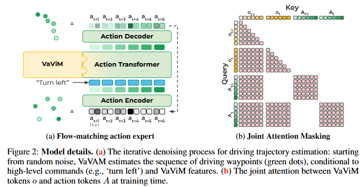
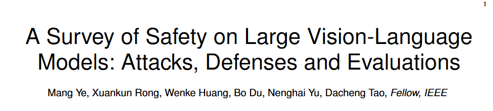
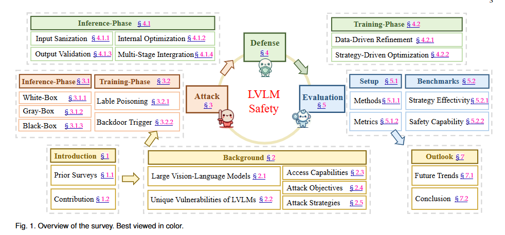

# 1. Image Processing

# 2. Video Processing

# 3. 3D Processing

# 4. LLM & VLM

# 5. Embodied AI

# 6. Autonomous Driving

#### 001 [VaViM and VaVAM: Autonomous Driving through Video Generative Modeling](https://arxiv.org/pdf/2502.15672)

We explore the potential of large-scale generative video models for autonomous driving, introducing an open-source auto-regressive video model (VaViM) and its companion video-action model (VaVAM) to investigate how video pre-training transfers to real-world driving. VaViM is a simple auto-regressive video model that predicts frames using spatio-temporal token sequences. We show that it captures the semantics and dynamics of driving scenes. VaVAM, the video-action model, leverages the learned representations of VaViM to generate driving trajectories through imitation learning. Together, the models form a complete perception-to-action pipeline. We evaluate our models in open- and closed-loop driving scenarios, revealing that video-based pre-training holds promise for autonomous driving. Key insights include the semantic richness of the learned representations, the benefits of scaling for video synthesis, and the complex relationship between model size, data, and safety metrics in closed-loop evaluations.

# 7. Dataset

# 8. Survey

#### 001 [A Survey of Safety on Large Vision-Language Models: Attacks, Defenses and Evaluations](https://arxiv.org/pdf/2502.14881)

With the rapid advancement of Large Vision-Language Models (LVLMs), ensuring their safety has emerged as a crucial area of research. This survey provides a comprehensive analysis of LVLM safety, covering key aspects such as attacks, defenses, and evaluation methods. We introduce a unified framework that integrates these interrelated components, offering a holistic perspective on the vulnerabilities of LVLMs and the corresponding mitigation strategies. Through an analysis of the LVLM lifecycle, we introduce a classification framework that distinguishes between inference and training phases, with further subcategories to provide deeper insights. Furthermore, we highlight limitations in existing research and outline future directions aimed at strengthening the robustness of LVLMs. As part of our research, we conduct a set of safety evaluations on the latest LVLM, Deepseek Janus-Pro, and provide a theoretical analysis of the results. Our findings provide strategic recommendations for advancing LVLM safety and ensuring their secure and reliable deployment in high-stakes, real-world applications. This survey aims to serve as a cornerstone for future research, facilitating the development of models that not only push the boundaries of multimodal intelligence but also adhere to the highest standards of security and ethical integrity. Furthermore, to aid the growing research in this field, we have created a public repository to continuously compile and update the latest work on LVLM safety