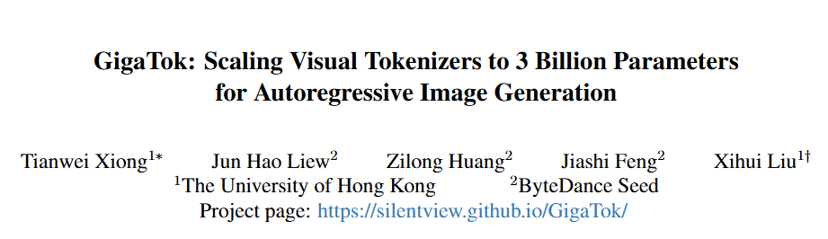
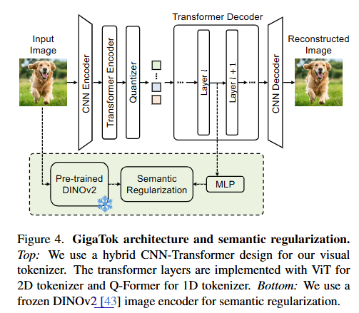
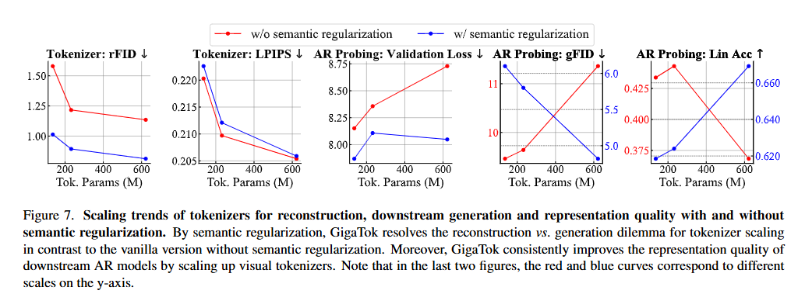
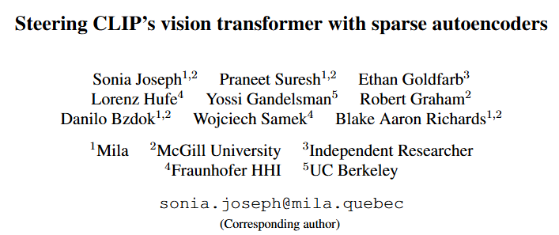
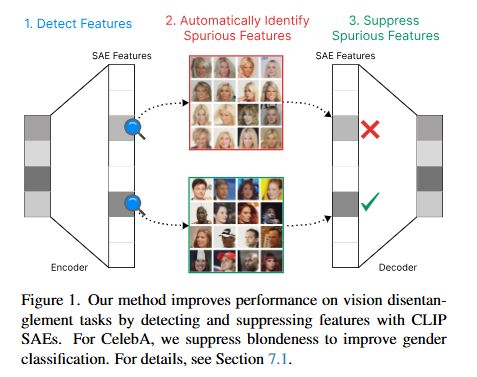
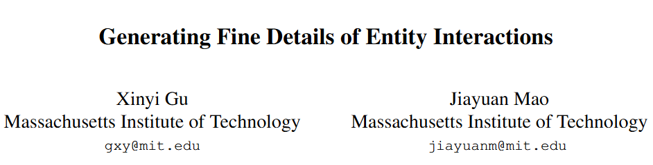
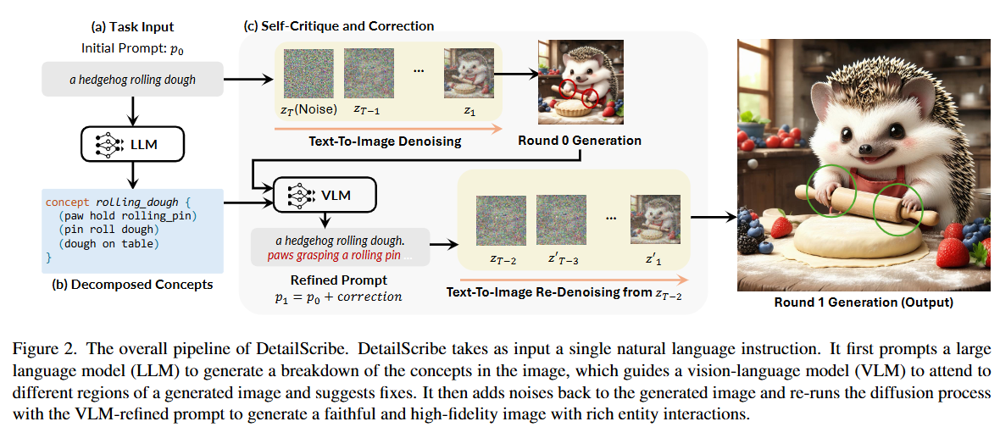

# 1. Image Processing

#### 001 [GigaTok: Scaling Visual Tokenizers to 3 Billion Parameters for Autoregressive Image Generation](https://arxiv.org/abs/2504.08736)

In autoregressive (AR) image generation, visual tokenizers compress images into compact discrete latent tokens, enabling efficient training of downstream autoregressive models for visual generation via next-token prediction. While scaling visual tokenizers improves image reconstruction quality, it often degrades downstream generation quality -- a challenge not adequately addressed in existing literature. To address this, we introduce GigaTok, the first approach to simultaneously improve image reconstruction, generation, and representation learning when scaling visual tokenizers. We identify the growing complexity of latent space as the key factor behind the reconstruction vs. generation dilemma. To mitigate this, we propose semantic regularization, which aligns tokenizer features with semantically consistent features from a pre-trained visual encoder. This constraint prevents excessive latent space complexity during scaling, yielding consistent improvements in both reconstruction and downstream autoregressive generation. Building on semantic regularization, we explore three key practices for scaling tokenizers:(1) using 1D tokenizers for better scalability, (2) prioritizing decoder scaling when expanding both encoder and decoder, and (3) employing entropy loss to stabilize training for billion-scale tokenizers. By scaling to 3 billion parameters, GigaTok achieves state-of-the-art performance in reconstruction, downstream AR generation, and downstream AR representation quality.

#### 002 [Steering CLIP's vision transformer with sparse autoencoders](https://arxiv.org/pdf/2504.08729)

While vision models are highly capable, their internal mechanisms remain poorly understood -- a challenge which sparse autoencoders (SAEs) have helped address in language, but which remains underexplored in vision. We address this gap by training SAEs on CLIP's vision transformer and uncover key differences between vision and language processing, including distinct sparsity patterns for SAEs trained across layers and token types. We then provide the first systematic analysis on the steerability of CLIP's vision transformer by introducing metrics to quantify how precisely SAE features can be steered to affect the model's output. We find that 10-15\% of neurons and features are steerable, with SAEs providing thousands more steerable features than the base model. Through targeted suppression of SAE features, we then demonstrate improved performance on three vision disentanglement tasks (CelebA, Waterbirds, and typographic attacks), finding optimal disentanglement in middle model layers, and achieving state-of-the-art performance on defense against typographic attacks.

#### 003 [Generating Fine Details of Entity Interactions](https://arxiv.org/pdf/2504.08714)

Images not only depict objects but also encapsulate rich interactions between them. However, generating faithful and high-fidelity images involving multiple entities interacting with each other, is a long-standing challenge. While pre-trained text-to-image models are trained on large-scale datasets to follow diverse text instructions, they struggle to generate accurate interactions, likely due to the scarcity of training data for uncommon object interactions. This paper introduces InterActing, an interaction-focused dataset with 1000 fine-grained prompts covering three key scenarios: (1) functional and action-based interactions, (2) compositional spatial relationships, and (3) multi-subject interactions. To address interaction generation challenges, we propose a decomposition-augmented refinement procedure. Our approach, DetailScribe, built on Stable Diffusion 3.5, leverages LLMs to decompose interactions into finer-grained concepts, uses a VLM to critique generated images, and applies targeted interventions within the diffusion process in refinement. Automatic and human evaluations show significantly improved image quality, demonstrating the potential of enhanced inference strategies. Our dataset and code are available at this https URL to facilitate future exploration of interaction-rich image generation.

# 2. Video Processing

# 3. 3D Processing

# 4. LLM & VLM

# 5. Embodied AI

# 6. Autonomous Driving

# 7. Dataset

# 8. Survey