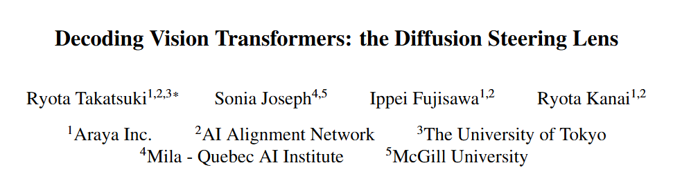
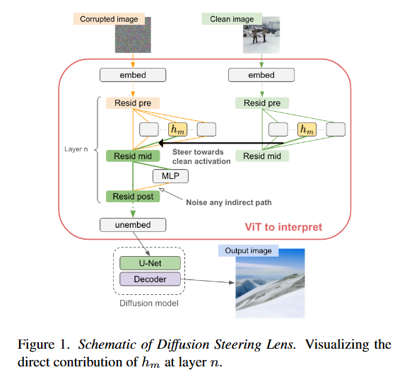
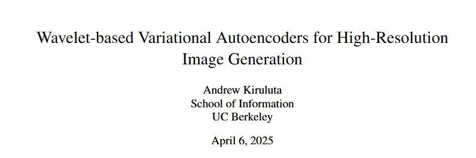
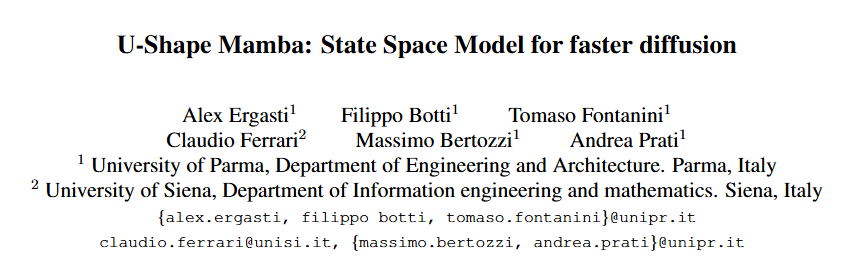
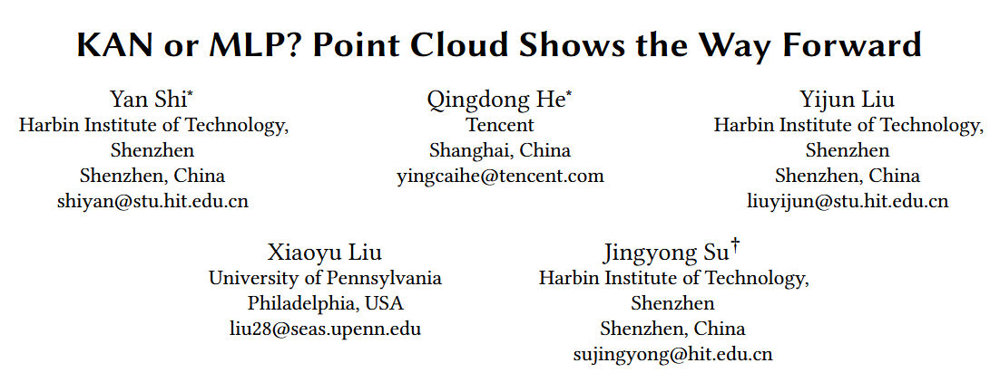
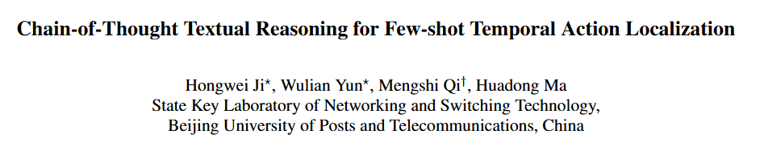
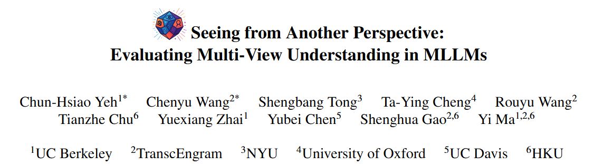
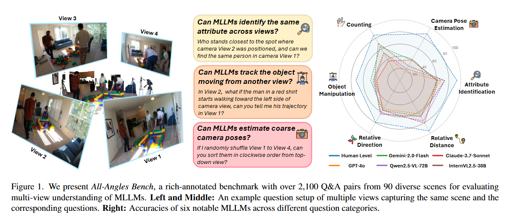
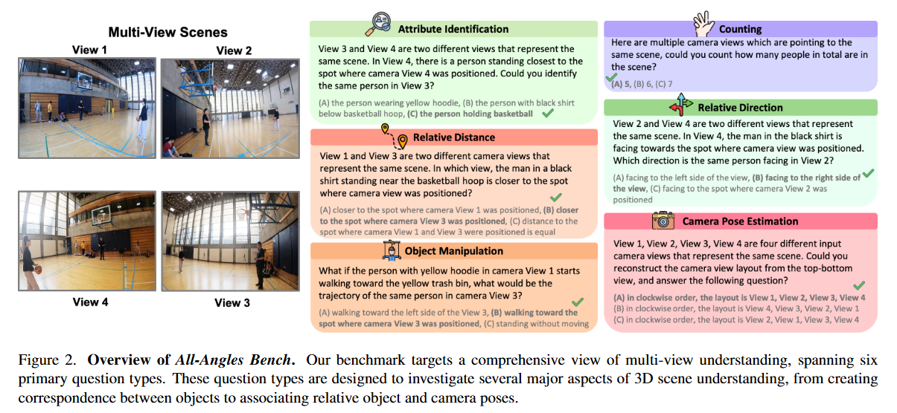

# 1. Image Processing

#### 001 [Decoding Vision Transformers: the Diffusion Steering Lens](https://arxiv.org/pdf/2504.13763)

Logit Lens is a widely adopted method for mechanistic interpretability of transformer-based language models, enabling the analysis of how internal representations evolve across layers by projecting them into the output vocabulary space. Although applying Logit Lens to Vision Transformers (ViTs) is technically straightforward, its direct use faces limitations in capturing the richness of visual representations. Building on the work of Toker et al. (2024)~\cite{Toker2024-ve}, who introduced Diffusion Lens to visualize intermediate representations in the text encoders of text-to-image diffusion models, we demonstrate that while Diffusion Lens can effectively visualize residual stream representations in image encoders, it fails to capture the direct contributions of individual submodules. To overcome this limitation, we propose \textbf{Diffusion Steering Lens} (DSL), a novel, training-free approach that steers submodule outputs and patches subsequent indirect contributions. We validate our method through interventional studies, showing that DSL provides an intuitive and reliable interpretation of the internal processing in ViTs.

#### 002 [Wavelet-based Variational Autoencoders for High-Resolution Image Generation](https://arxiv.org/abs/2504.13214)

Variational Autoencoders (VAEs) are powerful generative models capable of learning compact latent representations. However, conventional VAEs often generate relatively blurry images due to their assumption of an isotropic Gaussian latent space and constraints in capturing high-frequency details. In this paper, we explore a novel wavelet-based approach (Wavelet-VAE) in which the latent space is constructed using multi-scale Haar wavelet coefficients. We propose a comprehensive method to encode the image features into multi-scale detail and approximation coefficients and introduce a learnable noise parameter to maintain stochasticity. We thoroughly discuss how to reformulate the reparameterization trick, address the KL divergence term, and integrate wavelet sparsity principles into the training objective. Our experimental evaluation on CIFAR-10 and other high-resolution datasets demonstrates that the Wavelet-VAE improves visual fidelity and recovers higher-resolution details compared to conventional VAEs. We conclude with a discussion of advantages, potential limitations, and future research directions for wavelet-based generative modeling.

#### 003 [U-Shape Mamba: State Space Model for faster diffusion](https://arxiv.org/pdf/2504.13499)

Diffusion models have become the most popular approach for high-quality image generation, but their high computational cost still remains a significant challenge. To address this problem, we propose U-Shape Mamba (USM), a novel diffusion model that leverages Mamba-based layers within a U-Net-like hierarchical structure. By progressively reducing sequence length in the encoder and restoring it in the decoder through Mamba blocks, USM significantly lowers computational overhead while maintaining strong generative capabilities. Experimental results against Zigma, which is currently the most efficient Mamba-based diffusion model, demonstrate that USM achieves one-third the GFlops, requires less memory and is faster, while outperforming Zigma in image quality. Frechet Inception Distance (FID) is improved by 15.3, 0.84 and 2.7 points on AFHQ, CelebAHQ and COCO datasets, respectively. These findings highlight USM as a highly efficient and scalable solution for diffusion-based generative models, making high-quality image synthesis more accessible to the research community while reducing computational costs.

# 2. Video Processing

# 3. 3D Processing

#### 001 [KAN or MLP? Point Cloud Shows the Way Forward](https://arxiv.org/pdf/2504.13593)

Multi-Layer Perceptrons (MLPs) have become one of the fundamental architectural component in point cloud analysis due to its effective feature learning mechanism. However, when processing complex geometric structures in point clouds, MLPs' fixed activation functions struggle to efficiently capture local geometric features, while suffering from poor parameter efficiency and high model redundancy. In this paper, we propose PointKAN, which applies Kolmogorov-Arnold Networks (KANs) to point cloud analysis tasks to investigate their efficacy in hierarchical feature representation. First, we introduce a Geometric Affine Module (GAM) to transform local features, improving the model's robustness to geometric variations. Next, in the Local Feature Processing (LFP), a parallel structure extracts both group-level features and global context, providing a rich representation of both fine details and overall structure. Finally, these features are combined and processed in the Global Feature Processing (GFP). By repeating these operations, the receptive field gradually expands, enabling the model to capture complete geometric information of the point cloud. To overcome the high parameter counts and computational inefficiency of standard KANs, we develop Efficient-KANs in the PointKAN-elite variant, which significantly reduces parameters while maintaining accuracy. Experimental results demonstrate that PointKAN outperforms PointMLP on benchmark datasets such as ModelNet40, ScanObjectNN, and ShapeNetPart, with particularly strong performance in Few-shot Learning task. Additionally, PointKAN achieves substantial reductions in parameter counts and computational complexity (FLOPs). This work highlights the potential of KANs-based architectures in 3D vision and opens new avenues for research in point cloud understanding.

#### 002 [StyleMe3D: Stylization with Disentangled Priors by Multiple Encoders on 3D Gaussians](https://arxiv.org/pdf/2504.15281)

3D Gaussian Splatting (3DGS) excels in photorealistic scene reconstruction but struggles with stylized scenarios (e.g., cartoons, games) due to fragmented textures, semantic misalignment, and limited adaptability to abstract aesthetics. We propose StyleMe3D, a holistic framework for 3D GS style transfer that integrates multi-modal style conditioning, multi-level semantic alignment, and perceptual quality enhancement. Our key insights include: (1) optimizing only RGB attributes preserves geometric integrity during stylization; (2) disentangling low-, medium-, and high-level semantics is critical for coherent style transfer; (3) scalability across isolated objects and complex scenes is essential for practical deployment. StyleMe3D introduces four novel components: Dynamic Style Score Distillation (DSSD), leveraging Stable Diffusion's latent space for semantic alignment; Contrastive Style Descriptor (CSD) for localized, content-aware texture transfer; Simultaneously Optimized Scale (SOS) to decouple style details and structural coherence; and 3D Gaussian Quality Assessment (3DG-QA), a differentiable aesthetic prior trained on human-rated data to suppress artifacts and enhance visual harmony. Evaluated on NeRF synthetic dataset (objects) and tandt db (scenes) datasets, StyleMe3D outperforms state-of-the-art methods in preserving geometric details (e.g., carvings on sculptures) and ensuring stylistic consistency across scenes (e.g., coherent lighting in landscapes), while maintaining real-time rendering. This work bridges photorealistic 3D GS and artistic stylization, unlocking applications in gaming, virtual worlds, and digital art.

# 4. LLM & VLM

#### 001 [Chain-of-Thought Textual Reasoning for Few-shot Temporal Action Localization](https://arxiv.org/pdf/2504.13460)

Traditional temporal action localization (TAL) methods rely on large amounts of detailed annotated data, whereas few-shot TAL reduces this dependence by using only a few training samples to identify unseen action categories. However, existing few-shot TAL methods typically focus solely on video-level information, neglecting textual information, which can provide valuable semantic support for the localization task. Therefore, we propose a new few-shot temporal action localization method by Chain-of-Thought textual reasoning to improve localization performance. Specifically, we design a novel few-shot learning framework that leverages textual semantic information to enhance the model's ability to capture action commonalities and variations, which includes a semantic-aware text-visual alignment module designed to align the query and support videos at different levels. Meanwhile, to better express the temporal dependencies and causal relationships between actions at the textual level to assist action localization, we design a Chain of Thought (CoT)-like reasoning method that progressively guides the Vision Language Model (VLM) and Large Language Model (LLM) to generate CoT-like text descriptions for videos. The generated texts can capture more variance of action than visual features. We conduct extensive experiments on the publicly available ActivityNet1.3 and THUMOS14 datasets. We introduce the first dataset named Human-related Anomaly Localization and explore the application of the TAL task in human anomaly detection. The experimental results demonstrate that our proposed method significantly outperforms existing methods in single-instance and multi-instance scenarios. We will release our code, data and benchmark.

#### 002 [Seeing from Another Perspective: Evaluating Multi-View Understanding in MLLMs](https://arxiv.org/pdf/2504.15280)

Multi-view understanding, the ability to reconcile visual information across diverse viewpoints for effective navigation, manipulation, and 3D scene comprehension, is a fundamental challenge in Multi-Modal Large Language Models (MLLMs) to be used as embodied agents. While recent MLLMs have shown impressive advances in high-level reasoning and planning, they frequently fall short when confronted with multi-view geometric consistency and cross-view correspondence. To comprehensively evaluate the challenges of MLLMs in multi-view scene reasoning, we propose All-Angles Bench, a benchmark of over 2,100 human carefully annotated multi-view question-answer pairs across 90 diverse real-world scenes. Our six tasks (counting, attribute identification, relative distance, relative direction, object manipulation, and camera pose estimation) specifically test model's geometric correspondence and the capacity to align information consistently across views. Our extensive experiments, benchmark on 27 representative MLLMs including Gemini-2.0-Flash, Claude-3.7-Sonnet, and GPT-4o against human evaluators reveals a substantial performance gap, indicating that current MLLMs remain far from human-level proficiency. Through in-depth analysis, we show that MLLMs are particularly underperforming under two aspects: (1) cross-view correspondence for partially occluded views and (2) establishing the coarse camera poses. These findings highlight the necessity of domain-specific refinements or modules that embed stronger multi-view awareness. We believe that our All-Angles Bench offers valuable insights and contribute to bridging the gap between MLLMs and human-level multi-view understanding. The project and benchmark are publicly available at this https URL.

# 5. Embodied AI

# 6. Autonomous Driving

# 7. Dataset

# 8. Survey