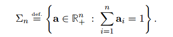

# 原书下载链接
[Computational Optimal Transport](https://arxiv.org/abs/1803.00567)

# 2.Theoretical Foundations

本章描述了最优传输的基础知识.  

## 2.1 Histograms and Measures 直方图与测度
对于属于概率单纯形的任何元素 $a \in \sum_n$ , 术语直方图和概率向量可以互换使用.

