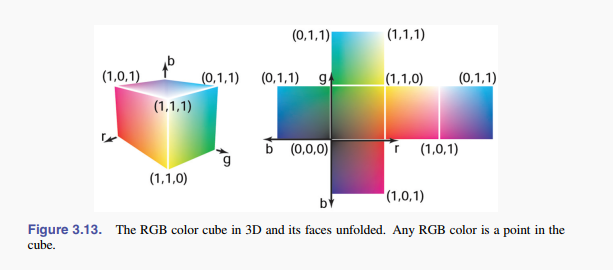

# 3. Raster Images

A raster image is simply a 2D array that stores the pixel value for each pixel, usually a color stored as three numbers for red, green and blue.

A vector image is described by storing descriptions of shapes—areas of color
bounded by lines or curves—with no reference to any particular pixel grid. In
essence, this amounts to storing the instructions for displaying the image rather
than the pixels needed to display it.

## 3.1 Raster Devices

Rester Devices categorized into:

### 3.1.1 Displays

based on fixed arrays of pixels

**emmisive displays**: use pixels that directly emit controllable amounts of light.  

**transmissive displays**: the pixels themselves don't emit light but instead vary the amount of light that they allow to pass through them. Transmissive displays require a light source to illuminate them.  

Light-emitting diode(LED) is an example of emmisive display.  

Liquid crystal displays(LCD) is an example of transmissive type. A liquid crystal is a material whose molecular structure enables it to rotate the polarization of light that passes through it, and the degree of rotation can be adjusted by an applied voltage.  

### 3.1.2 Hardcopy Devices

Many printers can only print binary images, pigment is either deposited or not at each grid position, with no intermediate amounts possible.  

### 3.1.3 Input Devices

A raster input device has to make a light measurement for each pixel, and they usually based on arrays of sensors.  

The image sensor in a digital camera is a semiconductor device with a grid of light-sensitive pixels.  

A flatbed scanner uses a 1D array that sweeps across the page being scanned. As with continuous-tone printers, the resolution of scanners is reported in pixels per inch(ppi).  

## 3.2 Images, Pixels, and Geometry

We can abstract an image as a function:  

$I(x,y): R \to V$

where $R \in \mathbb{R}^2$ is a rectangular area and $V$ is the set of possible pixel values.  

The pixel value is a local average of the color of the image, and it is called a $point  \, sample$ of the image. 

If an image has $n_x$ columns and $n_y$ rows of pixels, the bottom-left pixel is $(0, 0)$ and the top-right pixel if $(n_x - 1, n_y - 1)$. So the rectangular domain of a $n_x \times n_y$ image is:

$R = [-0.5, n_x - 0.5] \times [-0.5, n_y - 0.5]$

### 3.2.1 Pixel Values

Images stored with floating-point numbers, allowing a wide range of values, are often called $high \, dynamic \, range$(HDR) images to distinguish then from fixed-range, or $low \, dynamic \, range$(LDR) images that are stored with integers.  

Artifacts of reducing the number of bits used to store each pixel:  
* encoding images with fixed-range values produces clipping when pixels that would otherwise be brighter than the maximum value are clipped.
* encoding images with limited precision leads to quantization artifacts, or banding, when the need to round pixel values to the nearest representable value introduces visible jumps in intensity or color. 

### 3.2.2 Monitor Intensities and Gamma

The human perception of intensity is nonlinear.  

Monitors are nonlinear with respect to input. As an approximate characterization of this nonlinearity, monitors are commonly characterized by a $\gamma$ (gamma) value. This value is the degree of freedom in the formula:

$displayed \, intensity = (maximum \, intensity) a^\gamma$

where $a$ is the input pixel value between zero and one. 

## 3.3 RGB Color

## 3.4 Alpha Compositing

linear composition of foreground and background

$\bm{c} = \alpha \bm{c}_f + (1 - \alpha)\bm{c}_b$

### 3.4.1 Image Storage

lossless or lossy

