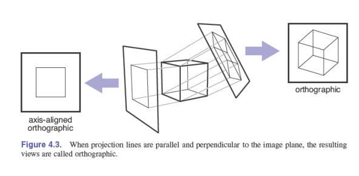
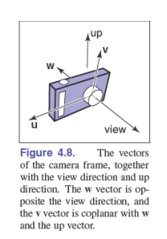
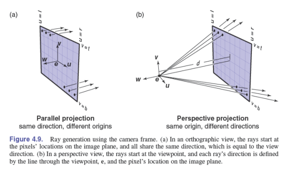
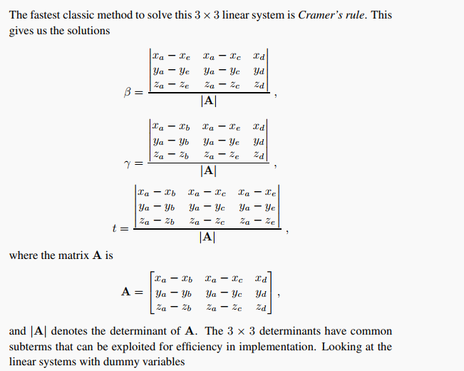
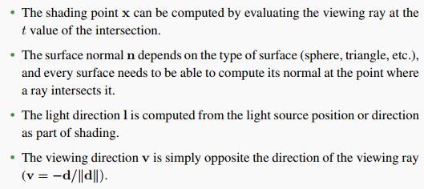
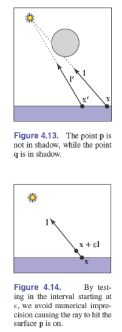
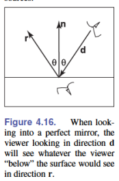

# Ray Tracing

$rendering$ three-dimensional objects: taking a scene composed of many geometric objects arranged in 3D space and computing a 2D image that shows the objects as viewed from a particular viewpoint.  

* $object\text{-}order\,rendering$: each object is considered in turn, and for each object, all the pixels that it influences are found and updated.

* $image\text{-}order\,rendering$: each pixel is considered in turn, and for each pixel all the objects that influence it are found and the pixel value is computed. 

image-order rendering is simpler to get working and more flexible in the effects that can be produced and usually(though not always) takes more execution time to produce a comparable image.  

Ray tracing is an image-order algorithm.  

## 4.1 The Basic Ray-Tracing Algorithm

A basic ray tracer has three parts:

1. $ray\,generation$, which computes the origin and direction of each pixel's viewing ray based on the camera geometry.

2. $ray\,intersection$, which finds the closest object intersecting the viewing ray.

3. $shading$, which computes the pixel color based on the results of ray intersection.

## 4.2 Perspective

$linear\,projection$: 3D objects are projected onto an image plane in such a way that straight lines in the scene become straight lines in the image.  

$parallel\,projection$:3D points are mapped to 2D by moving them along a projection direction until they hit the image plane. If the image plane is perpendicular to the view direction, the projection is called orthographic, otherwise, it is called oblique.  

$perspective\,projection$: project along lines that pass through view point. 

## 4.3 Computing Viewing Rays

A ray is really just an origin point and a propagation direction; a 3D parametric line is ideal for this. The 3D parametric line from the eye $\bm{e}$ through  a point $\bm{s}$ on the image plane:    

$\bm{p}(t) = \bm{e} + t(\bm{s}-\bm{e})$

All of the ray-generation methods start from an orthonormal coordinate frame known as the camera frame. 

### 4.3.1 Orthographic Views

four sides of the image: $l$ and $r$ are the positions of the left and right edges of the image, $b$ and $t$ are the positions of the bottom and top edges of the image.  

The pixel at position $(i,j)$ in the raster image has the position:  

$
u = l + (r-l)(i+0.5)/n_x \\
v = b + (t-b)(j+0.5)/n_y
$

where $(u,v)$ are the coordinates of the pixel's position on the image plane.  

For orthographic viewing rays:  

$
origin \, \bm{o} = \bm{e} + u\bm{u} + v\bm{v} \\
direction \, \bm{d} = -\bm{w}
$

### 4.3.2 Perspective Views

The image plane is no longer positioed at $\bm{e}$, but rather some distance $d$ in front of $\bm{e}$, this distance is the image plane distance, often loosely called the focal length. 

For perspective view:

$
origin \, \bm{o} = \bm{e} \\
direction \, \bm{d} = -d\bm{w} + u\bm{u} + v\bm{v} 
$

## 4.4 Ray-Object Intersection

find the first intersection with any object where $t \gt 0$

### 4.4.1 Ray-Sphere Intersection

Given a ray $\bm{p}(t) = \bm{e} + t\bm{d}$ and an implicit surface $f(\bm{p}) = 0$, solve the equation:

$f(\bm{p}(t))=0 \, or \, f(\bm{e} + t\bm{d}) = 0$

A sphere with center $\bm{c} = (x_c, y_c, z_c)$ and radius $R$

$(\bm{p}-\bm{c})(\bm{p}-\bm{c}) - R^2 = 0$

solve the equation.

### 4.4.2 Ray-Triangle Intersection

For 3D parametric surface:

$
\begin{rcases}
   x_e + tx_d = f(u, v) \\
   y_e + ty_d = g(u, v) \\
   z_e + tz_d = h(u, v)
\end{rcases} \text{or} \, \bm{e} + t\bm{d} = \bm{f}(u, v)
$

When the surface is a parametric plane, and if the vertices of the triangle are $\bm{a}$, $\bm{b}$ and $\bm{c}$:

$\bm{e} + t\bm{d} = \bm{a} + \beta(\bm{b}-\bm{a}) + \gamma(\bm{c}-\bm{a})$

The intersection is inside the triangle if and only if $\beta > 0, \gamma > 0, \beta + \gamma < 1$

### 4.4.3 Ray intersection in software

Object-Oriented design

### 4.4.4 Intersecting a Group of Objects

return the intersection with the smallest $t$ value.  

## 4.5 Shading

### 4.5.1 Light Sources

Three types of lights:

* **point lights**: emit light from a point in space
* **directional lights**: emit light from a single direction
* **ambient lights**: provide constant illumination to fill in the shadows

Four vectors:

### 4.5.2 Shading in software

### 4.5.3 Shadows

### 4.5.4 Mirror Reflection

$\bm{r} = \bm{d} - 2(\bm{d} \cdot \bm{n})\bm{n}$

In the real world, some energy is lost when the light reflects from the surface, and this loss can be different for different colors.

$\text{color} \, c = c + k_m \text{shade-ray}(Ray(\bm{p}, \bm{r}), \epsilon, \infty)$